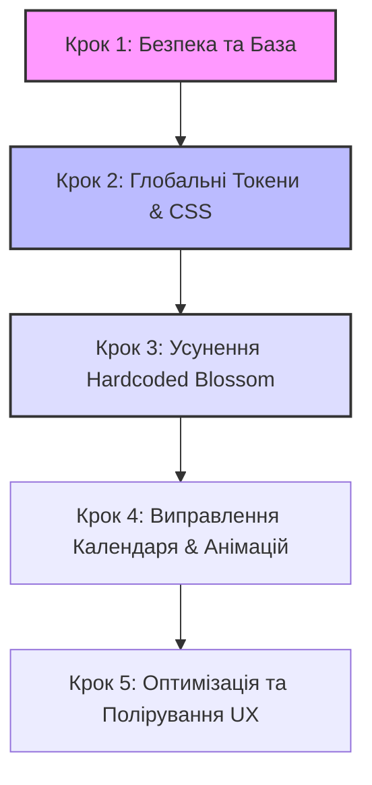

# План Виконання Виправлень — BookIT Remediation Plan

Цей документ є детальною дорожньою картою з виправлення виявлених дефектів безпеки, невідповідностей дизайну (Theme Drifts), порушень анімацій та інтерфейсних відхилень у проєкті BookIT.

---

## 📊 Зведені Метрики Задач

| Пріоритет | Кількість | Опис | Терміновість |
|---|---|---|---|
| **P0** | 5 | Критичні діри безпеки та злами інтерфейсу в темній/світлій темах | **Негайно** (блокує реліз) |
| **P1** | 6 | Функціональні помилки, витоки пам'яті/клієнтів, зламана адаптивність | **Висока** (наступний крок) |
| **P2** | 5 | Дрібні анімаційні дефекти, невідповідності тач-зонам та No-Emoji Policy | **Середня** (полірування) |

---

## 🏛️ ГРУПА 1: БЕЗПЕКА ТА БАЗА ДАНИХ (SECURITY & DATABASE)

### 📍 Імперсонація майстра адміном (P0 Security)
*   **Складність:** High (Висока)
*   **Проблема:** Вхід під видом іншого майстра реалізовано через запис `impersonate_master_id` в кукі. На серверній стороні в [(master)/layout.tsx](file:///C:/Users/Vitossik/SaaS/bookit/src/app/(master)/layout.tsx#L13-L15) роль перевіряється виключно за кукі `user_role === 'admin'`. Оскільки кукі не підписане (немає HMAC), зловмисник може вручну змінити кукі в браузері на `user_role=admin` та вказати будь-який `impersonate_master_id` для доступу до чужого кабінету.
*   **Нотатки:** RLS у Supabase захищає дані на рівні БД від неавторизованих запитів, але інтерфейс дашборду ламається та показує структуру.
*   **Виправлення:**
    1. Заборонити довіру клієнтському кукі `user_role` на сервері. Роль повинна зчитуватись тільки з авторизованого JWT токена Supabase (`supabase.auth.getUser()`).
    2. Реалізувати серверний `HMAC` підпис для `impersonate_master_id` через `process.env.IMPERSONATE_SECRET`, щоб запобігти підробці ID майстра.
*   **Файли для модифікації:**
    - [MastersDirectory.tsx](file:///C:/Users/Vitossik/SaaS/bookit/src/components/admin/MastersDirectory.tsx#L137-L142) (перехід на Server Action для встановлення підписаного кукі)
    - [layout.tsx (master)](file:///C:/Users/Vitossik/SaaS/bookit/src/app/(master)/layout.tsx#L10-L25) (перевірка підпису кукі на сервері)

### 📍 Відсутність search_path в RPC-функціях (P0 Security)
*   **Складність:** Low (Низька)
*   **Проблема:** RPC функція `check_and_log_sms_send` та інші функції з прапором `SECURITY DEFINER` не мають встановленого `SET search_path = public`, що є ризиком безпеки (Search Path Hijacking).
*   **Виправлення:** Додати `SET search_path = public` до тіла всіх RPC функцій у міграціях.
*   **Файли для модифікації:**
    - [DATABASE_SECURITY_RLS_MAP.md](file:///C:/Users/Vitossik/SaaS/XDEV/RELEASE/MAPS/DATABASE_SECURITY_RLS_MAP.md) (актуалізувати опис)
    - Supabase SQL міграції (запустити `npx supabase db push` після редагування файлів міграцій)

---

## 🏛️ ГРУПА 2: THEMING & КОЛІРНА СУМІСНІСТЬ (THEME SPECTRUM)

### 📍 Невидимий текст у редакторі розсилок (P0 Theming)
*   **Складність:** Medium (Середня)
*   **Проблема:** У темній темі Studio колір тексту у полі редагування повідомлення є темно-коричневим (`#28201A`) на темно-бірюзовому фоні, що робить його абсолютно невидимим.
*   **Карусель скріншотів:** [Broadcast Editor](../WAVE1/W_complex-widgets.md#екран-marketing-broadcasts-tab-desktop)
*   **Виправлення:** Замінити hardcoded колір тексту на змінну `var(--text-primary)` або `var(--accent-on)`.
*   **Файли для модифікації:**
    - [BroadcastEditor.tsx](file:///C:/Users/Vitossik/SaaS/bookit/src/components/master/marketing/BroadcastEditor.tsx)

### 📍 Прозорі кнопки BookingWizard (P0 Theming)
*   **Складність:** Low (Низька)
*   **Проблема:** Увесь `BookingWizard` використовує невизначену CSS-змінну `bg-[var(--btn-primary-bg)]` для головних кнопок дій, що призводить до прозорих CTA-кнопок у деяких темах.
*   **Карусель скріншотів:** [Booking Wizard Day](../WAVE1/C_client-zone.md#екран-my-bookings-desktop-desktop)
*   **Виправлення:** 
    1. Зареєструвати `--btn-primary-bg` у `globals.css` для кожної теми:
       - Blossom: `#28201A` (темно-коричневий)
       - Studio: `var(--accent)` (`#D3A376` золото)
       - Frost: `var(--accent)` (`#0F172A` глибокий лаванда/темний)
    2. Або перевести кнопки на пряме використання `bg-accent text-accent-on`.
*   **Файли для модифікації:**
    - [globals.css](file:///C:/Users/Vitossik/SaaS/bookit/src/app/globals.css)
    - [ClientDetails.tsx](file:///C:/Users/Vitossik/SaaS/bookit/src/components/shared/wizard/ClientDetails.tsx)
    - [DateTimePicker.tsx](file:///C:/Users/Vitossik/SaaS/bookit/src/components/shared/wizard/DateTimePicker.tsx)

### 📍 Hardcoded Blossom-Hex кольори (P0 Theming)
*   **Складність:** Medium (Середня)
*   **Проблема:** Сторінки `MorePage.tsx` (плитки меню) та `StudioJoinPage.tsx` (форми підключення студії) мають зашиті бежеві/коричневі hex-коди, які не реагують на зміну теми.
*   **Карусель скріншотів:** [Studio Join Page](../WAVE2/W2_B14_omitted-components.md#екран-studio-join-page-desktop-desktop)
*   **Виправлення:** Замінити hex-коди на змінні CSS-токени (`var(--surface)`, `var(--text-secondary)`, `var(--accent)`).
*   **Файли для модифікації:**
    - [MorePage.tsx](file:///C:/Users/Vitossik/SaaS/bookit/src/components/master/more/MorePage.tsx)
    - [StudioJoinPage.tsx](file:///C:/Users/Vitossik/SaaS/bookit/src/components/master/studio/StudioJoinPage.tsx)
    - [ProductCart.tsx](file:///C:/Users/Vitossik/SaaS/bookit/src/components/shared/wizard/ProductCart.tsx) (кнопки `+` та `-`)

### 📍 Злиття VIP-бейджів клієнтів (P2 Theming)
*   **Складність:** Low (Низька)
*   **Проблема:** У темній темі Studio золотистий колір VIP-бейджа зливається з фоном картки через відсутність контрастної рамки або затінення.
*   **Карусель скріншотів:** [Clients Segment VIP](../WAVE2/W2_B6_clients.md#екран-clients-segment-vip-desktop)
*   **Виправлення:** Додати тонку рамку `border border-accent-on/20` або змінити відтінок бейджа для Studio теми.
*   **Файли для модифікації:**
    - [ClientsPage.tsx](file:///C:/Users/Vitossik/SaaS/bookit/src/components/master/clients/ClientsPage.tsx)

---

## 🏛️ ГРУПА 3: АНІМАЦІЯ ТА UX (MOTION & LAYOUT)

### 📍 Стрибки висоти календаря при зміні місяців (P1 Motion)
*   **Складність:** Medium (Середня)
*   **Проблема:** При переході між місяцями висота сітки календаря стрибає (5 рядків vs 6 рядків), що зміщує весь контент під календарем вниз/вгору без плавного переходу.
*   **Карусель скріншотів:** [Bookings Day Desktop](../WAVE1/M_modals-sheets-drawers.md#екран-bookings-day-desktop-desktop)
*   **Виправлення:** Загорнути сітку календаря в `<motion.div layout transition={{ type: 'spring', duration: 0.3, bounce: 0 }}>` для плавної трансформації висоти.
*   **Файли для модифікації:**
    - [BookingsPage.tsx](file:///C:/Users/Vitossik/SaaS/bookit/src/components/master/bookings/BookingsPage.tsx) (або відповідний вкладений календар)

### 📍 Відсутність плавного розкриття FAQ (P2 Motion)
*   **Складність:** Low (Низька)
*   **Проблема:** Акордеони FAQ розкриваються миттєво без анімації, що порушує преміальність інтерфейсу.
*   **Карусель скріншотів:** [Landing FAQ Open](../WAVE1/U_ui-atoms.md#екран-faq-open-desktop)
*   **Виправлення:** Використати Framer Motion `AnimatePresence` + `motion.div` з висотою `height: 0` -> `height: "auto"` та низьким пружинним `bounce` для м'якого відкриття.
*   **Файли для модифікації:**
    - [SupportPage.tsx](file:///C:/Users/Vitossik/SaaS/bookit/src/components/master/support/SupportPage.tsx)
    - FAQ секція на головному лендингу.

---

## 🏛️ ГРУПА 4: ФУНКЦІОНАЛЬНІСТЬ ТА АДАПТИВНІСТЬ (WIDGETS & RESPONSIVE)

### 📍 Витік Supabase клієнта в BookingWizard (P1 Performance)
*   **Складність:** Medium (Середня)
*   **Проблема:** Хук `useBookingWizardState.ts` ініціалізує новий клієнт Supabase всередині `useEffect` замість використання глобального синглтону. Це призводить до витоку з'єднань при кожному рендері.
*   **Виправлення:** Імпортувати глобальний синглтон браузерного клієнта Supabase з `@/lib/supabase/client`.
*   **Файли для модифікації:**
    - [useBookingWizardState.ts](file:///C:/Users/Vitossik/SaaS/bookit/src/components/shared/wizard/useBookingWizardState.ts)

### 📍 Вихід меж кропера зображень на мобільних (P1 Responsive)
*   **Складність:** Medium (Середня)
*   **Проблема:** При редагуванні профілю на мобільному телефоні, контейнер `ImageCropper.tsx` виходить за мевати за межі екрана по ширині, роблячи кроп неможливим.
*   **Карусель скріншотів:** [Settings Profile Mobile](../WAVE2/W2_B9_settings.md#екран-settings-mobile-mobile)
*   **Виправлення:** Додати адаптивні обмеження ширини `max-w-full` або `w-[calc(100vw-32px)]` для вікна кропера.
*   **Файли для модифікації:**
    - [ImageCropper.tsx](file:///C:/Users/Vitossik/SaaS/bookit/src/components/master/settings/components/ImageCropper.tsx)

### 📍 Узгодження кроку Onboarding CHANNELS (P1 Alignment)
*   **Складність:** Medium (Середня)
*   **Проблема:** Мапа сповіщень вимагає крок `CHANNELS` в онбордингу, але в коді `OnboardingWizard` він примусово пропускається (`CHANNELS: 'SUCCESS'`).
*   **Виправлення:** Узгодити поведінку. Залишити спрощений онбординг без кроку підключення каналів, але додати в `NOTIFICATION_MAP.md` та `SYSTEM_MAP.md` опис, що підключення каналів тепер стимулюється через `ChannelBanner` на дашборді майстра.
*   **Файли для модифікації:**
    - [NOTIFICATION_MAP.md](file:///C:/Users/Vitossik/SaaS/XDEV/RELEASE/MAPS/NOTIFICATION_MAP.md)
    - [SYSTEM_MAP.md](file:///C:/Users/Vitossik/SaaS/XDEV/MAPS/SYSTEM_MAP.md)

### 📍 Малі Touch Targets у налаштуваннях годин (P2 Mobile UI)
*   **Складність:** Low (Низька)
*   **Проблема:** Інпути вибору робочого часу на мобільних пристроях мають тач-зону менше 44px, що ускладнює взаємодію.
*   **Карусель скріншотів:** [Settings Schedule Mobile](../WAVE2/W2_B9_settings.md#екран-settings-mobile-mobile)
*   **Виправлення:** Збільшити внутрішні відступи (padding) для полів введення часу та чекбоксів днів тижня на мобільних екранах.
*   **Файли для модифікації:**
    - [settings/tab-schedule](file:///C:/Users/Vitossik/SaaS/bookit/src/components/master/settings/components/ScheduleTab.tsx) (або відповідний файл налаштувань розкладу)

### 📍 Порушення No-Emoji Policy на першому кроці онбордингу (P2 Compliance)
*   **Складність:** Low (Низька)
*   **Проблема:** У списку вибору спеціалізацій використовуються емодзі `💅`, `💇` тощо, що прямо заборонено No-Emoji Policy проекту.
*   **Карусель скріншотів:** [Onboarding Step 1](../WAVE2/W2_B10_onboarding.md#екран-onboarding-step1-profile-desktop)
*   **Виправлення:** Замінити емодзі у типах спеціалізацій на відповідні Lucide-іконки (`Sparkles`, `Scissors` тощо).
*   **Файли для модифікації:**
    - [types.ts (onboarding)](file:///C:/Users/Vitossik/SaaS/bookit/src/components/master/onboarding/steps/types.ts)

---

## 🚀 Послідовність виконання задач (Remediation Roadmap)

### Етап 1: Гарячі виправлення безпеки (P0) — Складність: High
1. Усунення підробки сесії імперсонації в [MastersDirectory.tsx](file:///C:/Users/Vitossik/SaaS/bookit/src/components/admin/MastersDirectory.tsx) та [layout.tsx (master)](file:///C:/Users/Vitossik/SaaS/bookit/src/app/(master)/layout.tsx).
2. Запобігання витоку з'єднань Supabase в [useBookingWizardState.ts](file:///C:/Users/Vitossik/SaaS/bookit/src/components/shared/wizard/useBookingWizardState.ts).
3. Додавання `SET search_path = public` в RPC-функції.

### Етап 2: Глобальне пристосування тем (P0-P1) — Складність: Medium
1. Додавання `--btn-primary-bg` у [globals.css](file:///C:/Users/Vitossik/SaaS/bookit/src/app/globals.css) та застосування в кнопках `BookingWizard`.
2. Усунення невидимого тексту в [BroadcastEditor.tsx](file:///C:/Users/Vitossik/SaaS/bookit/src/components/master/marketing/BroadcastEditor.tsx).
3. Заміна жорстких кольорів у [MorePage.tsx](file:///C:/Users/Vitossik/SaaS/bookit/src/components/master/more/MorePage.tsx) та [StudioJoinPage.tsx](file:///C:/Users/Vitossik/SaaS/bookit/src/components/master/studio/StudioJoinPage.tsx).

### Етап 3: Анімації та адаптивність (P1-P2) — Складність: Medium
1. Впровадження пружинного лейауту для вирівнювання висоти календаря у [BookingsPage.tsx](file:///C:/Users/Vitossik/SaaS/bookit/src/components/master/bookings/BookingsPage.tsx).
2. Адаптація [ImageCropper.tsx](file:///C:/Users/Vitossik/SaaS/bookit/src/components/master/settings/components/ImageCropper.tsx) під мобільні екрани.
3. Коригування тач-зон у налаштуваннях розкладу.

### Етап 4: Стандарти та сумісність (P2) — Складність: Low
1. Очищення онбордингу від емодзі у [types.ts](file:///C:/Users/Vitossik/SaaS/bookit/src/components/master/onboarding/steps/types.ts).
2. Налаштування VIP-бейджів для кращого контрасту.
3. Плавне розкриття FAQ.
