# Phase C — Client Zone (6 files)
**Instrument: critique (A+B) + audit + animate + overdrive + polish + layout + optimize**
**Date: 2026-06-01 | Real sub-agent: ses_17b909e68ffepF7ESWQJcjVjjr**

---

## 1. MyBookingsPage.tsx
**Critique Score: 25/40**

### Assessment A (Sub-agent)
| ID | Issue | Severity |
|---|---|---|
| C1-P0.1 | `formatDate` TZ bug: appends `T00:00:00` to potentially full-ISO datetime | P0 |
| C1-P0.2 | `var(--text-tertiary)` undefined CSS variable — "Не прийшов" badge invisible | P0 |
| C1-P1.1 | Unhandled promise rejections in cancel/review server actions (lines 163, 171) | P1 |

### Assessment B (detect)
No anti-patterns detected by CLI.

### Audit (instrument 3)
| # | Dimension | Score | Key Finding |
|---|---|---|---|
| 1 | Accessibility | 2 | Badge invisible (undefined CSS var), no ARIA on status |
| 2 | Performance | 3 | Standard data-fetch, no major issues |
| 3 | Responsive Design | 3 | Booking cards stack well on mobile |
| 4 | Theming | 1 | Undefined CSS variable and hard-coded status colors |
| 5 | Anti-Patterns | 2 | TZ bug indicates copy-paste code |
| **Total** | | **11/20** | **Acceptable** |

### Animate (instrument 4)
- Booking cards: stagger entrance animation
- Status change: smooth transition when cancel action toggles
- Empty state: subtle animation on illustration

### Overdrive (instrument 5)
- View Transitions API for booking card → detail navigation

### Polish (instrument 6)
- Fix TZ bug: use `date-fns` `format` with proper timezone handling
- Replace `var(--text-tertiary)` with defined token (likely `var(--muted)`)
- Wrap cancel/review server actions in try/catch
- Add error toast when cancel fails

### Layout (instrument 7)
- Booking cards: `grid-cols-1 md:grid-cols-2 lg:grid-cols-3`
- Status badges need consistent positioning
- Current layout is clean and readable

### Optimize (instrument 8)
- Memoize sorted/filtered booking list
- Consider pagination for users with 50+ bookings

---

## 2. MyLoyaltyPage.tsx
**Critique Score: 27/40**

### Assessment A (Sub-agent)
| ID | Issue | Severity |
|---|---|---|
| C2-P1.1 | `navigator.share` catch silently swallows errors (line 69) | P1 |
| C2-P1.2 | `navigator.clipboard` used without existence check — crashes on HTTP (line 61) | P1 |
| C2-P2.1 | Dead code path in `rewardLabel` (lines 353-356) | P2 |

### Assessment B (detect)
No anti-patterns detected by CLI.

### Audit (instrument 3)
| # | Dimension | Score | Key Finding |
|---|---|---|---|
| 1 | Accessibility | 3 | Basic structure OK |
| 2 | Performance | 3 | No major issues |
| 3 | Responsive Design | 3 | Loyalty cards responsive |
| 4 | Theming | 3 | Mostly tokens used |
| 5 | Anti-Patterns | 2 | Silent error swallowing |
| **Total** | | **14/20** | **Good** |

### Animate (instrument 4)
- Progress bar toward next reward: smooth width transition
- Points counter: count-up animation
- Reward unlock: subtle celebration animation

### Overdrive (instrument 5)
- Points counter animation with spring physics

### Polish (instrument 6)
- Add `navigator.clipboard` existence check with fallback
- Handle `navigator.share` error properly (show toast, don't swallow)
- Remove dead code in `rewardLabel`
- Add share fallback for unsupported browsers

### Layout (instrument 7)
- Loyalty card: prominent points display
- Progress bar: full width below points
- Available rewards: bento grid or horizontal scroll
- Current layout is good but could use better visual hierarchy

### Optimize (instrument 8)
- Remove dead code path
- Lazy load share API detection

---

## 3. MyMastersPage.tsx
**Critique Score: 34/40 (Cleanest of Phase C)**

### Assessment A (Sub-agent)
No P0/P1 issues found.

### Assessment B (detect)
No anti-patterns detected by CLI.

### Audit (instrument 3)
| # | Dimension | Score | Key Finding |
|---|---|---|---|
| 1 | Accessibility | 3 | Good, minor ARIA gaps |
| 2 | Performance | 4 | Clean |
| 3 | Responsive Design | 4 | Works well |
| 4 | Theming | 3 | Mostly tokens |
| 5 | Anti-Patterns | 3 | Clean |
| **Total** | | **17/20** | **Good** |

### Animate (instrument 4)
- Master cards: stagger entrance
- Favorite toggle: heart icon scale animation

### Overdrive (instrument 5)
- Not needed — this page is already clean

### Polish (instrument 6)
- Minor: ensure all card states have proper hover feedback
- Loading skeleton for master cards

### Layout (instrument 7)
- Master grid: `grid-cols-1 sm:grid-cols-2 lg:grid-cols-3`
- Current layout is clean and functional — maintain

### Optimize (instrument 8)
- No significant optimization needed

---

## 4. MyProfilePage.tsx
**Critique Score: 27/40**

### Assessment A (Sub-agent)
| ID | Issue | Severity |
|---|---|---|
| C4-P1.1 | `setTimeout` never cleaned up — state update on unmounted component (line 95) | P1 |
| C4-P1.2 | `handleDisconnectTelegram` has `finally` but no `catch` — unhandled error (lines 99-106) | P1 |
| C4-P2.1 | Direct DOM manipulation for theme outside React lifecycle (line 64) | P2 |
| C4-P2.2 | Fragile `document.cookie` manipulation for signout (line 413) | P2 |

### Assessment B (detect)
No anti-patterns detected by CLI.

### Audit (instrument 3)
| # | Dimension | Score | Key Finding |
|---|---|---|---|
| 1 | Accessibility | 3 | Profile form labels present |
| 2 | Performance | 2 | Unmounted state updates, no cleanup |
| 3 | Responsive Design | 3 | Profile layout responsive |
| 4 | Theming | 3 | Theme toggle uses direct DOM — risky |
| 5 | Anti-Patterns | 2 | Memory leak risk, fragile signout |
| **Total** | | **13/20** | **Acceptable** |

### Animate (instrument 4)
- Save button: success checkmark animation
- Theme toggle: smooth transition
- Field edit: inline edit animation

### Overdrive (instrument 5)
- Not applicable for profile page — keep functional

### Polish (instrument 6)
- Clean up `setTimeout` in useEffect return
- Add `.catch()` to `handleDisconnectTelegram`
- Move theme manipulation to React state + CSS variable approach
- Replace `document.cookie` with proper signout API

### Layout (instrument 7)
- Profile sections: good vertical rhythm
- Avatar + name layout is clean
- Settings grouped logically

### Optimize (instrument 8)
- Clean up timer on unmount to prevent memory leaks
- Use React state for theme instead of DOM manipulation

---

## 5. ClientNotificationsPage.tsx
**Critique Score: 26/40**

### Assessment A (Sub-agent)
| ID | Issue | Severity |
|---|---|---|
| C5-P1.1 | Optimistic `resolvedIds` update without rollback on server failure (lines 56-67) | P1 |
| C5-P1.2 | Broadcast URL passed to `window.location.href` without validation — open redirect risk (line 167) | P1 |
| C5-P2.1 | 12-condition boolean chain should be extracted (line 170) | P2 |

### Assessment B (detect)
No anti-patterns detected by CLI.

### Audit (instrument 3)
| # | Dimension | Score | Key Finding |
|---|---|---|---|
| 1 | Accessibility | 3 | Notifications list has basic ARIA |
| 2 | Performance | 3 | Standard list rendering |
| 3 | Responsive Design | 4 | Works on mobile |
| 4 | Theming | 3 | Mostly tokens |
| 5 | Anti-Patterns | 1 | Open redirect vulnerability, optimistic update without rollback |
| **Total** | | **14/20** | **Good** |

### Animate (instrument 4)
- New notification: slide-in animation
- Resolved: fade-out with checkmark
- List: staggered entrance

### Overdrive (instrument 5)
- View Transitions for notification → broadcast navigation

### Polish (instrument 6)
- Add rollback for optimistic `resolvedIds` update on server failure
- Validate broadcast URL before `window.location.href` assignment
- Extract 12-condition boolean into named function
- Add error toast on notification resolve failure

### Layout (instrument 7)
- Notification list: clean timeline layout
- Each notification: icon + message + timestamp is consistent
- Consider grouping by date

### Optimize (instrument 8)
- Extract complex boolean condition
- Virtual scrolling if user has 100+ notifications

---

## 6. PhoneSetupForm.tsx
**Critique Score: 29/40**

### Assessment A (Sub-agent)
| ID | Issue | Severity |
|---|---|---|
| C6-P2.1 | `setTimeout` auto-verify calls not cleaned up on unmount (lines 79, 94) | P2 |

### Assessment B (detect)
No anti-patterns detected by CLI.

### Audit (instrument 3)
| # | Dimension | Score | Key Finding |
|---|---|---|---|
| 1 | Accessibility | 3 | Phone input labeled |
| 2 | Performance | 2 | Timer not cleaned up |
| 3 | Responsive Design | 4 | Compact form, works everywhere |
| 4 | Theming | 3 | Mostly tokens |
| 5 | Anti-Patterns | 3 | Cleaner than PhoneOtpForm |
| **Total** | | **15/20** | **Good** |

### Animate (instrument 4)
- Code input: smooth focus transition
- Verification: checkmark or error shake
- Resend timer: countdown animation

### Overdrive (instrument 5)
- Not applicable — simple form

### Polish (instrument 6)
- Clean up `setTimeout` in useEffect return
- Consistent styling with PhoneOtpForm (or replace if hook extracted)
- Add loading state for verification

### Layout (instrument 7)
- Form layout is clean: phone → code → submit
- Consistent with other form pages

### Optimize (instrument 8)
- Clean up timers on unmount
- Extract shared OTP logic with PhoneOtpForm

---

## Summary: Phase C

### P0 Count: 2 (C1-P0.1, C1-P0.2)
### P1 Count: 6 (C1-P1.1, C2-P1.1, C2-P1.2, C4-P1.1, C4-P1.2, C5-P1.1, C5-P1.2)
### P2 Count: 5

### Top 3 Critical Issues
1. **C1-P0.1**: MyBookings — `formatDate` TZ bug produces invalid dates
2. **C1-P0.2**: MyBookings — `var(--text-tertiary)` is undefined, renders badge invisible
3. **C5-P1.2**: ClientNotifications — unvalidated URL in `window.location.href` (open redirect risk)

### Cross-Cutting Patterns
- Multiple files have timer cleanup issues (MyProfile, PhoneSetupForm)
- Multiple files have unhandled promise rejections (MyBookings, MyProfile, ClientNotifications)
- MyMastersPage is the cleanest file across all phases (34/40, no P0/P1)

### Systemic Theme Gap
- `var(--text-tertiary)` undefined — token gap in the design system itself
- Most files use tokens, but `MyBookings` has the worst theming in this phase


---

--- 
## 📸 Візуальний E2E Аудит & Порівняння Тем (Visual Registry & Carousel)
> Цей розділ автоматично синхронізовано з E2E тестами та скріншотами Playwright за допомогою інтерактивних каруселей.

### 📍 Зона: 18-my (My)

#### 🖼️ Екран: My Bookings Desktop Desktop

````carousel
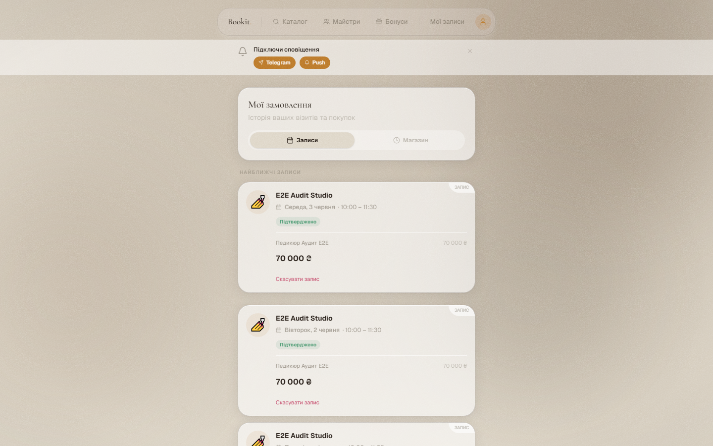
<!-- slide -->
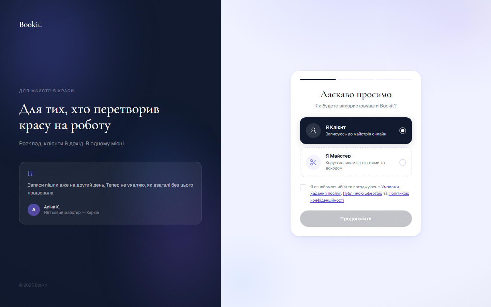
<!-- slide -->
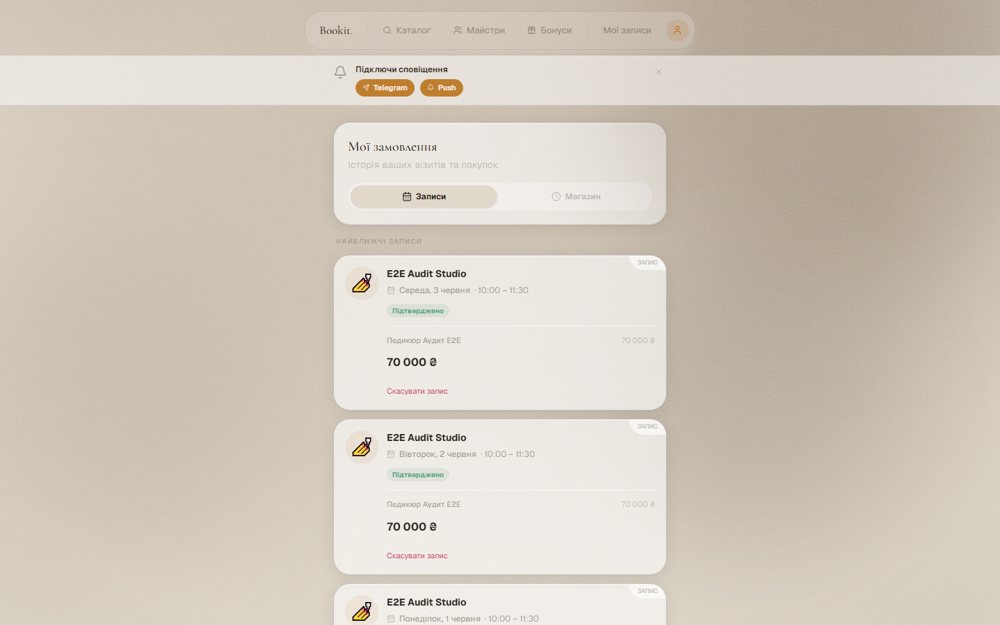
````

*Швидкі посилання на оригінали:* [🌸 Blossom](../screenshots/blossom/18-my/my-bookings-desktop-desktop.png) | [❄️ Frost](../screenshots/frost/18-my/my-bookings-desktop-desktop.png) | [🌲 Studio](../screenshots/studio/18-my/my-bookings-desktop-desktop.png)

#### 🖼️ Екран: My Bookings Mobile Mobile

````carousel

<!-- slide -->

<!-- slide -->
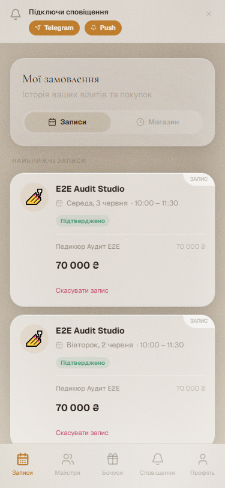
````

*Швидкі посилання на оригінали:* [🌸 Blossom](../screenshots/blossom/18-my/my-bookings-mobile-mobile.png) | [❄️ Frost](../screenshots/frost/18-my/my-bookings-mobile-mobile.png) | [🌲 Studio](../screenshots/studio/18-my/my-bookings-mobile-mobile.png)

#### 🖼️ Екран: My Loyalty Desktop Desktop

````carousel
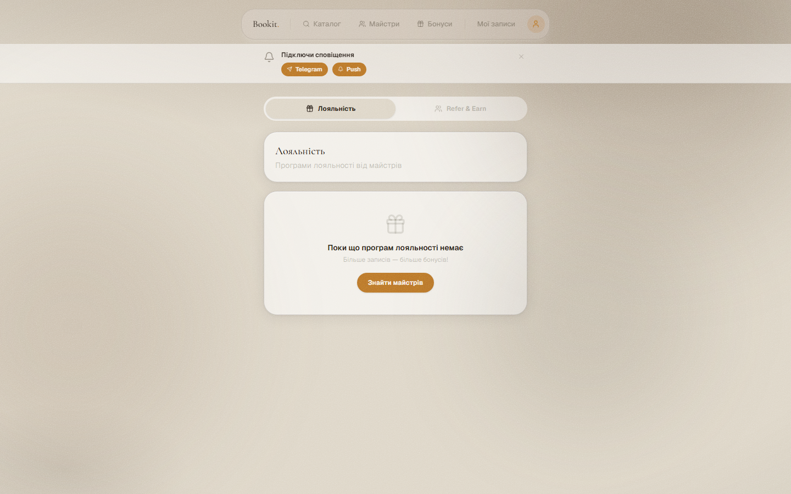
<!-- slide -->

<!-- slide -->

````

*Швидкі посилання на оригінали:* [🌸 Blossom](../screenshots/blossom/18-my/my-loyalty-desktop-desktop.png) | [❄️ Frost](../screenshots/frost/18-my/my-loyalty-desktop-desktop.png) | [🌲 Studio](../screenshots/studio/18-my/my-loyalty-desktop-desktop.png)

#### 🖼️ Екран: My Loyalty Mobile Mobile

````carousel
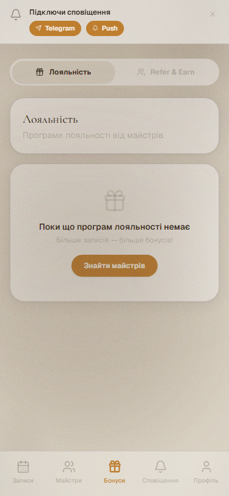
<!-- slide -->

<!-- slide -->
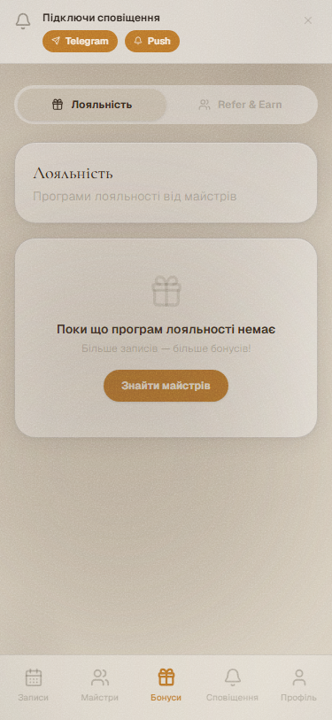
````

*Швидкі посилання на оригінали:* [🌸 Blossom](../screenshots/blossom/18-my/my-loyalty-mobile-mobile.png) | [❄️ Frost](../screenshots/frost/18-my/my-loyalty-mobile-mobile.png) | [🌲 Studio](../screenshots/studio/18-my/my-loyalty-mobile-mobile.png)

#### 🖼️ Екран: My Masters Desktop Desktop

````carousel
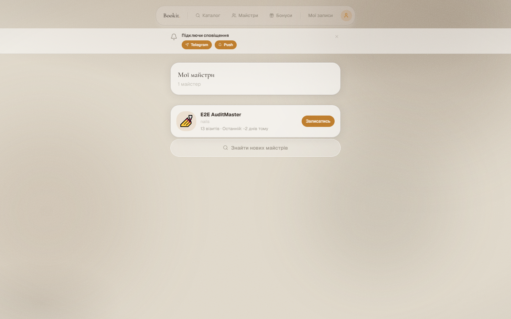
<!-- slide -->

<!-- slide -->

````

*Швидкі посилання на оригінали:* [🌸 Blossom](../screenshots/blossom/18-my/my-masters-desktop-desktop.png) | [❄️ Frost](../screenshots/frost/18-my/my-masters-desktop-desktop.png) | [🌲 Studio](../screenshots/studio/18-my/my-masters-desktop-desktop.png)

#### 🖼️ Екран: My Masters Mobile Mobile

````carousel
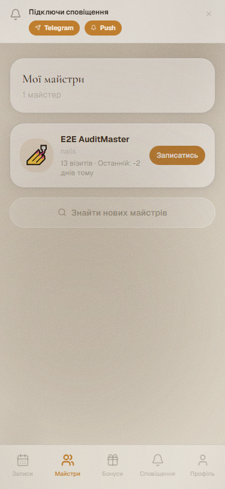
<!-- slide -->
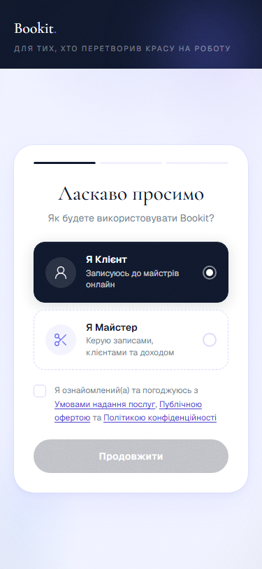
<!-- slide -->

````

*Швидкі посилання на оригінали:* [🌸 Blossom](../screenshots/blossom/18-my/my-masters-mobile-mobile.png) | [❄️ Frost](../screenshots/frost/18-my/my-masters-mobile-mobile.png) | [🌲 Studio](../screenshots/studio/18-my/my-masters-mobile-mobile.png)

#### 🖼️ Екран: My Notifications Desktop Desktop

````carousel
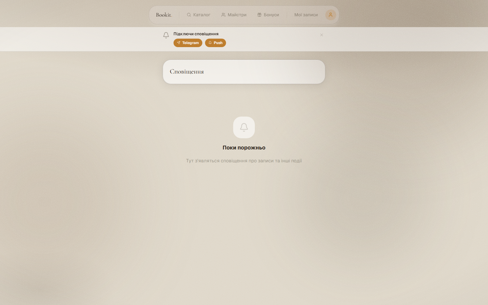
<!-- slide -->

<!-- slide -->

````

*Швидкі посилання на оригінали:* [🌸 Blossom](../screenshots/blossom/18-my/my-notifications-desktop-desktop.png) | [❄️ Frost](../screenshots/frost/18-my/my-notifications-desktop-desktop.png) | [🌲 Studio](../screenshots/studio/18-my/my-notifications-desktop-desktop.png)

#### 🖼️ Екран: My Notifications Mobile Mobile

````carousel
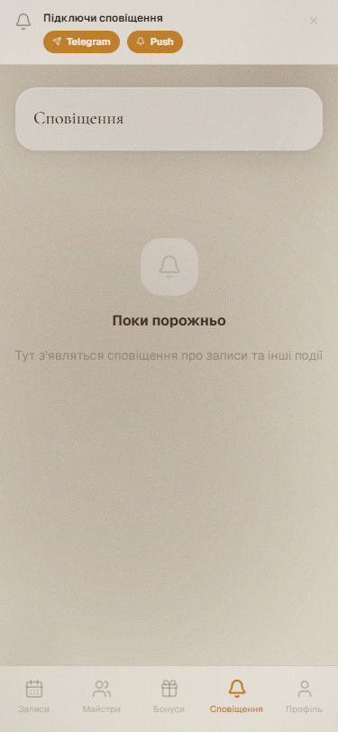
<!-- slide -->

<!-- slide -->

````

*Швидкі посилання на оригінали:* [🌸 Blossom](../screenshots/blossom/18-my/my-notifications-mobile-mobile.png) | [❄️ Frost](../screenshots/frost/18-my/my-notifications-mobile-mobile.png) | [🌲 Studio](../screenshots/studio/18-my/my-notifications-mobile-mobile.png)

#### 🖼️ Екран: My Profile Desktop Desktop

````carousel
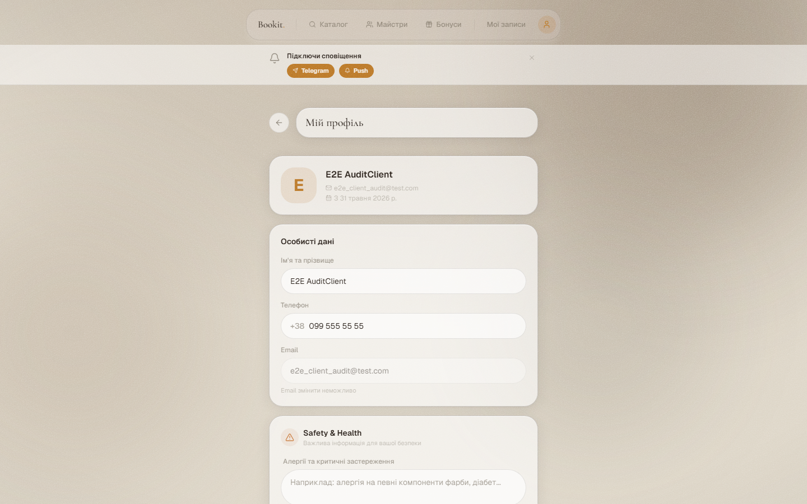
<!-- slide -->

<!-- slide -->
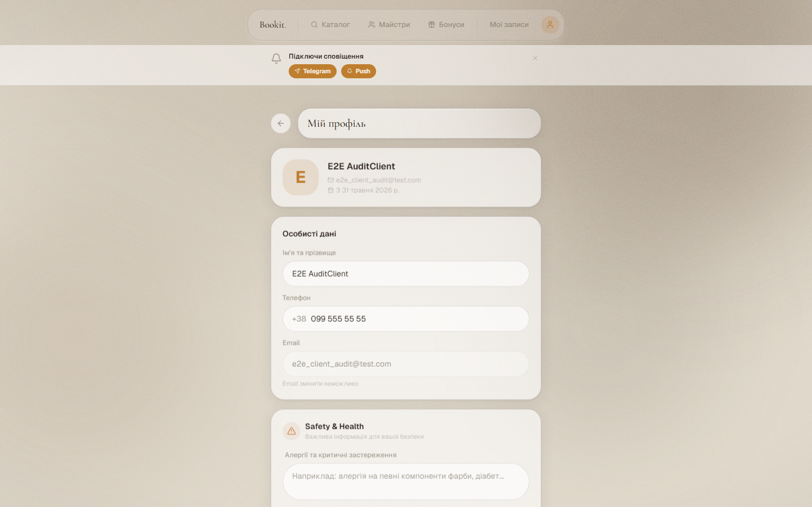
````

*Швидкі посилання на оригінали:* [🌸 Blossom](../screenshots/blossom/18-my/my-profile-desktop-desktop.png) | [❄️ Frost](../screenshots/frost/18-my/my-profile-desktop-desktop.png) | [🌲 Studio](../screenshots/studio/18-my/my-profile-desktop-desktop.png)

#### 🖼️ Екран: My Profile Form Desktop

````carousel
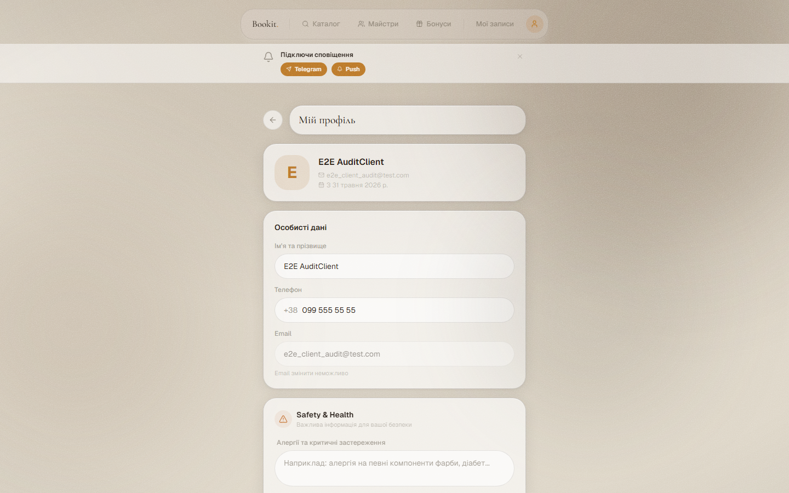
<!-- slide -->

<!-- slide -->
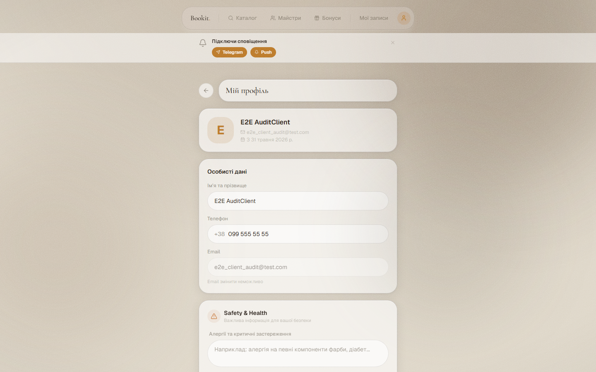
````

*Швидкі посилання на оригінали:* [🌸 Blossom](../screenshots/blossom/18-my/my-profile-form-desktop.png) | [❄️ Frost](../screenshots/frost/18-my/my-profile-form-desktop.png) | [🌲 Studio](../screenshots/studio/18-my/my-profile-form-desktop.png)

#### 🖼️ Екран: My Profile Mobile Mobile

````carousel
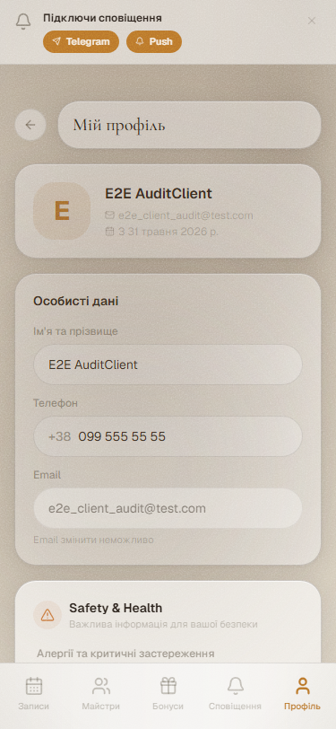
<!-- slide -->

<!-- slide -->
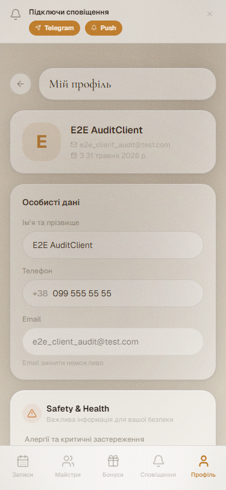
````

*Швидкі посилання на оригінали:* [🌸 Blossom](../screenshots/blossom/18-my/my-profile-mobile-mobile.png) | [❄️ Frost](../screenshots/frost/18-my/my-profile-mobile-mobile.png) | [🌲 Studio](../screenshots/studio/18-my/my-profile-mobile-mobile.png)

