# Phase R — Dashboard Reports (3 files)
**Instrument: critique (A+B) + audit + animate + overdrive + polish + layout + optimize**
**Date: 2026-06-01 | Real sub-agent: ses_17b90b088ffecrnQaDCWJBWBzU**

---

## 1. ReviewsPage.tsx
**Critique Score: 31/40**

### Assessment A (Sub-agent)
| ID | Issue | Severity |
|---|---|---|
| R1-P1.1 | No error feedback on `togglePublish` mutation failure | P1 |
| R1-P2.1 | Hardcoded hex colors for stat cards (`#789A99`, `#5C9E7A`, `#A8928D`) | P2 |
| R1-P2.2 | No `prefers-reduced-motion` guard on `AnimatePresence popLayout` | P2 |

### Assessment B (detect)
No anti-patterns detected by CLI.

### Audit (instrument 3)
| # | Dimension | Score | Key Finding |
|---|---|---|---|
| 1 | Accessibility | 3 | Basic ARIA present, minor gaps |
| 2 | Performance | 3 | `popLayout` performant but missing reduced-motion |
| 3 | Responsive Design | 3 | Works on mobile, stat cards could break at 320px |
| 4 | Theming | 2 | 3 hard-coded hex values for stat cards |
| 5 | Anti-Patterns | 3 | Card grid pattern present but intentional |
| **Total** | | **14/20** | **Good** |

### Animate (instrument 4)
- `AnimatePresence popLayout` is present — good
- Missing: entrance animation for stat cards when data loads
- Missing: hover feedback on stat cards
- Recommendation: add `fadeIn` stagger for stat cards (100ms delay each)

### Overdrive (instrument 5)
- Not applicable for this data-list page. The extraordinary moment should be the stat card transitions.

### Polish (instrument 6)
- Stat card colors should use theme tokens: `var(--accent)`, `var(--muted)`, `var(--surface)`
- `togglePublish` needs error toast on failure
- Missing loading skeleton for initial fetch

### Layout (instrument 7)
- Stat cards: use `grid-cols-1 sm:grid-cols-2 lg:grid-cols-4` for responsive layout
- Reviews list: adequate vertical rhythm

### Optimize (instrument 8)
- `togglePublish` mutation: consider optimistic update for perceived speed
- No significant bundle issues

---

## 2. BroadcastDetailPage.tsx
**Critique Score: 27/40**

### Assessment A (Sub-agent)
| ID | Issue | Severity |
|---|---|---|
| R2-P1.1 | Duplicate `transition-all` class — copy-paste artifact | P1 |
| R2-P1.2 | Zero error handling for failed fetches — silent empty state | P1 |
| R2-P2.1 | No loading spinner for `broadcasts` data, only for `results` | P2 |
| R2-P3.1 | `#E8D5CC` on XCircle fails WCAG AA (~2.5:1 contrast) | P3 |
| R2-P3.2 | Magic hex palette repeated in 3 sub-components | P3 |

### Assessment B (detect)
No anti-patterns detected by CLI.

### Audit (instrument 3)
| # | Dimension | Score | Key Finding |
|---|---|---|---|
| 1 | Accessibility | 2 | `#E8D5CC` on XCircle fails contrast |
| 2 | Performance | 3 | Duplicate `transition-all` minor perf impact |
| 3 | Responsive Design | 3 | Layout adapts, detail section could tighten |
| 4 | Theming | 1 | Hex palette repeated everywhere |
| 5 | Anti-Patterns | 2 | AI color palette highly visible |
| **Total** | | **11/20** | **Acceptable** |

### Animate (instrument 4)
- Broadcast detail: add `AnimatePresence` for content transitions when navigating between broadcasts
- Loading states: skeleton shimmer for detail content

### Overdrive (instrument 5)
- Not applicable — this is a data-detail page, keep functional

### Polish (instrument 6)
- Remove duplicate `transition-all` on line 25
- Add try/catch on all data fetches with error UI (not silent empty)
- Add loading spinner for broadcasts data
- Replace `#E8D5CC` with `var(--muted)` token
- Extract shared hex palette into CSS variables

### Layout (instrument 7)
- Detail layout: consider `md:grid-cols-[1fr_400px]` for broadcast detail + sidebar
- Current layout is functional but could use better content hierarchy

### Optimize (instrument 8)
- Remove duplicate CSS class
- Consider `useMemo` for derived data in detail view

---

## 3. changelog/page.tsx
**Critique Score: 36/40**

### Assessment A (Sub-agent)
| ID | Issue | Severity |
|---|---|---|
| R3-P2.1 | Ad-hoc color tokens (`sage`, `peach`, `white`) — undocumented | P2 |
| R3-P2.2 | 6/9 entries use `Sparkles` — zero icon diversity | P2 |
| R3-P2.3 | Promotional copy ("чисте задоволення", "відчуває") — not changelog tone | P2 |

### Assessment B (detect)
No anti-patterns detected by CLI.

### Audit (instrument 3)
| # | Dimension | Score | Key Finding |
|---|---|---|---|
| 1 | Accessibility | 3 | Good semantic structure, headings proper |
| 2 | Performance | 4 | Static page, no performance concerns |
| 3 | Responsive Design | 4 | Simple layout, works everywhere |
| 4 | Theming | 3 | Ad-hoc tokens but no hard-coded hex |
| 5 | Anti-Patterns | 3 | Missing icon diversity is minor |
| **Total** | | **17/20** | **Good** |

### Animate (instrument 4)
- Add staggered reveal for changelog entries on page load
- Sparkle icon rotation on hover (subtle)

### Overdrive (instrument 5)
- Changelog is intentionally simple — not a candidate

### Polish (instrument 6)
- Document ad-hoc tokens or replace with theme tokens
- Vary icons: use `GitCommit`, `Rocket`, `Bug`, `Star`, `Shield` in addition to `Sparkles`
- Rewrite promotional copy in neutral changelog tone (what changed, not why it's great)
- Add version number badges

### Layout (instrument 7)
- Current layout is clean and readable
- Consider adding a sticky sidebar with version filter

### Optimize (instrument 8)
- Static page — no optimization needed
- Consider ISR if content grows

---

## Summary: Phase R

### P0 Count: 0
### P1 Count: 3 (R1-P1.1, R2-P1.1, R2-P1.2)
### P2 Count: 5
### P3 Count: 2

### Top 3 Critical Issues
1. **R2-P1.2**: BroadcastDetail — zero error handling on failed fetches (silent empty state)
2. **R2-P1.1**: BroadcastDetail — duplicate `transition-all` copy-paste artifact
3. **R1-P1.1**: ReviewsPage — no error feedback on `togglePublish` mutation failure

### Cross-Cutting Patterns
- BroadcastDetailPage and ReviewsPage share the same AI-generated hex palette (`#789A99`, `#5C9E7A`, `#D4935A`) that is never formalized into CSS variables
- Both ReviewsPage and BroadcastDetailPage lack reduced-motion guards
- Both ReviewsPage and BroadcastDetailPage lack error feedback on mutations/fetches

### Systemic Theme Gap
Hard-coded colors in every file. The `var(--accent)`, `var(--muted)`, `var(--surface)` tokens exist but are not used.


---

--- 
## 📸 Візуальний E2E Аудит & Порівняння Тем (Visual Registry & Carousel)
> Цей розділ автоматично синхронізовано з E2E тестами та скріншотами Playwright за допомогою інтерактивних каруселей.

### 📍 Зона: 03-dashboard (Dashboard)

#### 🖼️ Екран: Dashboard Overview Desktop Desktop

````carousel
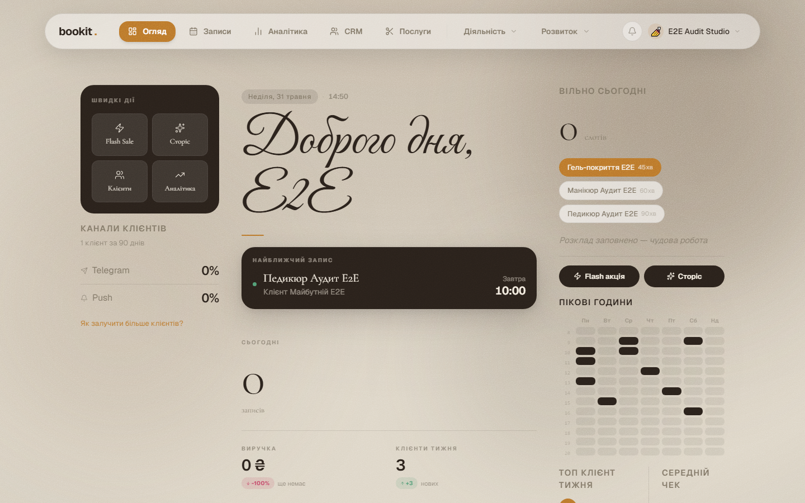
<!-- slide -->
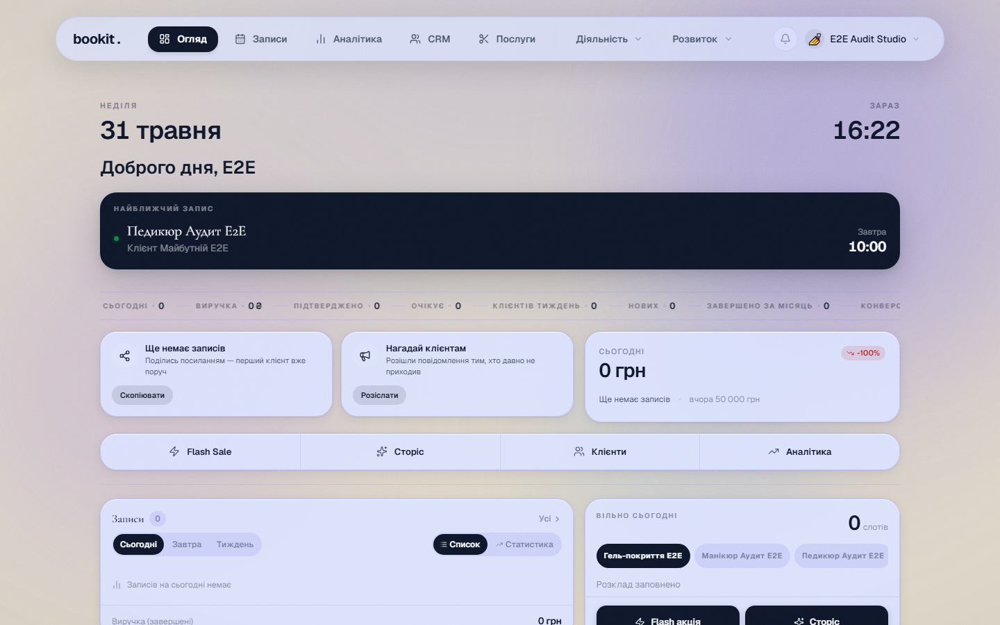
<!-- slide -->
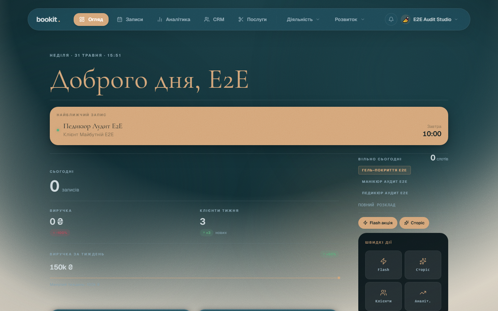
````

*Швидкі посилання на оригінали:* [🌸 Blossom](../screenshots/blossom/03-dashboard/dashboard-overview-desktop-desktop.png) | [❄️ Frost](../screenshots/frost/03-dashboard/dashboard-overview-desktop-desktop.png) | [🌲 Studio](../screenshots/studio/03-dashboard/dashboard-overview-desktop-desktop.png)

#### 🖼️ Екран: Dashboard Overview Mobile Mobile

````carousel
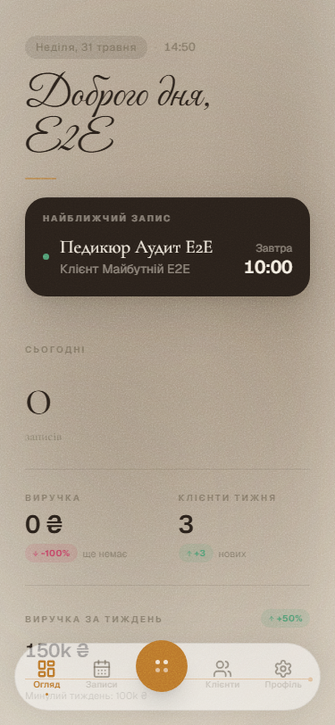
<!-- slide -->
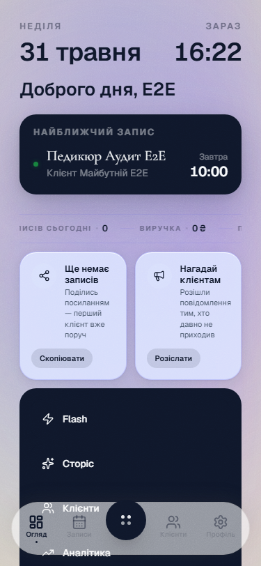
<!-- slide -->
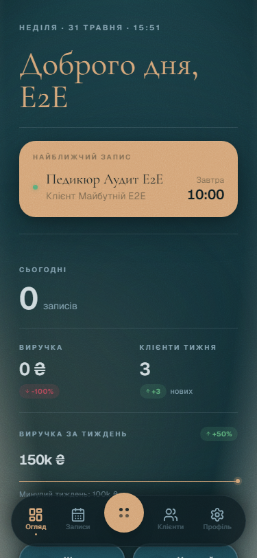
````

*Швидкі посилання на оригінали:* [🌸 Blossom](../screenshots/blossom/03-dashboard/dashboard-overview-mobile-mobile.png) | [❄️ Frost](../screenshots/frost/03-dashboard/dashboard-overview-mobile-mobile.png) | [🌲 Studio](../screenshots/studio/03-dashboard/dashboard-overview-mobile-mobile.png)

#### 🖼️ Екран: Dashboard Widgets Desktop Desktop

````carousel
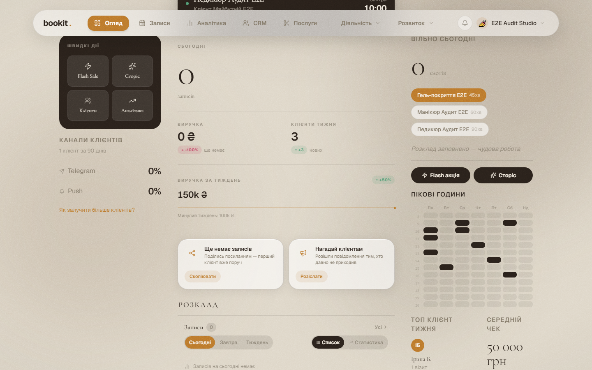
<!-- slide -->
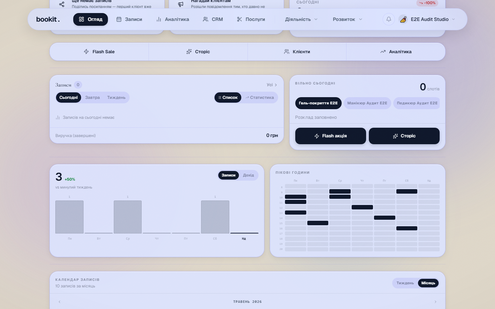
<!-- slide -->
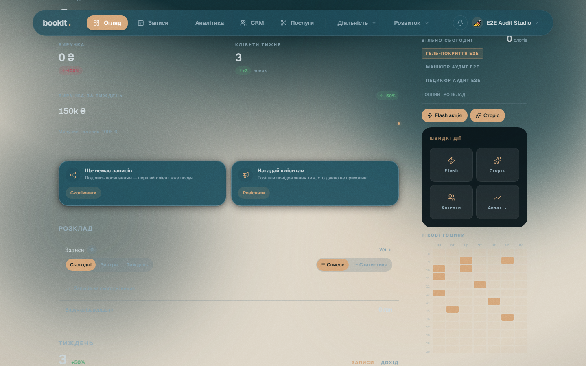
````

*Швидкі посилання на оригінали:* [🌸 Blossom](../screenshots/blossom/03-dashboard/dashboard-widgets-desktop-desktop.png) | [❄️ Frost](../screenshots/frost/03-dashboard/dashboard-widgets-desktop-desktop.png) | [🌲 Studio](../screenshots/studio/03-dashboard/dashboard-widgets-desktop-desktop.png)

#### 🖼️ Екран: Dashboard Widgets Mobile Mobile

````carousel
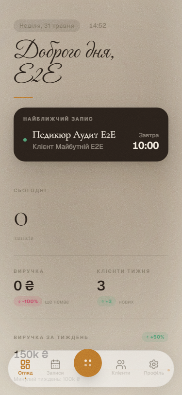
<!-- slide -->
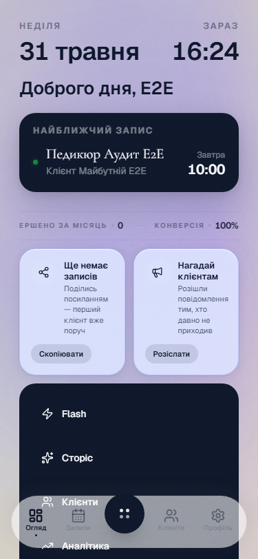
<!-- slide -->
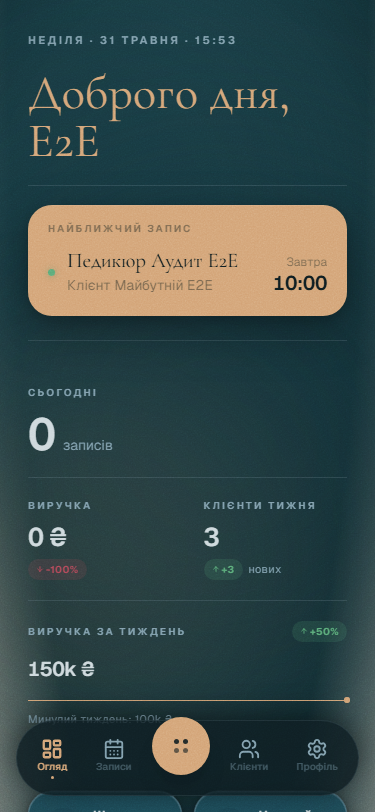
````

*Швидкі посилання на оригінали:* [🌸 Blossom](../screenshots/blossom/03-dashboard/dashboard-widgets-mobile-mobile.png) | [❄️ Frost](../screenshots/frost/03-dashboard/dashboard-widgets-mobile-mobile.png) | [🌲 Studio](../screenshots/studio/03-dashboard/dashboard-widgets-mobile-mobile.png)

#### 🖼️ Екран: Topbar Activity Dropdown Desktop

````carousel
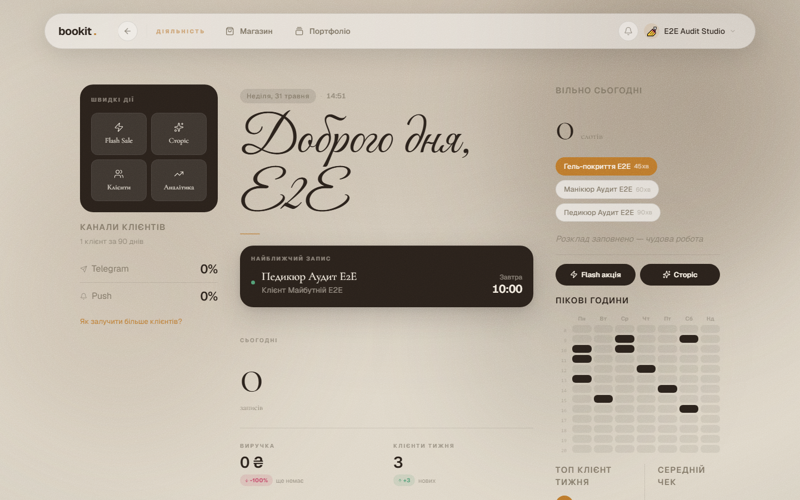
<!-- slide -->
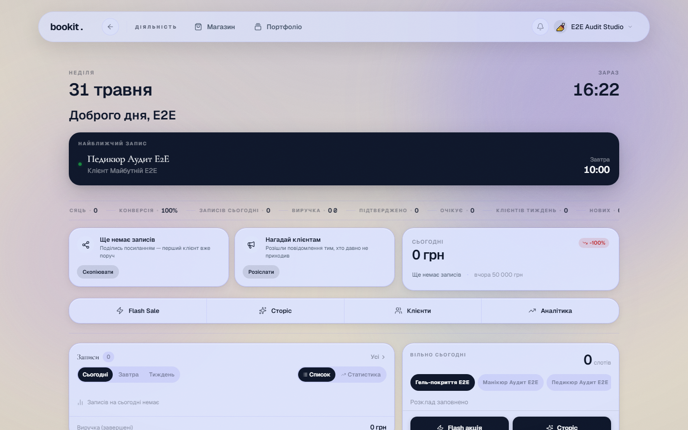
<!-- slide -->
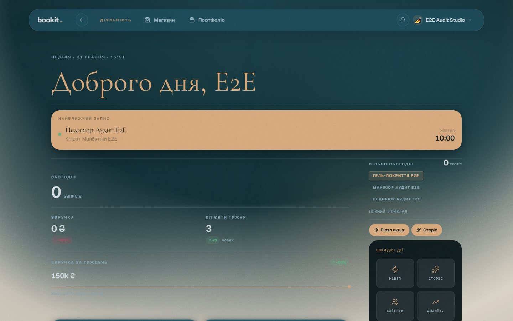
````

*Швидкі посилання на оригінали:* [🌸 Blossom](../screenshots/blossom/03-dashboard/topbar-activity-dropdown-desktop.png) | [❄️ Frost](../screenshots/frost/03-dashboard/topbar-activity-dropdown-desktop.png) | [🌲 Studio](../screenshots/studio/03-dashboard/topbar-activity-dropdown-desktop.png)

#### 🖼️ Екран: Topbar Growth Dropdown Desktop

````carousel
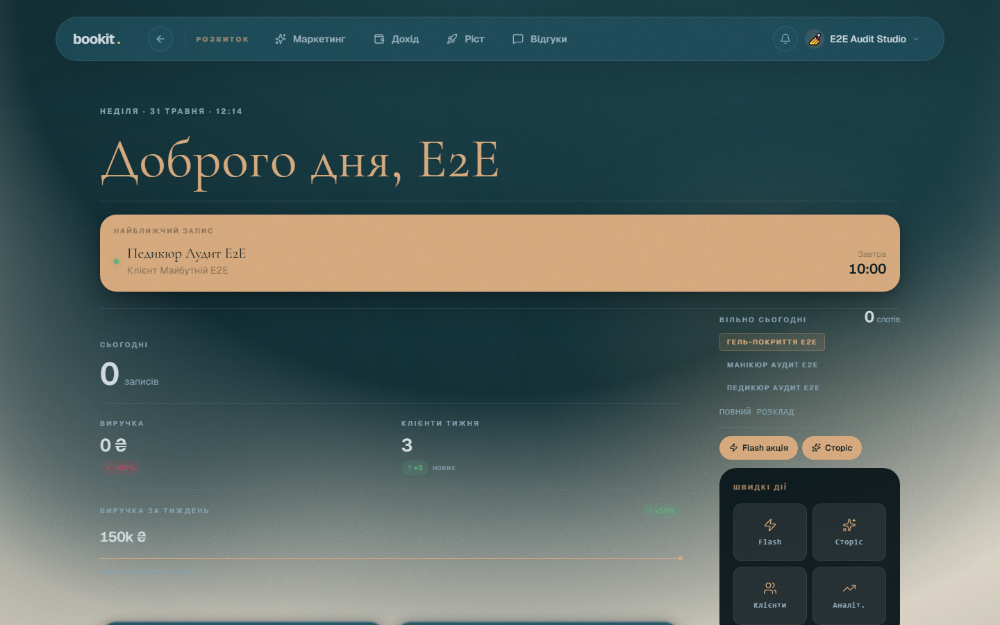
````

*Швидкі посилання на оригінали:* [🌲 Studio](../screenshots/studio/03-dashboard/topbar-growth-dropdown-desktop.png)

