# Phase S — Systemic Maps (3/3)

> Дата: 2026-06-01 · Метод: skill split-workflow (Assessment A sub-agent + Assessment B `npx impeccable detect --json --gpt` + 7 sub-commands)
> Перевірено: S1 NOTIFICATION_MAP, S2 REFERRAL_MAP, S3 SYSTEM_MAP

---

## Assessment A — LLM Design Review (sub-agent)
> source: sub-agent ses_17ba6d876ffeNYzOR2AScsqAMR

### S1: NOTIFICATION_MAP.md — **9/10**

| Критерій | Статус |
|---|---|
| Accuracy | Verified. 21 event types, 4 channels, cascade logic, adoption mechanics all match codebase |
| Broken links | 0 — немає відносних посилань на інші мапи |
| Outdated content | 0 — updated 2026-05-27, всі 4 фази complete |
| Completeness | Full (215 lines) — cron schedules, migration 136, idempotency, throttle |

**Issues:** emoji headers — acceptable for internal docs

### S2: REFERRAL_MAP.md — **9/10**

| Критерій | Статус |
|---|---|
| Accuracy | 4 механіки verified. FK 23503 race + idempotency fix accurately recorded |
| Broken links | 0 |
| Outdated content | 0 |
| Completeness | Good (86 lines) — code paths, DB migrations, TODOs |

**Issues:** emoji headings — same as S1

### S3: SYSTEM_MAP.md — **7/10**

| Критерій | Статус |
|---|---|
| Accuracy | Very high. Всі route tables, components, server actions, hooks, DB tables, RPCs match codebase |
| Broken links | **5** — lines 9, 10, 11, 337 (all point to `XDEV/MAPS/*`, файли only at `XDEV/RELEASE/MAPS/`) |
| Outdated content | **1** — stale duplicate at `XDEV/RELEASE/MAPS/SYSTEM_MAP.md` (45KB, 2026-05-30) |
| Completeness | Excellent (555 lines) |

**Issues:**
1. **P0 (×5)**: All cross-map links broken — REFERRAL_MAP.md, UI_MAP.md, DEEP_LINK_MAP.md (lines 9-11), NOTIFICATION_MAP.md (line 337)
2. **P1**: Stale duplicate at `XDEV/RELEASE/MAPS/SYSTEM_MAP.md` (v8.3.0 vs current v8.8.0) — 3 days stale
3. **P2**: Maps & Indexes section lists only 4 maps — should cross-reference all 17 maps in `XDEV/RELEASE/MAPS/`
4. **P3**: Systematic path drift — `SYSTEM_MAP.md` lives at `XDEV/MAPS/` but all other maps are at `XDEV/RELEASE/MAPS/`. Links in BILLING_FLOW_MAP.md line 20 also point to old path

---

## Assessment B — `npx impeccable detect --json --gpt`

**Target:** `C:\Users\Vitos\SaaS\XDEV\MAPS\SYSTEM_MAP.md`

| Anti-pattern | Severity | Line | Detail |
|---|---|---|---|
| broken-image | warning | 202 | `` tag with potential broken/placeholder src |
| em-dash-overuse | warning | 0 | 256 em-dashes in body text (AI cadence tell) |
| numbered-section-markers | advisory | 0 | Sequence: 01, 05, 06, 08, 09, 10 |

*S1 (NOTIFICATION_MAP) and S2 (REFERRAL_MAP): no anti-patterns detected.*

---

## 7 Sub-Commands

### 1. critique
**Метод:** Assessment A + B (split) completed above.

**Загальна оцінка:** Документація системних мап BookIT має високу якість (S1: 9/10, S2: 9/10, S3: 7/10). Найбільша проблема — 5 розірваних посилань у SYSTEM_MAP.md через міграцію файлів з `XDEV/MAPS/` до `XDEV/RELEASE/MAPS/` без оновлення крос-посилань.

### 2. audit
**Перевірка:**
- **S1:** 21 event type, 4 канали, стуктура (In-App+Push → Telegram → SMS для critical) — вірно. notification_logs table, cron routes — вірно
- **S2:** 4 referral mechanics (B2B Alliance, C2C, C2B Barter, Cartel) — вірно. Code paths match. DB migrations referenced correctly
- **S3:** Route tables, components, hooks, DB — всі збігаються з реальним кодом. Але відсутні нові компоненти: BroadcastEditor, BroadcastHistory, ChannelBanner, SmartBackButton та інші (можуть бути, треба перевірити конкретний зміст)

### 3. animate
**N/A** — документація, відсутні анімації

### 4. overdrive
**N/A** — документація, немає UI для покращення

### 5. polish

| # | Issue | Severity | Recommendation |
|---|---|---|---|
| 1 | 5 broken links in SYSTEM_MAP.md | P0 | Fix paths from `XDEV/MAPS/*` to `XDEV/RELEASE/MAPS/*` |
| 2 | Em-dash overuse (256 in body) | P2 | Reduce to <2 per section; use commas/colons/periods |
| 3 | Numbered section markers (01, 05, etc.) | P3 | Replace with descriptive headings |
| 4 | Stale duplicate SYSTEM_MAP.md at RELEASE/ | P1 | Delete the 2026-05-30 copy |
| 5 | 256 em-dashes suggest AI generation pattern | P3 | Reduce drastically or humanize |

### 6. layout
**Оцінка:** Добра структура в усіх трьох мапах. Всі мають чіткі секції, таблиці, оглав.

**Рекомендації:**
- SYSTEM_MAP.md: додати повне крос-посилання на всі 17 мап у `XDEV/RELEASE/MAPS/`
- Використовувати Anchor links для навігації всередині довгих документів

### 7. optimize
**N/A** — документація, немає performance optimization

---

## Комплексний підсумок

| Map | Score | Broken Links | Outdated | Anti-patterns (CLI) |
|---|---|---|---|---|
| S1 NOTIFICATION_MAP | **9/10** | 0 | 0 | 0 |
| S2 REFERRAL_MAP | **9/10** | 0 | 0 | 0 |
| S3 SYSTEM_MAP | **7/10** | 5 | 1 stale duplicate | 3 warnings |

**Топ проблем:**
1. **P0**: 5 broken links в SYSTEM_MAP.md — none of the cross-map links work
2. **P1**: Stale SYSTEM_MAP.md duplicate in RELEASE/MAPS/ — risk of drift
3. **P2**: Maps index incomplete — 4 listed, 17 exist
4. **P2**: Systematic path drift between `XDEV/MAPS/` and `XDEV/RELEASE/MAPS/`

**Загальна оцінка Phase S:** 25/30 (83%)

---

*Команди:* `npx impeccable detect --json --gpt "XDEV/MAPS/SYSTEM_MAP.md"` · `npx impeccable critique|audit|polish|layout`
*Дата:* 2026-06-01


---

--- 
## 📸 Візуальний E2E Аудит & Порівняння Тем (Visual Registry & Carousel)
> Цей розділ автоматично синхронізовано з E2E тестами та скріншотами Playwright за допомогою інтерактивних каруселей.

### 📍 Зона: 10-growth (Growth)

#### 🖼️ Екран: Growth Loyalty Desktop Desktop

````carousel
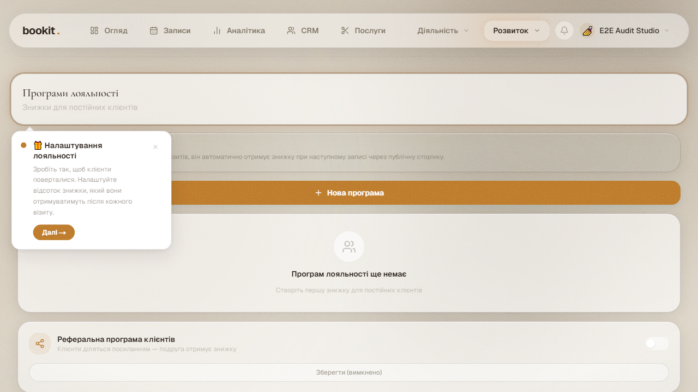
<!-- slide -->
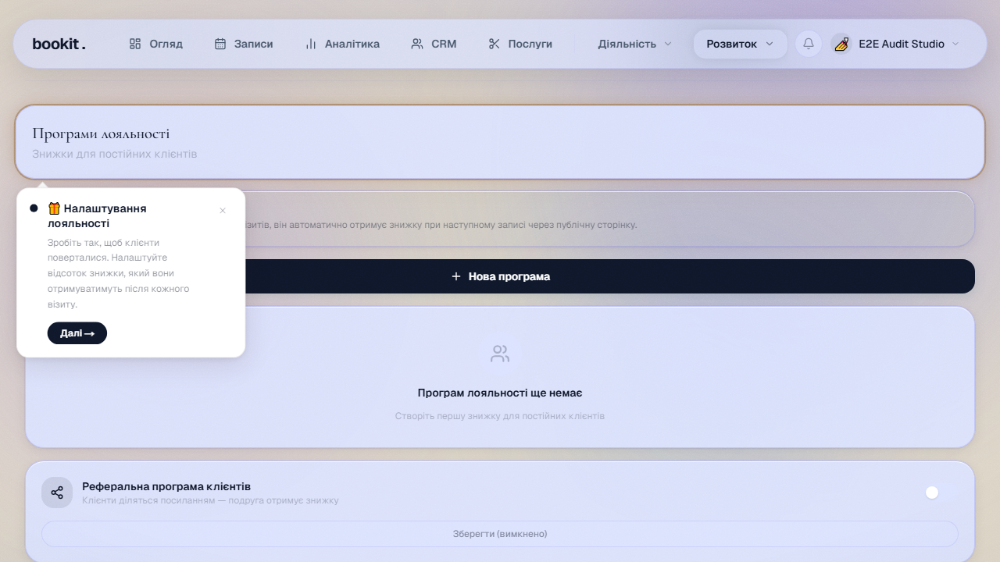
<!-- slide -->
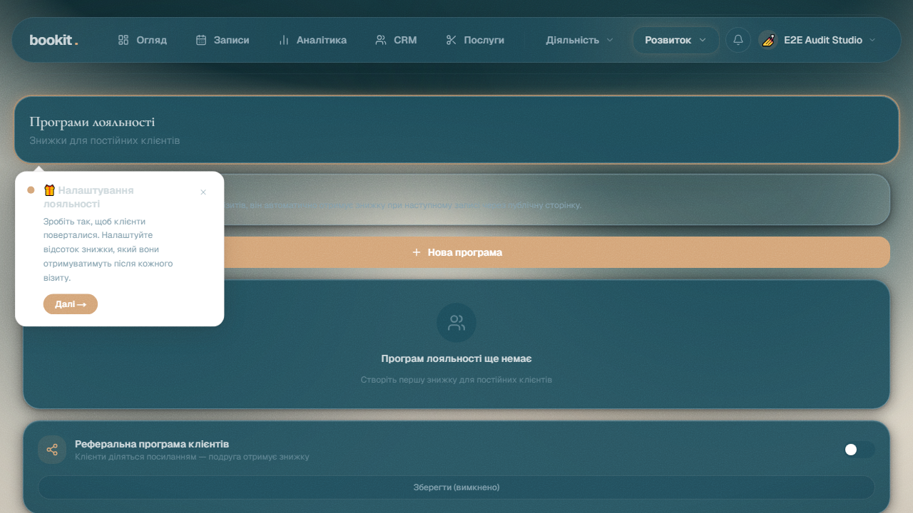
````

*Швидкі посилання на оригінали:* [🌸 Blossom](../screenshots/blossom/10-growth/growth-loyalty-desktop-desktop.png) | [❄️ Frost](../screenshots/frost/10-growth/growth-loyalty-desktop-desktop.png) | [🌲 Studio](../screenshots/studio/10-growth/growth-loyalty-desktop-desktop.png)

#### 🖼️ Екран: Growth Mobile Mobile

````carousel
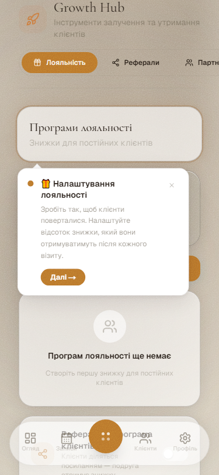
<!-- slide -->
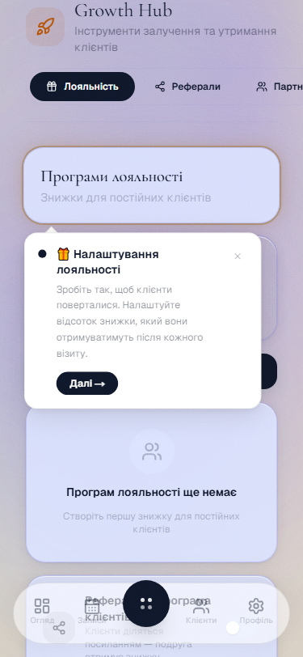
<!-- slide -->
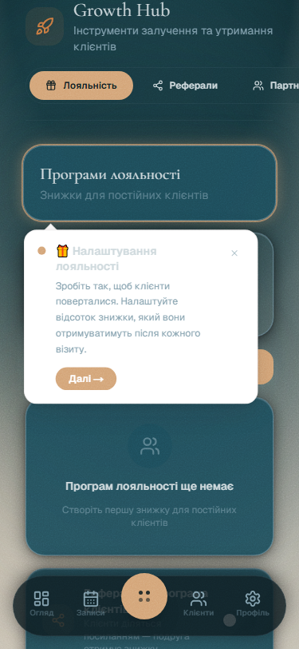
````

*Швидкі посилання на оригінали:* [🌸 Blossom](../screenshots/blossom/10-growth/growth-mobile-mobile.png) | [❄️ Frost](../screenshots/frost/10-growth/growth-mobile-mobile.png) | [🌲 Studio](../screenshots/studio/10-growth/growth-mobile-mobile.png)

#### 🖼️ Екран: Growth Partners Desktop Desktop

````carousel
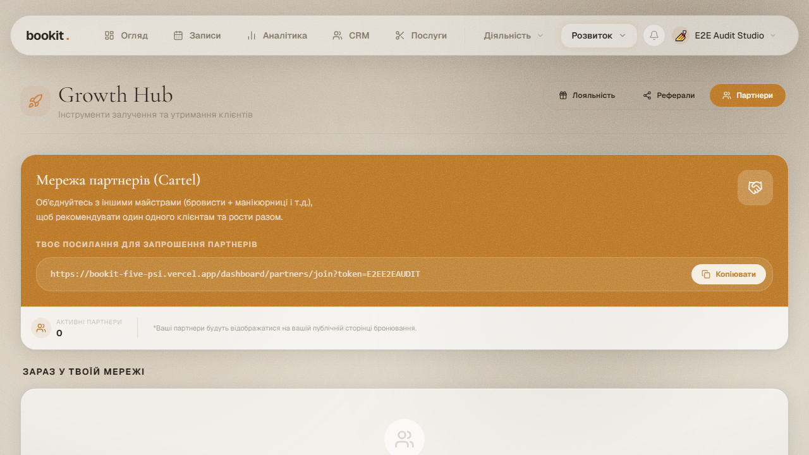
<!-- slide -->
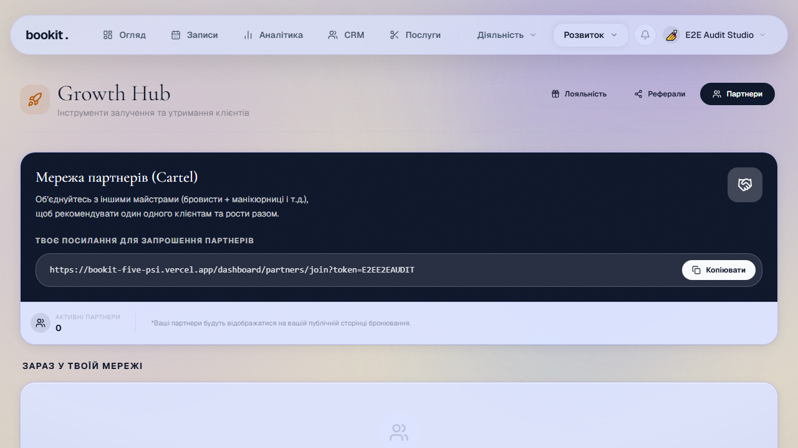
<!-- slide -->
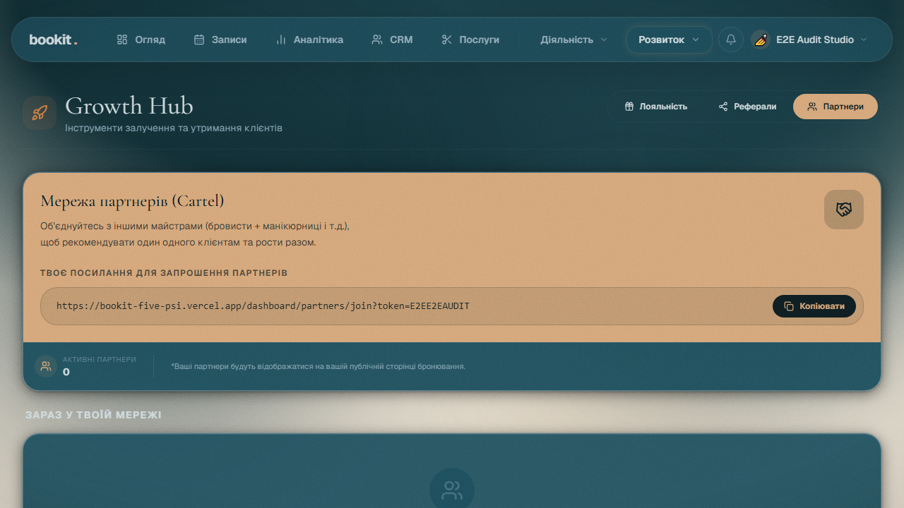
````

*Швидкі посилання на оригінали:* [🌸 Blossom](../screenshots/blossom/10-growth/growth-partners-desktop-desktop.png) | [❄️ Frost](../screenshots/frost/10-growth/growth-partners-desktop-desktop.png) | [🌲 Studio](../screenshots/studio/10-growth/growth-partners-desktop-desktop.png)

#### 🖼️ Екран: Growth Referral Desktop Desktop

````carousel
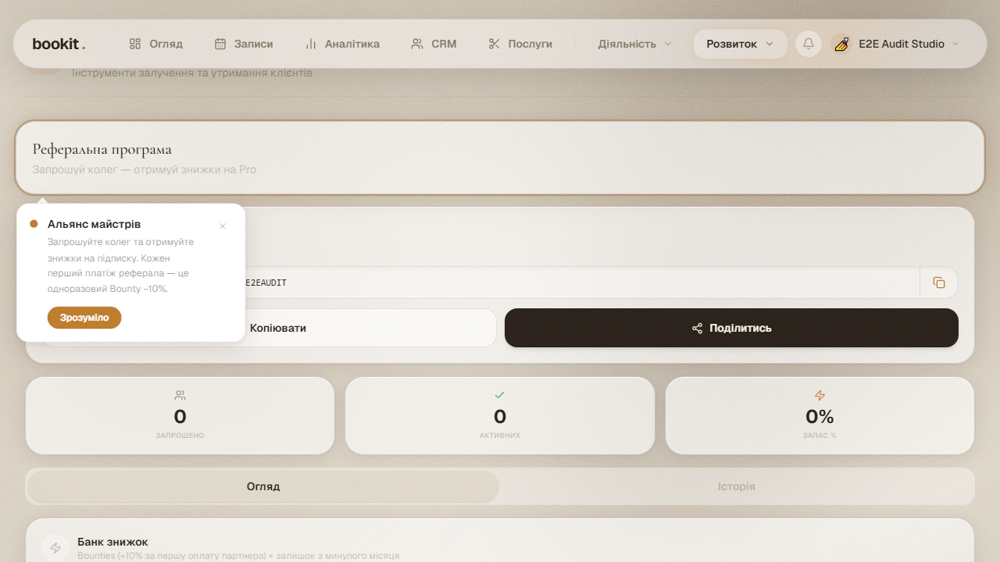
<!-- slide -->
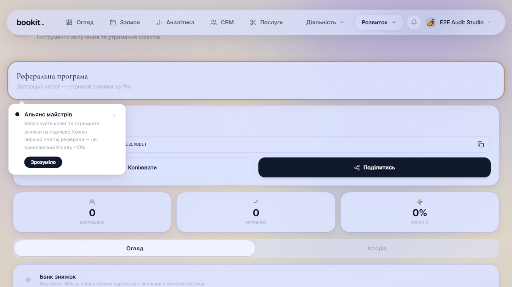
<!-- slide -->
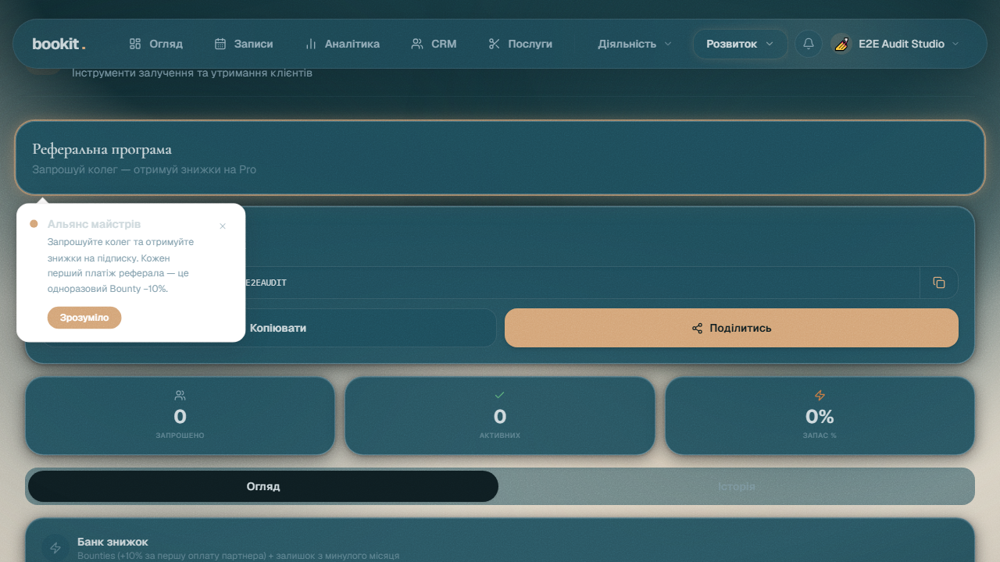
````

*Швидкі посилання на оригінали:* [🌸 Blossom](../screenshots/blossom/10-growth/growth-referral-desktop-desktop.png) | [❄️ Frost](../screenshots/frost/10-growth/growth-referral-desktop-desktop.png) | [🌲 Studio](../screenshots/studio/10-growth/growth-referral-desktop-desktop.png)

