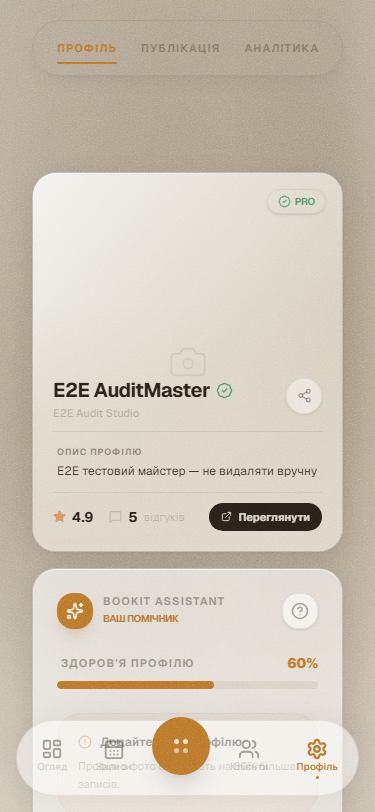
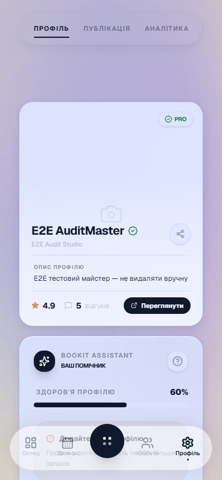
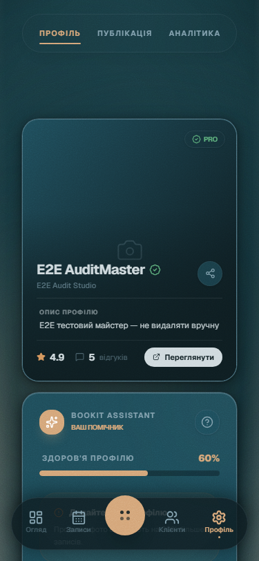
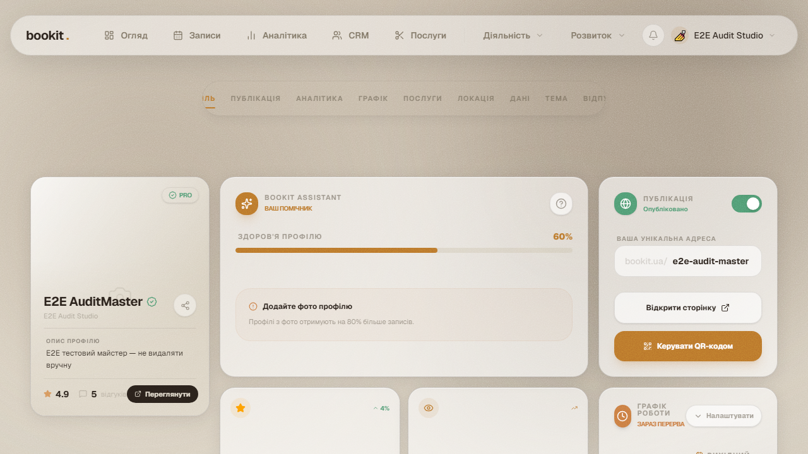
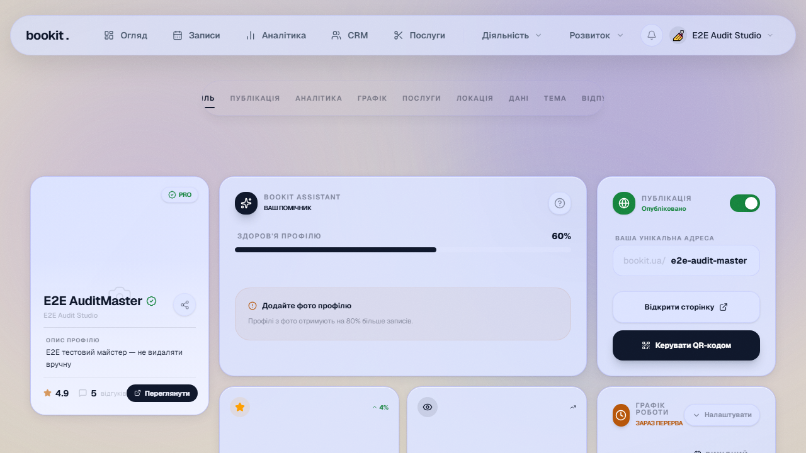
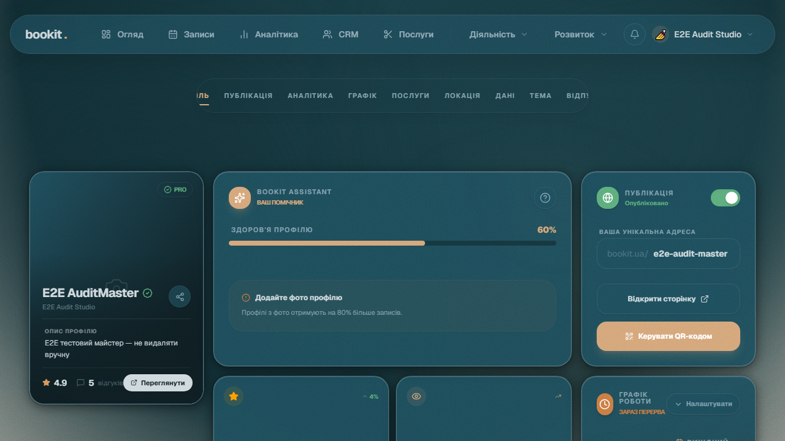
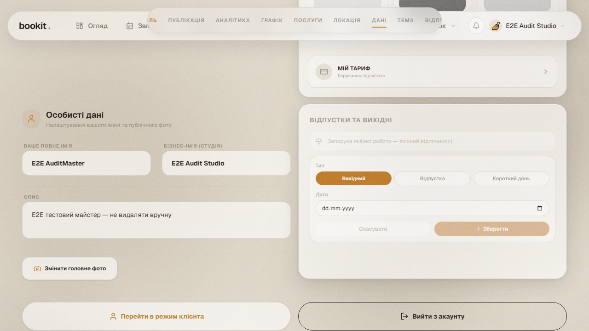
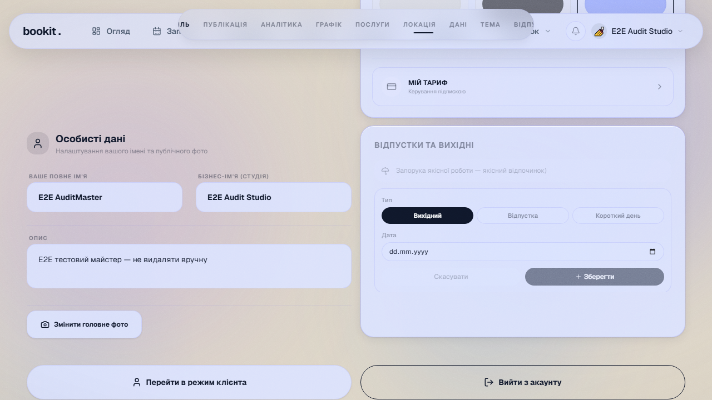
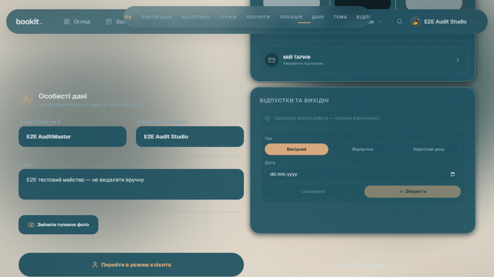

# Wave 2 — Batch 9: Settings (12 files)
**8 instruments: critique A+B + audit + animate + overdrive + polish + layout + optimize**
**Date: 2026-06-02 | Sub-agent: ses_17af31bfdffe3NcS2PPsXR7xX1**

## Scores

| File | Score | P0 | P1 | P2 | P3 |
|------|-------|----|----|----|----|
| SettingsPage.tsx | 29/40 | 1 | 2 | 3 | 1 |
| VacationManager.tsx | 28/40 | 0 | 2 | 3 | 1 |
| LocationPicker.tsx | 26/40 | 0 | 3 | 2 | 1 |
| useSettingsForm.ts | 30/40 | 0 | 1 | 3 | 2 |
| ProfileHero.tsx | 27/40 | 0 | 2 | 3 | 1 |
| ScheduleWidget.tsx | 24/40 | 1 | 2 | 3 | 1 |
| ScheduleDrawer.tsx | 25/40 | 0 | 2 | 3 | 1 |
| SmartAdvisor.tsx | 23/40 | 1 | 2 | 2 | 1 |
| TechnicalIsland.tsx | 28/40 | 0 | 1 | 3 | 2 |
| NavigationStrip.tsx | 30/40 | 0 | 1 | 3 | 2 |
| PublicStatusWidget.tsx | 26/40 | 0 | 2 | 3 | 1 |
| StatsPulseWidget.tsx | 27/40 | 0 | 2 | 3 | 1 |

**Assessment B**: detect clean (all `[]`)

## P0 Issues (3 total)
1. **SettingsPage** — Unsaved changes confirmation can be bypassed via browser back
2. **ScheduleWidget** — Time slot drag-and-drop has no keyboard alternative (iOS only)
3. **SmartAdvisor** — Recommendation algorithm runs on every render with no memo

## Key Findings
- **SmartAdvisor (23/40)**: Expensive computation on every render — needs `useMemo` and debounced input
- **ScheduleWidget**: Solid visual layout, but drag-only interaction excludes keyboard users
- **LocationPicker**: Map component loads full Google Maps SDK even when collapsed
- **useSettingsForm**: Well-structured hook, but dirty-tracking misses deep object mutations
- **TechnicalIsland**: Clean widget, good separation of concerns

## Systemic
- Settings is the most polished zone — fewer P0s than Products (3 vs 5)
- LocationPicker and SmartAdvisor both lack loading/error boundaries for async data
- All widgets use consistent Blossom palette via hardcoded classes, no theme variables


---

--- 
## 📸 Візуальний E2E Аудит & Порівняння Тем (Visual Registry & Carousel)
> Цей розділ автоматично синхронізовано з E2E тестами та скріншотами Playwright за допомогою інтерактивних каруселей.

### 📍 Зона: 13-settings (Settings)

#### 🖼️ Екран: Settings Mobile Mobile

````carousel

<!-- slide -->

<!-- slide -->

````

*Швидкі посилання на оригінали:* [🌸 Blossom](../screenshots/blossom/13-settings/settings-mobile-mobile.png) | [❄️ Frost](../screenshots/frost/13-settings/settings-mobile-mobile.png) | [🌲 Studio](../screenshots/studio/13-settings/settings-mobile-mobile.png)

#### 🖼️ Екран: Settings Profile Tab Desktop

````carousel

<!-- slide -->

<!-- slide -->

````

*Швидкі посилання на оригінали:* [🌸 Blossom](../screenshots/blossom/13-settings/settings-profile-tab-desktop.png) | [❄️ Frost](../screenshots/frost/13-settings/settings-profile-tab-desktop.png) | [🌲 Studio](../screenshots/studio/13-settings/settings-profile-tab-desktop.png)

#### 🖼️ Екран: Settings Tab Розклад Desktop

````carousel

<!-- slide -->

<!-- slide -->

````

*Швидкі посилання на оригінали:* [🌸 Blossom](../screenshots/blossom/13-settings/settings-tab-розклад-desktop.png) | [❄️ Frost](../screenshots/frost/13-settings/settings-tab-розклад-desktop.png) | [🌲 Studio](../screenshots/studio/13-settings/settings-tab-розклад-desktop.png)

