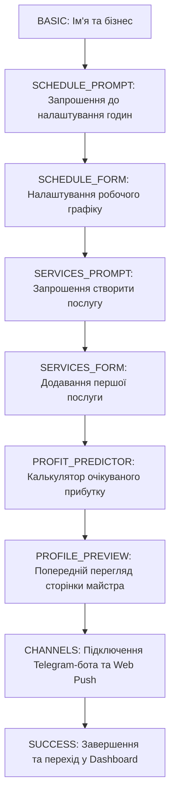

# 🚀 Master Onboarding Flow Map — BookIT

Цей документ визначає структуру, етапи онбордингу нового майстра, механізм збереження стану онбордингу та підключення каналів Telegram і Web Push.

---

## 🗺️ Кроки Онбордингу (State Transitions)

Процес первинного налаштування кабінету майстра складається з 9 послідовних кроків, реалізованих у [OnboardingWizard.tsx](file:///c:/Users/Vitossik/SaaS/bookit/src/app/onboarding/page.tsx) (було розширено з 3 до 4 основних етапів візуального прогресу):

### Деталі Кроків:
1.  **`BASIC`**: Майстер вказує `business_name`, `slug` для свого профілю та категорію діяльності.
2.  **`SCHEDULE_FORM`**: Встановлюються базові робочі години (`working_hours` JSONB) та вихідні дні.
3.  **`SERVICES_FORM`**: Створюється перша послуга (ціна, тривалість, категорія) для наповнення каталогу.
4.  **`PROFIT_PREDICTOR`**: Маркетинговий калькулятор, що візуалізує потенційний дохід майстра на основі його цін та очікуваної завантаженості.
5.  **`PROFILE_PREVIEW`**: Рендериться інтерактивне превью публічної сторінки `/[slug]`, щоб майстер побачив свій майбутній вигляд.
6.  **`CHANNELS`**: 
    *   Генерується Telegram Connect Token через `generateTelegramConnectToken()`.
    *   Майстер переходить за посиланням у Telegram бот для авторизації чату.
    *   Паралельно запитується дозвіл на Web Push підписку.
7.  **`SUCCESS`**: Завершення онбордингу, скидання стану та редирект в `/dashboard`.

---

## 💾 Збереження та відновлення стану (Persistence)

Стан онбордингу зберігається після кожного успішного кроку, що дозволяє користувачу закрити вкладку та продовжити з того самого місця.

### Реалізація:
*   **Server Action**: `saveOnboardingProgress(step: string, data: any)`
*   **Схема збереження в DB**:
    *   Поточний крок записується в `profiles.onboarding_step`.
    *   Проміжний JSON-стан записується в `profiles.onboarding_data` (зберігає тимчасові дані форми, вибраний розклад та створену послугу).
*   **Рев'ю стану при завантаженні**:
    Компонент `src/app/onboarding/page.tsx` при монтуванні читає `onboarding_step` з бази. Якщо крок дорівнює `completed`, майстер автоматично перенаправляється на `/dashboard`.

---

## 🤖 Telegram Connect & Identity Sync (TMA)

Підключення Telegram бота є обов'язковим кроком перед завершенням онбордингу для забезпечення надійного каналу сповіщень.

### Протокол зв'язування:
1.  Створюється унікальний тимчасовий токен, пов'язаний з `user_id`.
2.  Генерується посилання виду `https://t.me/BookitPartnerBot?start=connect_token`.
3.  Коли майстер запускає бота з цим токеном, Telegram Webhook обробляє запит:
    *   Знаходить `profiles.id` за токеном.
    *   Оновлює `profiles.telegram_chat_id` та `master_profiles.telegram_chat_id`.
    *   Відправляє привітальне повідомлення з інструкцією.
