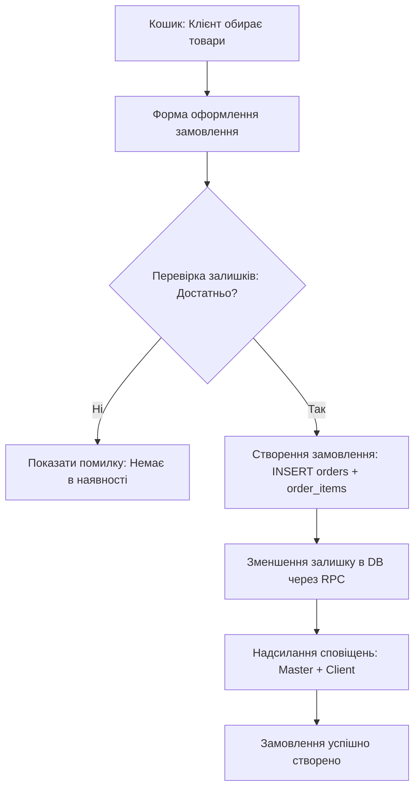

# 🛒 Public Shop & Order Lifecycle Map — BookIT

Цей документ визначає структуру публічного магазину товарів майстра, життєвий цикл замовлень, вибір способів доставки (самовивіз чи Нова Пошта), автоматичне резервування залишків (stock control) та сповіщення про нові замовлення.

---

## 🌍 Публічний Магазин (`/[slug]/shop`)

Магазин доступний для майстрів на тарифах Pro та Studio. Клієнтська сторінка реалізована в [ShopPage.tsx](file:///c:/Users/Vitos/SaaS/bookit/src/app/[slug]/shop/page.tsx).

### Особливості UI:
*   **Products preview strip**: Смужка попереднього перегляду (до 3 товарів) виводиться безпосередньо на головній публічній сторінці майстра `/[slug]`.
*   **Shop Banner**: Рекламний банер магазину розміщується вище каталогу послуг для стимулювання B2C продажів.

---

## 📦 Життєвий цикл замовлення (Order Lifecycle Flow)

Створення та обробка замовлення складається з таких фаз:

### Деталі кроків:
1.  **Оформлення замовлення (`createOrder` Server Action)**:
    *   Клієнт заповнює ім'я, телефон та обирає спосіб доставки:
        *   **Самовивіз (`pickup`)**: Клієнт може додатково вказати бажаний час самовивозу (`pickup_at`).
        *   **Нова Пошта (`nova_poshta`)**: Доставка у відділення або поштомат. Доступна, тільки якщо майстер увімкнув тумблер `master_profiles.ships_nova_poshta BOOLEAN`.
2.  **Контроль залишків (Inventory Guard)**:
    *   Перед фіксацією замовлення перевіряється поточна кількість товару на складі (`products.stock`).
    *   Якщо товарів на складі менше, ніж у кошику, замовлення блокується із виведенням помилки.
3.  **Атомарне списання залишку (`increment_stock_rpc`)**:
    *   Зменшення кількості на складі відбувається через спеціальну RPC-функцію, яка зменшує залишок атомарно.
    *   Це запобігає ситуації Double Buy (коли два клієнти купують останній товар одночасно).
4.  **Каскад Сповіщень**:
    *   **Для майстра**: Надсилається In-App + Telegram повідомлення про нове замовлення із деталями товарів та доставки.
    *   **Alert по залишках (Stock Alert)**: Якщо після списання кількість товару стає меншою або дорівнює встановленому порогу `stock_alert_threshold` (за замовчуванням 3 шт., міграція 136), майстру надсилається сповіщення `notifyMasterStockAlert` про необхідність поповнення складу.
5.  **Доставка та статус**:
    *   Майстер керує замовленням у кабінеті `/dashboard/products` (вкладка "Замовлення").
    *   При зміні статусу замовлення клієнт отримує сповіщення `notifyClientOrderStatus`.
