0. Сторінка клієнти. Картки клієнтів, треба синхронізуват набір кнопок на карткатх клієнтів у різних типах преегляду, бо в режимі список, кнопка яка має відповідати за чат і зв'язок - веде не маркетинг, треба зробити як smart кнпока в режимсі сітки.

1. Чат підтримки
1.1. Зробити список діалогів, між якими можна перемикатись, і які можна видалити ( тільки для себе зі сторони клієнта)
1.2. На мобайл треба поправити initial state, зверху трохи зробити відступ контенту, бо ховаєтсья за чубом, і знизу, даю референс телеграм чату - зроби бувквально так само, всі розташування, і коли відрита клавіатура - поле вводу має бути з мінімальним відступом до клавіатури, також даю референс.
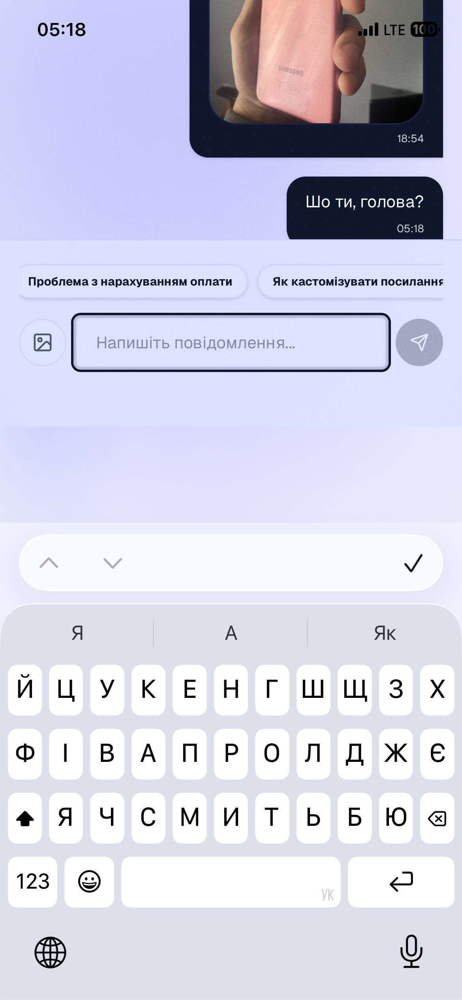
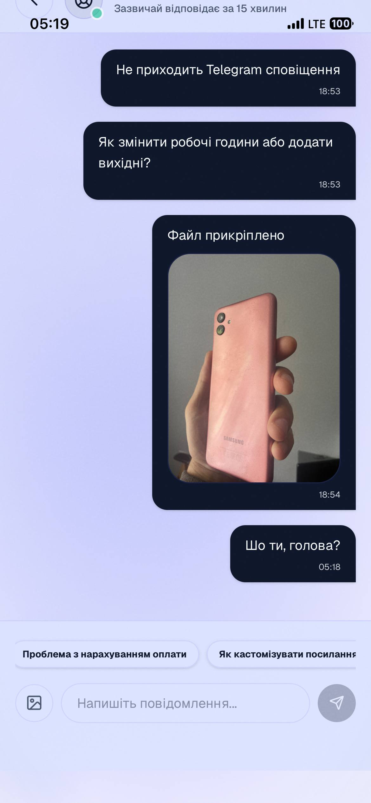
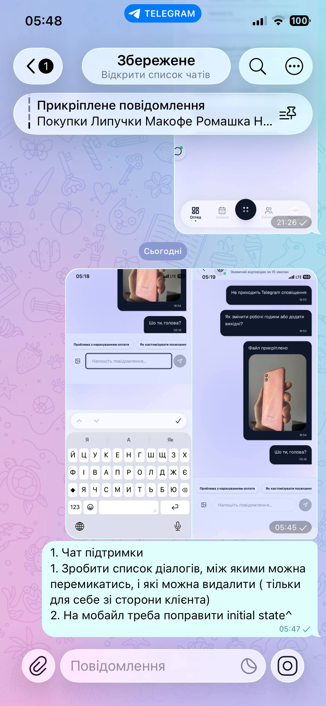
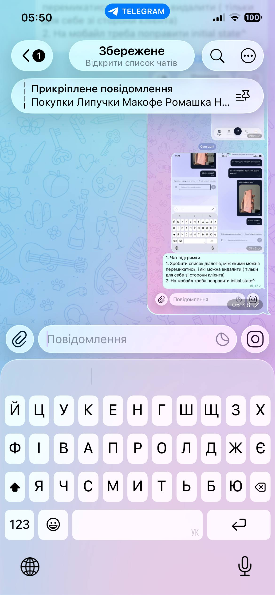
2. Конструктор сторіс на пк: Розширити саму робочу зону, на десктопі ж місце, визнач безпечні діапазони, і зроби красиво, на скріні синім позначив вільне місце
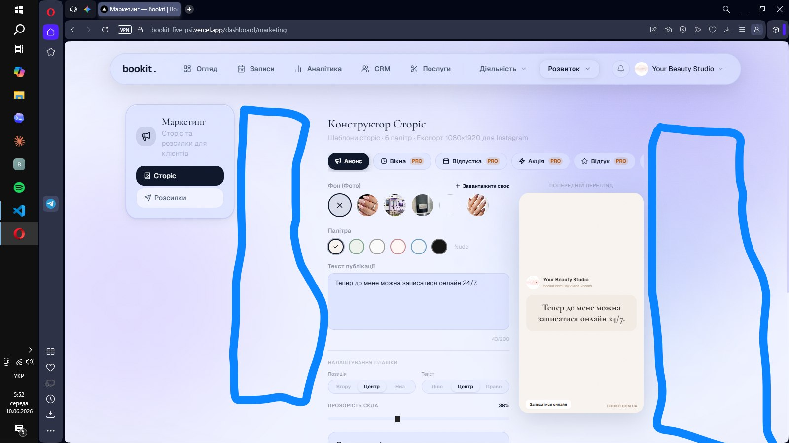

3. Сторінка записи, коли я на мобільному скролю вниз -проблема у панелч керування (тижні, місяці ,режими перегляду) 
3.1. Її треба зверху трохи посунути вниз щоб вона не ховалась за чолку телефону, додати відступ зверху
 3.2. Коли скролю  - накладається на уже самі картки записів треба їх змінювати прозорість щоб забезпечити повну читабельність при накладанні  на картки записів
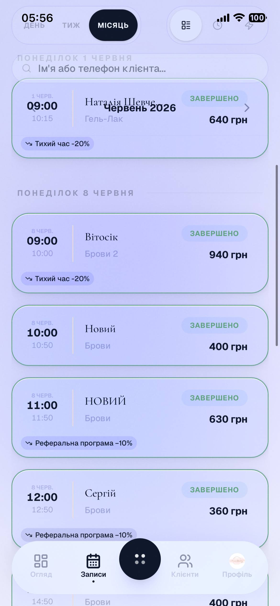

4. Мобайл. Сторінка послуги: 
4.1.Кнопку додати послугу треба зробити з тесктом і одразу після заголовку сторінки
4.2.Тугл: виправити кольоровий непопад, коли він активний - весь чорний, коли ні - весь білий, a11y аналізуй.
4.3.Картки послуг: зробити компактніше, і додати розділювачі по спеціалізаціям
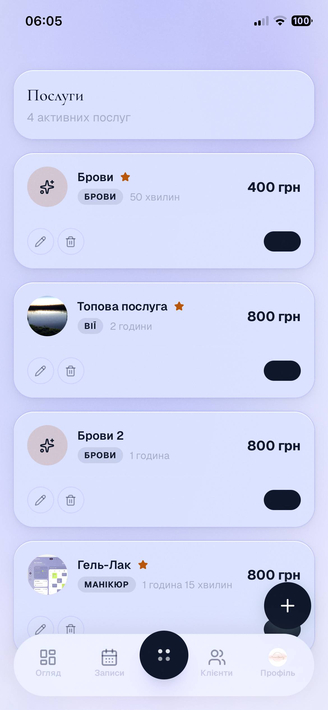

5. Мобайл. Сторінка магазин: 
5.1. Кнопку додати товар треба зробити з текстом і одразу після заголовку сторінки
5.2.Тугл: виправити кольоровий непопад, коли він активний - весь чорний, коли ні - весь білий, a11y аналізуй.

6. Сторінка портфоліо - кольори і стилізації кнопок відрізняються від загальнопроектних. Поправити, все стандартизувати
6.1. мобайл, не має кнопки видалити, а drag-n-drop, не працюєю Давай при тапі на фото давати 3 кнопки : видалити, зробити головним, переглянути, перегляд має бути інлайн на сторінці, бо зараз фото всі віжкривається типу в новій вкладці. Перегляд фото також треба пофісксити для товарів і послуг

7. GrowthHUb на мобільному, всі 3 таби не влазять, є боковий скрол, переосмислити лейаут треба.
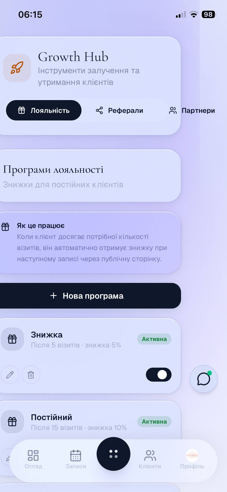

8. Мобайл, в меню, пукнт система є кнопка студія: там треба зробити таку ж логіку як на сторінці тарифів, детальний опис участі у альфа/бета тестуванні, можливість безпосередньо впливат на розвиток продукту і вносити власні ідеї та правки + кнопку треба зробити таку ж як на тарифі.

9. Треба стандартизвувати усі поля, логіки, механіки для додавання фото, послуги, товари, порфтоліо, фото профілю, все має працювати однаково добре. 

10. Сторінка послуг дуже довго завантажується на мобільному, треба оптимізувати

##Клієнтська зона##
11. /my/bookings - повний загальний, глобальний аудит дизайну, стилізації, розташування елементів і т.д. Треба повністю зробити преміум дизайн тут. Що панель керування записи/замовлення, що самі картки, і всі компоненти типу кнопок, шрифтів 

11.2. Функціонал залишити відгук, можемо викликати у модалці, щоб його можна було відкрити із  посилання.( сам подумай, як краще зробити)
11.3.Кнопка "записатися знову " маж бути button, а не просто текст із посиланням

12. Клієнтський мобільний навбар требла зробити по подобі того,який в зоні майстрів, і додати кнопку "Каталог"  і на сторінці /explore навбар не має змінюватись, чи спрощуватись. + на десктоп додати сповіщення, іконку і спливаючий список.

13. my/masters - картку майстра треба зробити як картку товару по лейауту і дизайну. З усією інформацією і актвиними кнопками.

14. Всі сторінки : треба переробити лейаут на десктопі, оптимізувати і зробити шикарні вигляди всюди.

15. Додати клієнту можливість додавати фото, інстаграм, телеграм, оптимізувати блок оформлення на сторінці профілю,  та глобально провести аудит сторінки проілю через impeccable

16. Для нового профілю застоссовується тема Blossom, має бути тільки FROST, завжди, і для клієнтів, і для майстрів

17. Мобайл, дашборд, спливаючі тултіпи обрізаються або всередині свого блоку, Як на віджеті" доходи" або краями дисплею, як на віджеті пікові години,  пропиши для них safe area, зроби все красиво, використовуй скіли  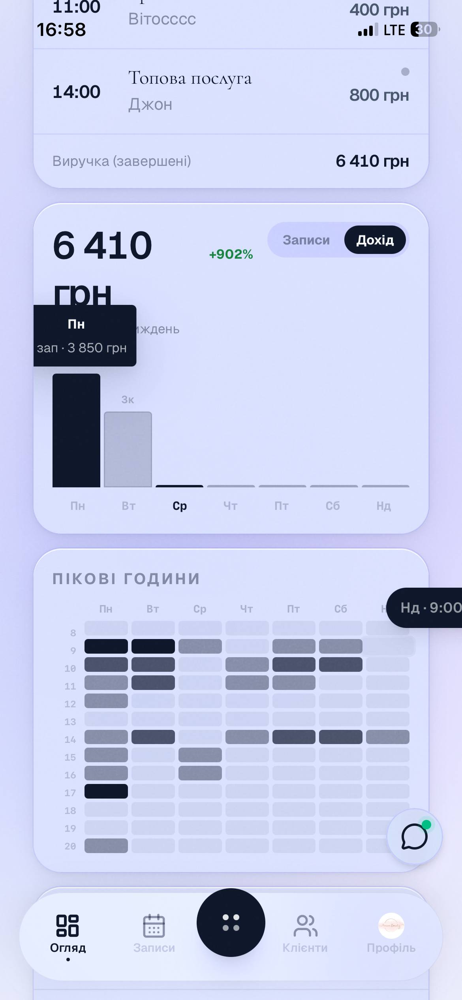

18. Мобайл, налаштування профілю, блок відпустка і вихідні, аудит, критика + редизайн, поля накладаються один на одного на всіх 3-х табах, вихідний, відпустка, короткий день, у нас на всьому проекті має бути максимально зручни UX з мінімальним тертям - це глобальне правило.

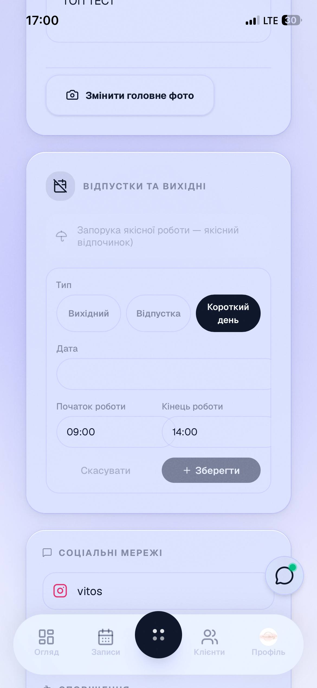 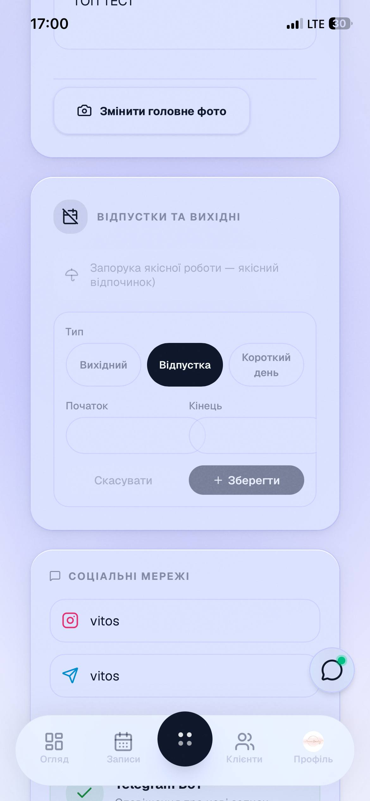

19. Логіка записів.
На скріні дивись: 1-й Вітосік на Брови 2 з 9:00 до 10:00, а наступний запис одразу на 10:00, чому не було буферу у 10 хвилин між записами?
Тривалість Брови 2 - 1 година, тривалість брови 50 хв.  id майстра у supabase: 551c7a11-a02b-4944-9b34-594c41ccb951.
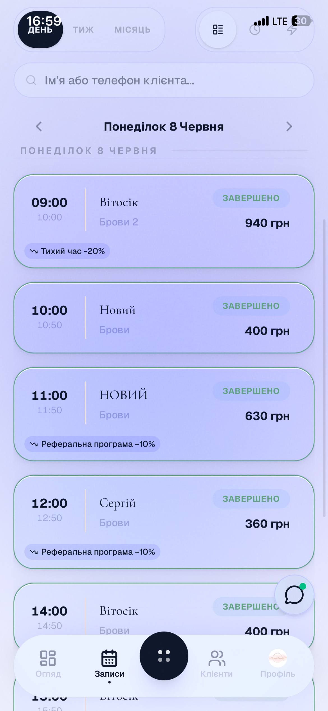

20. Сторінка порфтоліо, кнопка сторіс, вона відкриває drawer, ми від цьго тут відходимо і робимо повноцінний редірект на сторінку конструктора стоірс, з усіма передоббраними значеннями. Тип сторіс і id роботи.