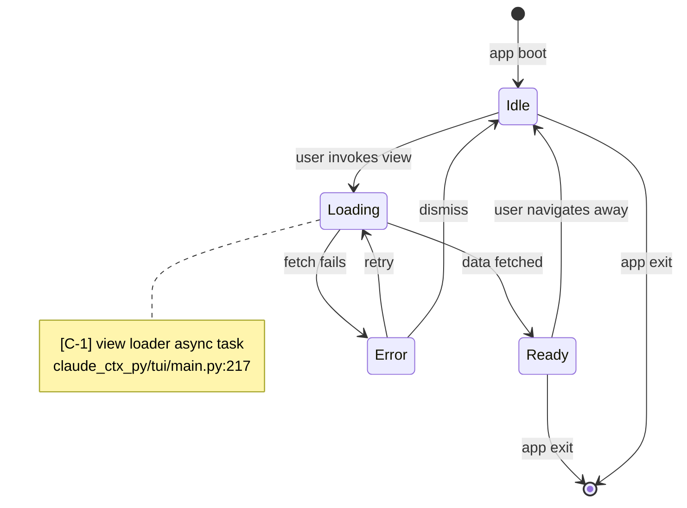
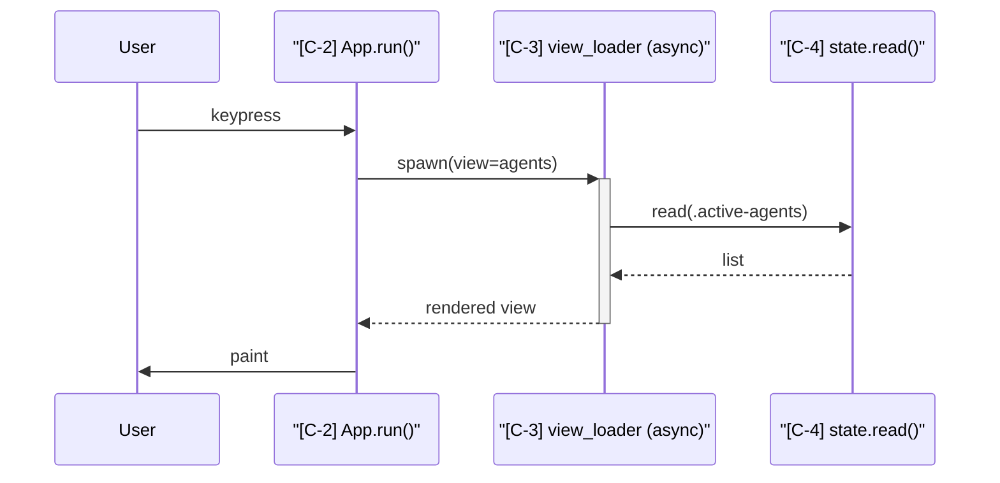

# Mode: Control Flow

## What this mode answers

How does work get scheduled, threaded, and sequenced? Who decides what runs when? Control flow captures the *dynamics* of execution — async tasks, workers, schedulers, lifecycle transitions, state machines, event loops.

Callout prefix: `C-`. Primary mermaid: `stateDiagram-v2` for lifecycle / state machines. Optional secondary: `sequenceDiagram` for execution flows that aren't naturally state-machine-shaped.

## Target signals

Sub-agents look for:

1. **Async/await patterns** — `async def`, `await`, `asyncio.gather`, `Promise.all`, coroutines, channels.
2. **Threads and processes** — `threading.Thread`, `multiprocessing.Process`, worker pools, executors.
3. **Schedulers and timers** — cron, interval timers, debouncers, throttlers, scheduled tasks.
4. **Event loops** — main loops, polling loops, message-handling loops.
5. **State machines** — explicit (`enum State`, transition functions) or implicit (lifecycle hooks like `__enter__`/`__exit__`, `mount`/`unmount`, `on_*` handlers).
6. **Lifecycle hooks** — Textual's `on_mount`, React's `useEffect`, Django middleware, Express handlers, application startup/shutdown.
7. **Concurrency primitives** — locks, semaphores, queues, channels, mutexes.
8. **Hook / callback registration points** — `claude.hooks` registration, Express middleware chains, plugin systems.

## What to capture as nodes (state diagram)

- Each meaningful state in a lifecycle: one state.
- Each transition trigger (event name, condition).
- Decision branches with conditions.
- Concurrent regions (mermaid `state X { }` nesting) when multiple things happen in parallel.

## What to capture as nodes (sequence diagram)

- Each long-lived participant (process, thread, task, service).
- Activations marking when each is doing work.
- Synchronization points (joins, gathers, locks).

## What NOT to capture

- Synchronous straight-line code flow — that's not interesting at the architectural level.
- Single-function decision trees (if/else within one function).
- Loops over data — that's data flow.
- Pure data transformation chains — that's data flow.

## State diagram example



For sequence diagrams, the participant list and citations:



## Sub-agent prompt seed

```
# Mode
Control flow — how work gets scheduled and sequenced.

# What to find
1. Async/await patterns and coroutines.
2. Threads, processes, worker pools, executors.
3. Schedulers, timers, debouncers, cron-like patterns.
4. Event loops and main loops.
5. State machines (explicit or implicit via lifecycle hooks).
6. Lifecycle hooks (mount/unmount, startup/shutdown, on_*).
7. Concurrency primitives (locks, queues, channels).
8. Hook/callback/plugin registration points.

# What NOT to find
- Synchronous straight-line code flow.
- Local if/else logic within a single function.
- Data transformation chains (that's data flow).

# Output orientation
Prefer state-machine framings over sequence diagrams when the system has clear lifecycles. Sequence diagrams when participants and message ordering are the dominant concern (e.g., bootstrap, request handling).

# Concurrent regions
Mark concurrent execution explicitly. If two tasks run in parallel without synchronization, they should appear as separate states (or separate participant lifelines).
```

## Common pitfalls

- **Confusing control flow with data flow.** "User input flows to handler" is data flow. "Handler runs synchronously then awaits IO" is control flow.
- **Modeling every async function.** Only async patterns that constitute *architectural concurrency* belong — a single `await` for an HTTP call doesn't deserve a state.
- **Missing implicit state machines.** Many systems have de facto state machines hidden in flag combinations (`is_loading + has_error + is_dirty`). These are valid synthesized states.
- **Over-detailing the happy path.** Three states is often enough; ten states usually means the diagram is mixing levels.

## Cross-mode boundary

| Belongs to control flow | Belongs elsewhere |
|---|---|
| "View load is async, parallel with state read" | "What state is read?" → data-flow / data-model |
| "Hook chain runs on every prompt submit" | "What hooks are installed?" → IA / integrations |
| "Retry logic kicks in on transient failure" | "What counts as a transient failure?" → failure-modes |
| "App lifecycle: boot → idle → exit" | "What does each lifecycle hook touch?" → IA |
