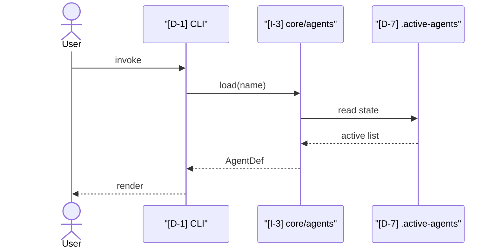

# Mode: Data Flow

## What this mode answers

How does data move through the system? Where does it enter, what transforms apply, where does it land? Data flow is a *verb* — the movement of data, not its shape.

Callout prefix: `D-`. Primary mermaid: `flowchart LR` for steady-state pipeline. Optional secondary: `sequenceDiagram` per critical path (request lifecycle, bootstrap sequence, etc.).

## Target signals

Sub-agents look for:

1. **Sources** — where data originates outside the system: CLI argument parsing, HTTP request handlers, file readers, MCP/API responses, environment variable lookups, message queue consumers.
2. **Transformations** — functions that take data in one shape and produce data in another: parsers, validators, normalizers, mappers, enrichers, aggregators.
3. **Persistence boundaries** — writes to disk, DB inserts/updates, cache writes, state file writes (`.active-*` files in Cortex).
4. **Sinks** — where data exits the system: HTTP responses, file writes, stdout/stderr, message emissions, MCP tool returns.
5. **Branch points** — where the same input fans out to multiple downstream paths, or merge points where multiple inputs converge.

## What to capture as nodes

- Each *source* — one node (CLI input, HTTP handler entrypoint, file reader function).
- Each *significant* transformation — functions that meaningfully reshape data, not every helper.
- Each persistence boundary — DB write, file write, state mutation.
- Each *sink* — output emission point.

## What NOT to capture as nodes

- Every internal function call — data flow is the *shape* of the pipeline, not the call graph.
- Variable assignments — those are control flow / mechanics.
- Pure pass-through wrappers — collapse them into the next significant transformation.

## Edges

Edges *are* the data flow. Each edge:

- Cites the line where data passes from A → B (call site, return site, queue.put, file.write).
- Carries a label naming what flows: `request body`, `parsed config`, `normalized event`.
- Solid for verified flow, dotted for synthesized (cross-cutting flow with no single owning line).

```mermaid
flowchart LR
    D1["[D-1] CLI args (argparse)"] -->|"argv list"| D2["[D-2] cli.parse()"]
    D2 -->|"command + opts"| D3["[D-3] dispatcher"]
    D3 -->|"agent name"| D4["[D-4] agents.load()"]
    D4 -->|"agent yaml"| D5["[D-5] front-matter parser"]
    D5 -->|"AgentDef"| D6["[D-6] activation registry"]
    D6 -->|".active-agents write"| D7[("[D-7] state file")]

    classDef cited fill:#fff,stroke:#333,stroke-width:1px
    class D1,D2,D3,D4,D5,D6,D7 cited
```



For request/lifecycle traces, render a sequenceDiagram secondary:



## Sub-agent prompt seed

```
# Mode
Data flow — trace how data moves through the system.

# What to find
1. Sources: every place data enters from outside (CLI args, HTTP, file I/O, env vars, MCP returns).
2. Significant transformations: functions that meaningfully reshape data (parsers, validators, normalizers).
3. Persistence boundaries: writes to disk, DB, cache, state files.
4. Sinks: every output emission point.
5. Branch and merge points: fan-out and convergence in the pipeline.

# What NOT to find
- Internal helper calls, variable assignments, pure pass-through wrappers.
- Control-flow decisions (those belong to the control-flow mode).
- Static schema (those belong to data-model).

# Edges are first-class
- Every edge cites the line where data passes A → B.
- Every edge carries a label naming what flows.
- Pipelines beat call graphs — model the data's journey, not the function dispatch.

# Critical paths
If the codebase has obvious request lifecycles or bootstrap sequences, identify 1–3 of them as candidates for sequenceDiagram secondaries.
```

## Common pitfalls

- **Confusing data flow with control flow.** "If config X then take path Y" is control flow. "Config bytes → parsed dict → validated config → consumer" is data flow.
- **Tracking too granular.** Don't node every assignment. A node should be a meaningful shape change.
- **Missing the persistence boundaries.** Reads and writes to disk, state files, and DBs are the highest-value nodes — they cross the in-memory/persistent boundary.
- **Including too many sinks.** Logging is technically a sink but rarely architecturally interesting; only include it if logging is load-bearing (audit, observability).

## Cross-mode boundary

| Belongs to data flow | Belongs elsewhere |
|---|---|
| "CLI args parsed into Config" | "What fields does Config have?" → data-model |
| "Config drives which agents activate" | "Why does activation pick agent X?" → control-flow |
| "Failed validation raises ValidationError" | "What happens when ValidationError fires?" → failure-modes |
| "Request hits HTTP handler" | "Is the HTTP API authenticated?" → integrations |
