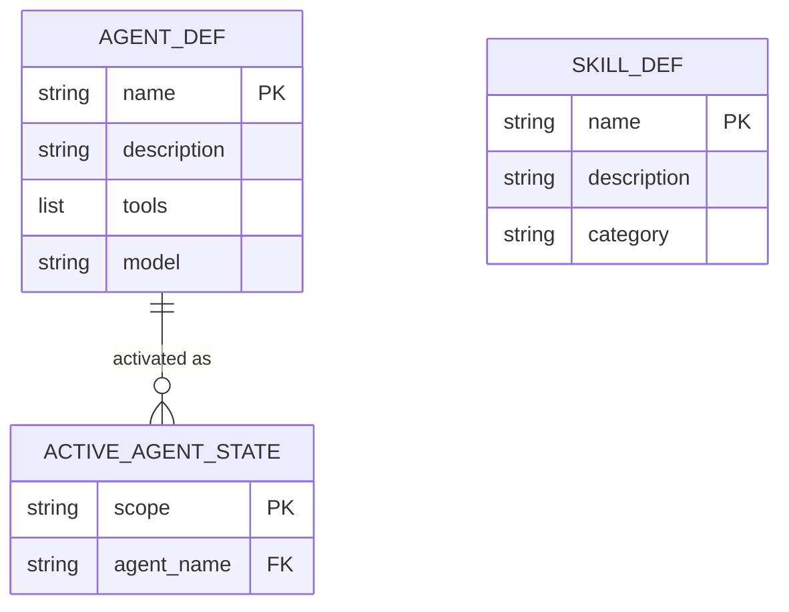

# Mode: Data Model

## What this mode answers

What is the *shape* of the data this system handles? Entities, relationships, persistence schemas, in-memory structures. Data model is a *noun* — the structure of information, not its movement.

Callout prefix: `M-`. Primary mermaid: `erDiagram`. No secondary diagram by default; if the system has a complex in-memory type graph distinct from its persistence, a `classDiagram` may be added.

## Target signals

Sub-agents look for, in order:

1. **SQL schema files** — `migrations/*.sql`, `schema.sql`, ORM-generated schema dumps.
2. **ORM model declarations** — SQLAlchemy `Base` subclasses, Django `Model` subclasses, Prisma schemas, Drizzle schemas.
3. **Dataclass / Pydantic / TypedDict declarations** — in-memory structured types that constitute the public data shape.
4. **Schema files** — JSON Schema, OpenAPI components, GraphQL types.
5. **Migration files** — to surface evolution and constraints.
6. **Front-matter shapes** — when the system parses structured front-matter (e.g., agent/skill YAML), the schema of that front-matter is a data model.
7. **Configuration schemas** — settings.json shape, TOML structure.

## What to capture as entities

- Each persisted entity (DB table, document type, file format): one entity in the ERD.
- Each in-memory structured type that crosses module boundaries (function signatures, return types, public API): one entity.
- Each external schema the system reads (e.g., GitHub API response shapes the system parses): one entity, classDef `external`-equivalent (use a comment to note external origin since erDiagram has limited classDef support).

## What NOT to capture as entities

- Internal types used within a single function — those are mechanics.
- Tuple shapes and one-off `dict[str, Any]` blobs — promote to a TypedDict in the codebase if they're worth capturing; otherwise omit.
- Classes that are pure behavior (no data fields).

## Relationships

- **One-to-many** — `||--o{`
- **Many-to-many** — `}o--o{`
- **One-to-one** — `||--||`
- **Optional / nullable** — `|o`

Annotate the relationship label with the linking field: `User ||--o{ Session : "owns (session.user_id)"`. Cite the relationship at the FK declaration line in the schema.

## ERD example



For the ERD, callouts go in a leading comment block since `erDiagram` doesn't natively support label prefixes:

```
%% [M-1] AGENT_DEF — claude_ctx_py/core/agents.py:42
%% [M-2] SKILL_DEF — claude_ctx_py/core/skills.py:55
%% [M-3] ACTIVE_AGENT_STATE — claude_ctx_py/core/agents.py:128
```

The narrative report references these by callout ID; the diagram itself shows the entity name without the prefix because mermaid's erDiagram syntax doesn't easily accept bracket prefixes.

## Sub-agent prompt seed

```
# Mode
Data model — every persisted or structured-in-memory entity.

# What to find
1. Persistence schema (SQL, ORM models, document schemas, file-format schemas).
2. In-memory structured types crossing module boundaries (dataclasses, TypedDicts, Pydantic).
3. JSON Schema / OpenAPI components / GraphQL types if applicable.
4. Front-matter and config schemas (parsed structured input).
5. Migration history if it reveals evolution constraints.

# What NOT to find
- Internal one-shot types within single functions.
- Untyped dicts.
- Classes that are pure behavior.

# Capture pattern
- One entity per schema/type definition. Cite the declaration line.
- Fields with type and PK/FK markers.
- Relationships cited at the FK declaration or join-table definition.

# Output mapping
You return YAML findings (callout_id M-N + citation + evidence). The orchestrator builds the erDiagram from your findings — do NOT author mermaid yourself.
```

## Common pitfalls

- **Confusing data model with data flow.** Model is the noun (entity shape); flow is the verb (how data moves between entities).
- **Modeling implementation classes.** A `class HookInstaller` is not a data model entity unless its instances are persisted or serialized.
- **Missing the schema-from-comments cases.** Some systems define data shapes in docstrings or markdown rather than code (front-matter, config dumps). These are valid model entities; cite the schema definition wherever it lives.
- **Over-modeling temporary intermediates.** A request body parsed from JSON has a shape — but if it's immediately decomposed into individual variables, it's not a model entity. Model entities have *identity over time*.

## Cross-mode boundary

| Belongs to data model | Belongs elsewhere |
|---|---|
| "Agent has fields name, description, tools" | "Where does Agent come from?" → data-flow |
| "ActiveAgentState persists in `.active-agents`" | "When is it written?" → control-flow |
| "Skill front-matter is YAML with these fields" | "How is it parsed?" → data-flow |
| "Migrations history shows agent column added" | "What broke during migration?" → failure-modes |
