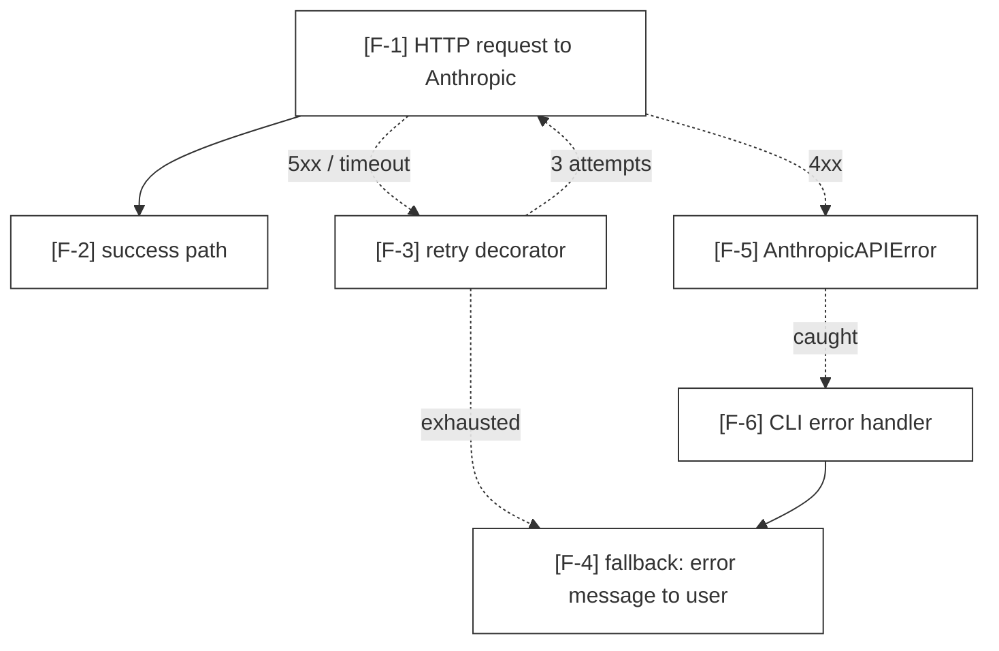

# Mode: Failure Modes

## What this mode answers

How does the system break? What error paths exist, where do they originate, what catches them, what gets retried, what gets fallbacked, what gets propagated to the user? Failure modes is the inverse of the happy-path diagram.

Callout prefix: `F-`. Primary mermaid: `flowchart TD` with explicit error edges (dotted, labeled `error`/`timeout`/`retry`). No secondary diagram by default; for resilience-heavy systems, a `stateDiagram-v2` of recovery state may be added.

## Target signals

Sub-agents look for:

1. **try/except / try/catch blocks** — every catch is a captured failure mode. Cite at the catch site.
2. **Custom exception classes** — definitions and the call sites that raise them.
3. **Retry decorators / patterns** — `@retry`, `tenacity.retry`, manual retry loops. Cite the decorator or loop initiation.
4. **Timeout configurations** — explicit timeouts on HTTP, subprocess, async tasks.
5. **Fallback logic** — `try { primary } catch { fallback }` patterns where the fallback is a different code path, not just an error message.
6. **Circuit breakers / bulkheads** — explicit resilience patterns when present.
7. **Validation failures** — input validation that rejects malformed data; cite the validation site.
8. **Error propagation chains** — exceptions raised at A and re-raised / wrapped / logged at B. Cite both.
9. **Default-fallback values** — `dict.get(key, default)`, `getattr(x, name, default)` when the default represents a meaningful failure mode (config missing, optional feature unavailable).
10. **Assertion-style guards** — `assert x is not None`, `if not config: raise`. These are explicit failure modes.

## What to capture as nodes

- Each *named* exception class: one node.
- Each significant catch site (the catch *handles* something the user cares about — converts to user-facing error, decides to retry, falls back): one node.
- Each retry / fallback / circuit breaker as its own node.
- The user-facing error sink (where errors finally emit to the user / log / metric).

## What NOT to capture

- Re-raises with no transformation — just an edge through, not a node.
- `finally` blocks that only do cleanup — they're not failure paths.
- Defensive checks that can't actually fail at runtime — those are noise.
- Every single `except` — group `except` clauses that handle the same logical failure.

## Edges

- **Error edges** are dotted with explicit labels: `A -.->|"timeout"| B`.
- **Retry edges** loop back: `B -.->|"retry"| A` with a count or condition label.
- **Fallback edges** branch sideways: `A -.->|"fallback"| C` (and `A --> B` for happy path).
- **Propagation edges** are dotted upward: `B -.->|"re-raises"| C`.



## Sub-agent prompt seed

```
# Mode
Failure modes — every error path, retry, fallback, and propagation.

# What to find
1. try/except (try/catch) blocks — each catch is a captured failure mode.
2. Custom exception classes (definitions + raise sites).
3. Retry decorators and manual retry loops.
4. Timeout configurations (HTTP, subprocess, async).
5. Fallback logic where the fallback is a different code path.
6. Circuit breakers, bulkheads (explicit resilience patterns).
7. Validation failures (input rejection sites).
8. Error propagation: re-raise / wrap / log chains.
9. Default-fallback values where the default carries failure-mode meaning.
10. Assertion-style guards.

# What NOT to find
- Pure cleanup (finally) blocks.
- Pass-through re-raises with no transformation.
- Defensive checks that can't actually fail at runtime.

# Capture pattern
- Each named exception class is a node (cite the class definition).
- Each significant catch site is a node (cite the `except` line).
- Retries and fallbacks are nodes; their edges loop back / branch sideways.
- The terminal user-facing error sink is a node.

# Important
ABSENCE CLAIMS REQUIRE EVIDENCE. If you assert "no retry on this path" or "no error handling for X", grep for retry/handler patterns first. The orchestrator will reject absence claims that turn up evidence in the codebase.
```

## Common pitfalls

- **Listing every try/except.** Collapse cleanups, group by logical failure. A 200-node failure diagram is unreadable.
- **Missing implicit failures.** A function that returns `None` on failure has a failure mode even without a raised exception. Cite the early-return line.
- **Confusing logging with handling.** `except: log.error(); raise` is propagation, not handling. The handler is whoever finally catches.
- **Asserting absence without grep.** "There's no retry logic" is the most-fabricated finding type. Always grep `retry|tenacity|backoff` across the subtree before recording an absence.

## Cross-mode boundary

| Belongs to failure modes | Belongs elsewhere |
|---|---|
| "Anthropic 5xx triggers retry" | "What's in the request?" → data-flow |
| "Hook install fails if jq missing" | "What does the hook do?" → integrations |
| "Validation rejects malformed YAML" | "What's the YAML schema?" → data-model |
| "Async task crashes silently if not awaited" | "Why is the task spawned?" → control-flow |
