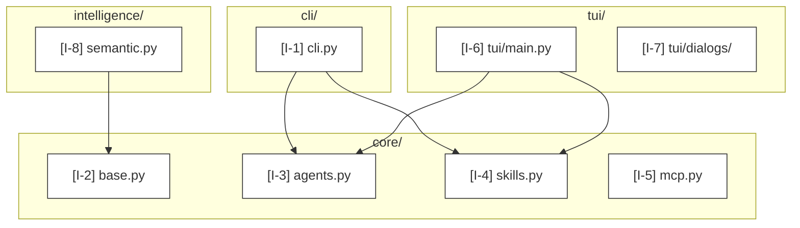

# Mode: Information Architecture

## What this mode answers

What is the conceptual layout of the codebase? Which top-level domains exist, what does each own, how do they nest? IA is the *map of the territory* — not every file, but the meaningful structural units.

Callout prefix: `I-`. Primary mermaid: `graph TD` module hierarchy. Optional secondary: C4 container diagram (when the system has clear container boundaries — service, daemon, CLI).

## Target signals

Sub-agents look for, in order of priority:

1. **Top-level package directories** — children of the repo root that hold code. These are usually IA's load-bearing nodes.
2. **`__init__.py` re-exports** (Python) / `index.ts` barrels (TypeScript) — these declare the public face of a package; what's re-exported is the package's intent.
3. **Module-level docstrings** — when present, they often state the module's role explicitly. Cite the docstring line.
4. **Naming conventions** — `core/`, `tui/`, `cli/`, `intelligence/`, `memory/` (in the Cortex codebase, e.g.) — convention names indicate domain ownership.
5. **README or CLAUDE.md sections** that name modules — secondary corroboration; cite the source file, not the README.
6. **Import direction at the package level** — `tui/` imports from `core/` but not vice versa is an architectural fact worth a citation (cite the import line).

## What to capture as nodes

- Each package or top-level module: one node.
- Each major sub-module within a package (e.g., `core/agents.py`, `core/skills.py`): one node, only if it has a distinct domain role.
- Concept-level groupings *only when* a clear pattern exists (e.g., "all `mcp_*.py` files form a coherent MCP installer subsystem"). These usually become synthesized nodes.

## What NOT to capture as nodes

- Every file — IA is not a file listing. If a package has 20 utility files with similar shapes, group them under a synthesized concept node, don't enumerate.
- Helper functions, classes, internal types — those are not architecture, they're implementation.
- Test files — exclude unless the test infrastructure itself is architecturally distinct.

## Edges

Use IA edges sparingly — IA is mostly nesting (subgraphs) and a few high-signal relationships:

- **Subgraph membership** — encode containment with mermaid `subgraph` blocks, not edges.
- **Cross-package depends-on** — only the most significant 5–15 edges. `A --> B` cited at the import line.
- **Re-exports** — when an `__init__.py` re-exports from siblings, model as `package -.-> sub` (dotted) to show "shows up here but lives there".

## Diagram example



## Sub-agent prompt seed

Use this as the body of the IA dispatch (combined with the standard envelope from `subagent-dispatch.md`):

```
# Mode
Information architecture — produce the conceptual map of the codebase.

# What to find
1. Top-level package directories under the scope.
2. Major sub-modules within each package (those with distinct architectural roles).
3. The 5–15 most significant cross-package dependencies (cite at the import line).
4. Synthesized groupings ONLY when a clear naming or structural pattern exists across multiple files (e.g., a `mcp_*` subsystem). Justify each.

# What NOT to find
- Individual helper functions, internal types, or implementation details.
- Test files (unless test infrastructure is architecturally distinct).
- Every file — group small utility files under synthesized concepts.

# Citation discipline
- Each package node cites its `__init__.py:1` (or the directory's primary entry file).
- Each sub-module node cites its file's first non-comment line (often the module docstring or first import block).
- Cross-package dependency edges cite the import statement line.
```

## Common pitfalls

- **Confusing IA with the dependency graph.** IA is conceptual ("what owns what"). Deps are mechanical ("what imports what"). Build deps are noisy and rarely architectural.
- **Including every file.** A 200-node IA diagram is unreadable. Aim for 15–40 nodes.
- **Missing the synthesized cap.** "Subsystem X" nodes pile up fast — confirm each is justified or promote to a cited canonical file.

## Cross-mode boundary

| Belongs to IA | Belongs elsewhere |
|---|---|
| "The TUI is one of three top-level surfaces" | "The TUI's view switching uses ContentSwitcher" → control-flow |
| "intelligence/ contains semantic matching" | "What entities does the embedding store?" → data-model |
| "agents/ defines the subagent registry" | "How is an agent invoked?" → control-flow / data-flow |
| "Every package depends on core/" | "What data flows from CLI through core to TUI?" → data-flow |
