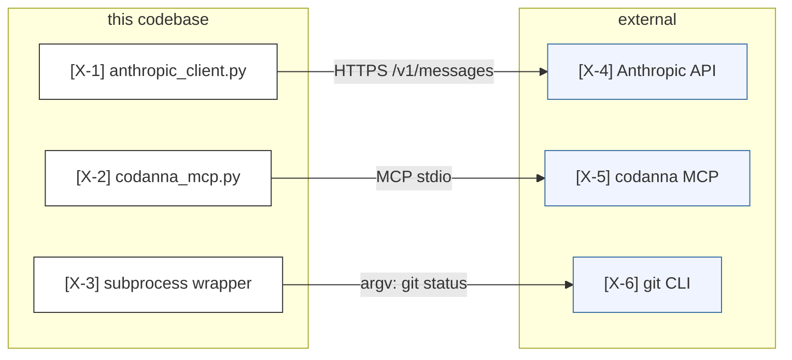

# Mode: Integration Points

## What this mode answers

Where does the system touch other systems? Every external boundary: APIs consumed and exposed, third-party services, MCP servers, OS processes, file system contracts, env var dependencies, network protocols.

Callout prefix: `X-` (eXternal). Primary mermaid: C4 context boundary diagram. Optional secondary: dependency table in markdown for less-visual integrations (env vars, config files).

## Target signals

Sub-agents look for:

1. **HTTP client invocations** — `requests`, `httpx`, `fetch`, `aiohttp`, etc. Cite at the call site.
2. **HTTP servers / API exposures** — route registrations (Flask, FastAPI, Express), gRPC service methods, GraphQL schemas.
3. **Third-party SDK imports** — `import anthropic`, `import openai`, `import google.cloud.*`, `import boto3`. Cite the import; node represents the integration.
4. **MCP servers** — tools and resources from declared MCP servers, plus any in-repo MCP server definitions.
5. **OS processes** — `subprocess.run`, `os.system`, `Popen`, shell-out calls.
6. **File system contracts** — known paths the system reads or writes that aren't internal state (e.g., `~/.claude/settings.json`, `.codanna/`, user dotfiles).
7. **Database connections** — connection strings, ORM session creation, raw SQL clients.
8. **Message queues / event buses** — pub/sub topics, queue consumers/producers.
9. **Env var reads** — `os.getenv`, `os.environ[*]`, especially when they configure third-party access.
10. **Config files** — TOML/YAML/JSON files the system reads that influence external behavior.

## What to capture as nodes

- Each external system is a node, classDef `external`. Examples: "Anthropic API", "GitHub API", "PostgreSQL", "Slack", "User filesystem".
- Each in-repo *adapter* to that external system is a node, classDef `cited`. Example: "anthropic_client.py" mediates the Anthropic API node.
- Trust zones (subgraphs) when meaningful: "this code", "user environment", "third-party APIs", "spawned processes".

## What NOT to capture as nodes

- Internal modules — those are IA, not integrations.
- Standard library imports unless they cross a process/IO boundary (`subprocess` yes, `dataclasses` no).
- Every individual env var — group related ones under one node ("Anthropic config: `ANTHROPIC_API_KEY`, `ANTHROPIC_BASE_URL`").

## Edges

- **In-repo adapter → external system**: solid arrow with classDef edge. Cites the *call site* line, not the import.
- **External system → in-repo adapter**: when external pushes inbound (webhooks, callbacks). Cite the registration line.
- **Bidirectional**: `<-->` for true two-way integrations.
- **Edge labels** name the protocol or contract: `HTTPS POST /messages`, `MCP tool call`, `subprocess argv`, `read file`.



## Sub-agent prompt seed

```
# Mode
Integrations — every place this system touches another system.

# What to find
1. HTTP client calls (requests, httpx, fetch) — cite call sites.
2. HTTP/RPC servers exposed — route registrations.
3. Third-party SDK imports paired with their first usage line.
4. MCP servers (declared in config + in-repo definitions).
5. OS process invocations (subprocess, Popen).
6. File system contracts at well-known paths (config dirs, dotfiles, lockfiles).
7. Database connections and ORM session creation.
8. Message queues and pub/sub.
9. Significant env var reads (those that configure external access).
10. Config files the system reads.

# What NOT to find
- Internal module imports (IA's job).
- Internal logging or telemetry unless it crosses a process boundary.
- Every env var — group related ones under one logical node.

# Capture pattern
- For each integration: one in-repo adapter node + one external system node + one edge with protocol label citing the call site.
- Use trust zone subgraphs to group: "this codebase", "user environment", "third-party APIs", "spawned processes".
```

## Common pitfalls

- **Confusing imports with integrations.** `import requests` is not an integration; the *call* `requests.post(...)` is.
- **Missing implicit integrations.** File system contracts (e.g., reading `~/.claude/settings.json`) are integrations even though they don't go over the wire.
- **Listing every API endpoint.** Group under the external system; the per-endpoint detail belongs in API documentation, not architectural diagrams.
- **Treating subagent dispatch as an external integration.** `Agent` calls in this codebase are control flow within the harness, not external integrations.

## Cross-mode boundary

| Belongs to integrations | Belongs elsewhere |
|---|---|
| "Reads `~/.claude/settings.json`" | "How is settings.json structured?" → data-model |
| "POSTs to Anthropic /messages" | "What gets serialized into the request?" → data-flow |
| "git CLI subprocess call" | "What if git fails?" → failure-modes |
| "MCP server provides 50 tools" | "Which tool runs when?" → control-flow |
