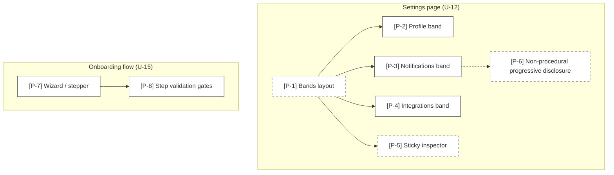

# Mode: Interaction Patterns

## What this mode answers

How is content within UI surfaces *organized*? Bands or tabs? Wizard or accordion? Sticky inspector or modal-driven? Progressive disclosure procedural (click-to-reveal-next) or non-procedural (always-visible-but-collapsed)? Two layouts can have identical component imports and produce radically different user mental models — this mode reads composition shape, ARIA roles, state shape, and pattern conventions to surface the difference that static structural analysis misses.

This mode exists because the other seven modes share a blind spot: they all answer questions resolvable from imports, types, and call graphs. A bands→tabs change can ship without altering any of those signals. The interaction pattern *is* the architectural change, even when the import surface is unchanged.

Callout prefix: `P-`. Primary mermaid: `graph TD` per-surface pattern decomposition. Optional secondary: pattern × surface matrix as a markdown table.

## Why the cap is higher

Interaction patterns are inherently emergent. The "bands layout" decision is rarely declared in a single line — it lives in:

- A parent component that maps over children with stable visibility (rather than conditionally rendering one)
- CSS classes establishing vertical stacking with consistent spacing
- Absence of `activeTab`/`currentStep` state
- Component naming using `*Band`, `*Section`, `*Region` rather than `*Tab`, `*Panel`

No single line declares "this is a bands layout"; the pattern is *constituted by* the combination. The synthesized cap for this mode is **35%** (vs. 20% for other modes). Synthesized findings still require justifications naming ≥2 contributing files; the cap is not a relaxation of rigor, it's a calibration to the actual nature of the signal.

## Pattern catalog

The patterns this mode recognizes. Not exhaustive — extend per project as needed.

| Pattern | One-line definition | Distinguishing signal |
|---|---|---|
| **Tabs** | One pane visible at a time, user-toggled | `activeTab` state + conditional render of one panel |
| **Bands** | All panes stacked, all visible | Map over panels with no active state; vertical flex stack |
| **Accordion / Disclosure** | Collapsible sections, one or many open | `aria-expanded`, `expandedSet`, summary/details |
| **Wizard / Stepper** | Sequential steps, validation between, prev/next | `currentStep`, step validation gates, `<Stepper>` |
| **Master-detail / Sticky inspector** | List + detail pane that pins or follows | `position: sticky`, `aria-current`, list selection drives detail |
| **Progressive disclosure (procedural)** | Show-more / show-advanced reveals next layer on click | Click handler toggles a specific advanced section |
| **Progressive disclosure (non-procedural)** | All layers present but collapsed by default; user expands what's relevant | Independent `expanded` state per section, no enforced order |
| **Modal / Drawer / Popover** | Transient overlay, focus-trapped | `role="dialog"`, focus trap, `aria-modal` |
| **Cards / Tiles / List** | Repeating item display | Map over array of similar shapes |
| **Empty state / Skeleton / Loading** | Zero-data and loading treatments | `if (loading) return <Skeleton/>`, `if (!items.length) return <Empty/>` |

## Signal sources

Sub-agents look across multiple signals — no single signal is sufficient. Layered evidence is the goal.

1. **Layout primitives imported** — `<Tabs>`, `<Accordion>`, `<Disclosure>`, `<Stepper>`, `<Wizard>`, `<Drawer>` from design system or libraries (Radix, Headless UI, Reach, Mantine, MUI). Cite the import line.
2. **ARIA roles and attributes** — `role="tablist"`, `role="tab"`, `role="tabpanel"`, `role="region"`, `aria-expanded`, `aria-current`, `aria-modal`, `aria-controls`. Cite the JSX attribute line.
3. **State shape** — `activeTab: string` (tabs), `currentStep: number` (wizard), `expandedSet: Set<id>` (accordion / non-procedural disclosure), `selected: id` driving a detail pane (master-detail). Cite the state declaration.
4. **Composition shape** — parent that *maps all children visibly* (bands) vs. parent that *conditionally renders one* (tabs). Cite the JSX render block.
5. **CSS class patterns** — `sticky top-0`, `flex flex-col gap-`, `tab-active`, `aria-current:bg-`. Especially in Tailwind-heavy codebases. Cite the className.
6. **Component naming conventions** — `*Band`, `*Section`, `*Region` vs. `*Tab`, `*Panel`, `*Pane`. Cite the component definition.
7. **Comments and docblocks naming the pattern** — `// bands layout: each section always visible`, JSDoc descriptions, README sections. Cite the comment line.
8. **Storybook stories named after patterns** — when stories exist, `Settings/Bands.stories.tsx` is strong intent signal.
9. **Routing and deep-linking** — does the URL change between tabs (deep-link tabs) or not (in-page tabs)? Cite the route config or `useSearchParams` calls.
10. **Focus management** — explicit focus trapping, restoration, or programmatic focus moves on transitions. Cite the focus-management hook.
11. **Animation primitives** — Framer Motion variants, layout animations, `AnimatePresence` (often paired with disclosure patterns). Cite the variant declaration.
12. **Responsive breakpoint behavior** — patterns that transform across breakpoints (e.g., desktop tabs → mobile accordion). Cite the breakpoint conditional.

## What to capture as nodes

- **Per surface, the dominant interaction pattern**: one node. E.g., `[P-1] Settings page — bands layout`.
- **Sub-patterns within a surface**: nodes for each distinct pattern instance. E.g., `[P-2] Settings.Profile band`, `[P-3] Settings sticky inspector`.
- **Cross-surface pattern instances** of the *same* pattern: separate nodes (one per surface). The matrix secondary diagram aggregates.
- **Pattern transitions**: when a user action changes the pattern in view (open modal → modal pattern; expand band → progressive disclosure). Edges represent the transition with a label.

## What NOT to capture

- Individual style props or CSS class minutiae — patterns are constituted by combinations of signals, not single declarations.
- Component hierarchy — that's UI surfaces.
- Routing structure — that's UI surfaces.
- Pure visual styling without interaction implications (theming, color tokens) — not architectural.

## Diagram example



In this example, `[P-1] Bands layout` is synthesized — no single line declares it; it emerges from the combination of (a) the Settings page mapping over band components without `activeTab` state, (b) the band components naming convention, (c) the vertical flex stacking. The justification cites the parent render block, the band component naming, and the absence of conditional rendering.

`[P-5] Sticky inspector` is synthesized for similar reasons — the pattern emerges from a combination of `position: sticky` styling, scroll listener, and selected-item state. The justification cites the sticky CSS, the scroll handler registration, and the selection-state hook.

`[P-2,3,4]` (the individual bands) are cited at their component definitions; they're concrete components.

## Pattern × surface matrix (optional secondary)

When the codebase has many surfaces and a small set of recurring patterns, a markdown table is more legible than diagrams:

| Surface | Tabs | Bands | Accordion | Wizard | Sticky inspector | Disclosure (proc.) | Disclosure (non-proc.) |
|---|---|---|---|---|---|---|---|
| Settings | — | ✓ [P-1] | — | — | ✓ [P-5] | — | ✓ [P-6] |
| Onboarding | — | — | — | ✓ [P-7] | — | ✓ [P-9] | — |
| Editor | ✓ [P-10] | — | — | — | — | — | — |
| Project | — | — | ✓ [P-12] | — | — | — | — |

This matrix often reveals the cross-cutting finding ("the product uses bands consistently except in editor, which is the lone tab holdout") that's harder to spot in per-surface diagrams alone.

## Sub-agent prompt seed

```
# Mode
Interaction patterns — how content is organized within UI surfaces. Bands vs tabs, wizard vs accordion, sticky inspector, progressive disclosure (procedural and non-procedural), modal patterns.

# Why this mode exists
The other modes (UI surfaces, IA, control flow) can't distinguish patterns that share component imports and call shapes. Bands and tabs both manifest as "a parent renders panel children" — the distinction lives in composition shape (all-visible vs. one-active), state shape (no active state vs. activeTab), and naming/styling conventions.

# What to find
1. The dominant interaction pattern for each significant UI surface.
2. Sub-patterns within surfaces (e.g., the inspector pane within the settings page).
3. Pattern transitions (user actions that change the pattern in view: open modal, expand band, navigate to detail).

# Signals (layered — no single signal sufficient)
- Layout primitives imported (<Tabs>, <Accordion>, <Wizard>, <Drawer>, <Stepper>).
- ARIA roles and attributes (role="tablist", aria-expanded, aria-current, aria-modal).
- State shape (activeTab vs. expandedSet vs. currentStep vs. nothing).
- Composition shape: parent maps all children visibly (bands) vs. conditionally renders one (tabs).
- CSS class patterns (sticky top-, tab-active, flex flex-col gap-).
- Component naming (*Band, *Section vs. *Tab, *Panel).
- Comments and docblocks naming the pattern explicitly.
- Storybook stories named after patterns.
- Deep-linking behavior (URL changes between sub-views?).
- Focus management (trap, restore, programmatic moves).
- Responsive breakpoint pattern transitions (desktop tabs → mobile accordion).

# Output guidance
- Most findings will be SYNTHESIZED. The cap for this mode is 35% (vs. 20% for other modes), reflecting the emergent nature of pattern signals.
- Each synthesized finding requires a justification naming ≥2 contributing files (with citations).
- Concrete components (individual bands, individual panels, individual modals) are cited at their definitions and are NOT synthesized.
- The dominant pattern of a surface IS often synthesized. Justify by combining signals.

# What NOT to find
- Component hierarchy (that's UI surfaces).
- Routing structure (that's UI surfaces).
- Pure styling without interaction implications.
- Individual style props.

# Output contract reminder
YAML findings as in subagent-dispatch.md. callout_id format: P-N. Each finding's confidence: high (cited at single line) | medium (cited at single line, multiple plausible interpretations) | synthesized (no single owning line).
```

## Common pitfalls

- **Asserting the pattern from a single signal.** A `<Tabs>` import alone doesn't mean "this surface uses tabs" — it might be a one-off in a sub-component. Confirm with at least two independent signals.
- **Confusing components with patterns.** A `<Settings>` component is a UI surface element; the pattern is *how* `<Settings>` arranges its content (bands).
- **Missing the non-procedural disclosure case.** Procedural disclosure ("show advanced" reveals the next thing) is easy to spot from click handlers. Non-procedural disclosure (everything is present, user expands what's relevant) looks like an accordion plus stable narrative — easy to miss because there's no "reveal" event.
- **Treating ARIA absence as pattern absence.** Many real codebases use tab-like patterns without `role="tablist"`. Use ARIA when present, but don't require it.
- **Overusing synthesized.** Even at 35% cap, prefer cited findings when a canonical line exists. The cap is the limit, not the target.

## Cross-mode boundary

| Belongs to interaction patterns | Belongs elsewhere |
|---|---|
| "Settings page uses bands layout" | "Where does Settings live?" → UI surfaces |
| "Onboarding is a 4-step wizard" | "What components does each step render?" → UI surfaces |
| "Sticky inspector pinned to selected item" | "What state drives selection?" → control-flow |
| "Editor uses tabs (the only tabbed surface)" | "What does each tab show?" → UI surfaces |
| "Non-procedural disclosure across settings bands" | "What's inside each band?" → UI surfaces |
