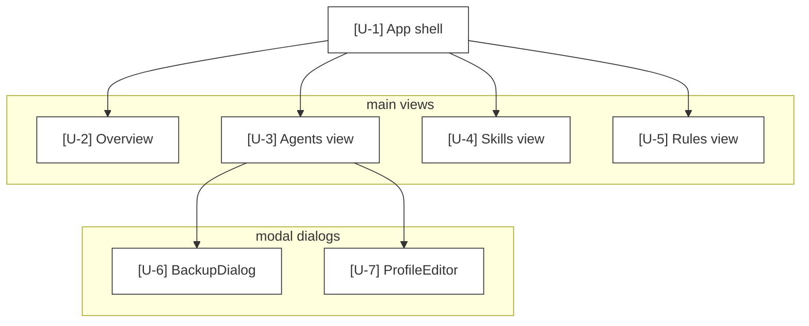

# Mode: UI Surfaces

## What this mode answers

What does the user see and interact with? Every user-facing entry point: routes, screens, components, key bindings, slash commands, CLI subcommands. UI surfaces map the system's *exposed surface area*, not its internals.

Callout prefix: `U-`. Primary mermaid: `graph TD` route or screen tree. Optional secondary: `graph LR` component graph with state-ownership annotations.

## Target signals

The applicable signals depend heavily on the UI framework. Common patterns:

### Web (React, Vue, Next.js, etc.)

1. **Route definitions** — router config, file-system routing (`pages/`, `app/`).
2. **Top-level page components** — declared per route.
3. **Major shared components** — layouts, navigation, modals, providers.
4. **State ownership** — Redux stores, Zustand slices, React Context providers, server-state hooks.

### CLI

1. **Subcommand registrations** — argparse/click/typer command decorators or registry entries.
2. **Help text and option declarations** — they define the user-visible contract.
3. **Slash commands** in chat-style CLIs.

### TUI (Textual, Bubble Tea, etc.)

1. **App / screen classes** — `App`, `Screen`, `View` subclasses.
2. **Bindings** — `BINDINGS = [...]` declarations (Textual) or equivalent.
3. **View IDs / route keys** — `ContentSwitcher` view registrations.
4. **Modal dialogs** — declared screen overlays.

### Desktop / mobile native

1. **Window / activity / scene classes**.
2. **Menu definitions, toolbar items**.
3. **Navigation graphs**.

## What to capture as nodes

- Each route / screen / page / subcommand: one node.
- Each shared layout, provider, or modal: one node.
- State ownership boundaries: one node per store / context / slice (these are often synthesized — state is usually distributed).
- Key bindings and command palettes when they constitute a user-facing contract: one node per binding group, with the bindings listed in the report.

## What NOT to capture as nodes

- Every leaf component (buttons, inputs, list items) — UI surfaces is not a component inventory.
- Internal helper hooks / utilities.
- Styling / theming code.
- Tests.

## Edges

Two kinds:

- **Navigation** — `A --> B` where A links to B (route transition, screen push, command opens screen).
- **Composition** — `A --> B` where A renders B (only for *significant* compositional relationships, e.g., layout-into-page, app-into-screen).

For state ownership, use a dotted edge from the owning store node to the consuming view: `S1 -.->|reads| U2`.



## Sub-agent prompt seed

```
# Mode
UI surfaces — every user-facing entry point.

# What to find (adapt to the framework in use)
1. Routes / screens / pages / subcommands — each as a node.
2. Top-level layouts, providers, app shells.
3. Shared modals and overlays.
4. State ownership boundaries (stores, contexts, slices) — often synthesized.
5. Key bindings, command palettes, slash commands when they form a user contract.

# What NOT to find
- Leaf components (buttons, inputs).
- Internal hooks/utilities.
- Styling / theming.
- Tests.

# Special handling
- For TUIs with ContentSwitcher-style views, list each view ID with its registering line.
- For CLIs, list each subcommand with its registration decorator/line.
- For web apps, list each route with its file path / config line.

# State ownership
If the codebase has clear state ownership (Redux, Zustand, Context), surface it. Reads/writes from views are dotted edges, not solid.
```

## Common pitfalls

- **Confusing UI surfaces with the component graph.** UI surfaces is *what the user sees*. The component graph is *how it's built*. The latter has 200 nodes; the former has 15–30.
- **Missing slash commands and key bindings.** These are user-facing surfaces in CLIs and TUIs even though they don't look like routes.
- **Including styling code.** Tailwind classes and CSS modules are implementation, not surface.
- **Treating every modal as a node.** Group rare/contextual modals into the screen that owns them; only call out modals with persistent identity.

## Cross-mode boundary

| Belongs to UI surfaces | Belongs elsewhere |
|---|---|
| "Agents view exposes the agent registry" | "How does the registry persist?" → data-model |
| "BackupDialog opens when user presses Ctrl+B" | "What happens during backup?" → control-flow / data-flow |
| "TUI uses ContentSwitcher" | "How are view modules organized?" → IA |
| "Settings page shows API keys" | "Are keys read from env?" → integrations |
