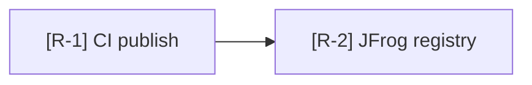
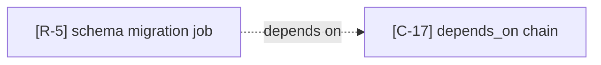
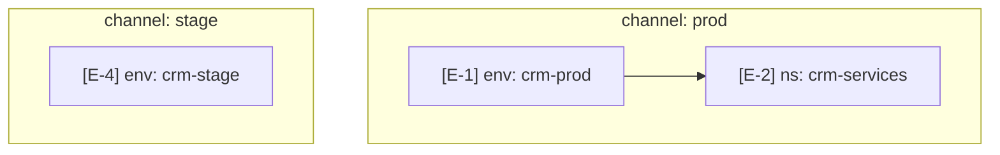

# Mermaid Conventions

How diagrams are authored across all four release-analysis modes. Follows the same conventions as `architectural-analysis` so cross-skill callout reuse works seamlessly — `[C-17]` referenced from a release-analysis report renders identically to `[C-17]` referenced from the originating arch-analysis report.

## Diagram type per mode

| Mode | Primary | Optional secondary |
|---|---|---|
| Promotion path | `flowchart LR` | `sequenceDiagram` for multi-actor promotion (dev / CI / registry / platform / cluster) |
| Environment matrix | `graph TD` (channel → env → namespace) for cloud; markdown table for local profile matrix | `graph TD` for local when overlap matters |
| Configuration provenance | `flowchart LR` (key → resolution chain → runtime) | markdown table when key cardinality > 5 |
| Recovery & rollback | `stateDiagram-v2` (healthy → degraded → recovering) — **always required** | numbered procedure list per state (markdown supplement, not diagram substitute) |

When a mode has both a primary and a secondary diagram, the primary lands in the canonical `<mode>.mmd`. Secondaries get descriptive filenames.

## Callout prefixes

| Prefix | Mode |
|---|---|
| `R-` | Promotion path (Release) |
| `E-` | Environment matrix |
| `K-` | Configuration provenance (config Key) |
| `V-` | Recovery & rollback (recoVery) |

Cross-skill prefixes still resolve when ingested from a prior arch-analysis run:

| Prefix | Mode (arch-analysis) |
|---|---|
| `I-` | Information architecture |
| `D-` | Data flow |
| `X-` | Integrations |
| `U-` | UI surfaces |
| `P-` | Interaction patterns |
| `M-` | Data model |
| `C-` | Control flow |
| `F-` | Failure modes |

In mermaid, encode the callout in the node label:



## Cross-skill references

When a release-analysis diagram references an arch-analysis callout, use the original ID. Don't re-number. The synthesis README's Provenance and cross-mode index sections resolve the lookup.



Render the cross-skill node with `classDef crossmode` so it visually differs.

## classDef conventions

```mermaid
classDef cited fill:#fff,stroke:#333,stroke-width:1px
classDef synthesized fill:#fff,stroke:#888,stroke-width:1px,stroke-dasharray:5
classDef external fill:#f0f4ff,stroke:#3b6ea5,stroke-width:1px
classDef crossmode fill:#fdf6e3,stroke:#b58900,stroke-width:1px
classDef gate fill:#fff8e1,stroke:#f80,stroke-width:2px
classDef removed fill:#fde7e7,stroke:#c0392b,stroke-width:1px,stroke-dasharray:3
```

- **cited** (default) — node has a verified citation (file or eve-mcp).
- **synthesized** — no single owning source (≤20% per mode).
- **external** — third-party system or service. Use for registries (JFrog, ECR), platforms (Eve), external SaaS.
- **crossmode** — node defined in a different mode or skill, referenced here for context.
- **gate** — promotion gate, healthcheck gate, manual approval point. Release-analysis-specific style; helps readers see where the lever lives.
- **removed** — used to exist, now deleted. Only when explicitly tracking change.

## Edge styling

| Edge type | Mermaid syntax | Meaning |
|---|---|---|
| Verified | `A --> B` | Solid arrow, citation in report |
| Synthesized | `A -.-> B` | Dotted; relationship real, no single line owns it |
| Conditional | `A -->|condition\| B` | Edge taken under named condition (e.g., promote\|approval) |
| Manual gate | `A -->|manual\| B` | Promotion or recovery edge that requires human action |
| Automatic gate | `A -->|cron\| B` | Edge taken automatically (cron, healthcheck-driven) |
| Error / degrade | `A -.->|fail\| B` | Failure path leading to a degraded state |

## Layout direction per mode

- Promotion path: `flowchart LR` — source on left (commit), destination on right (running instance).
- Environment matrix (cloud): `graph TD` — channels at top, namespaces at bottom.
- Environment matrix (local): markdown table preferred; `graph TD` if overlap is the point.
- Configuration provenance: `flowchart LR` — defaults on left, runtime on right.
- Recovery & rollback: `stateDiagram-v2` — naturally vertical.

Override only when a specific diagram reads better otherwise — note the override in the diagram's leading comment.

## Subgraphs

Use `subgraph` blocks to group nodes by channel, environment, or boundary. Keep nesting shallow.



## Node label hygiene

- Lead with the callout: `[R-1] CI publish`.
- Keep labels under ~40 characters.
- For eve-mcp-cited nodes, the label can be the resource identity (`manifest: crm-services`); the citation in the report carries the query.
- For compose-cited nodes, prefer the service name + file (`proxy (compose.yml)`).
- Escape special characters with quoting.

## Rendering

```bash
bash scripts/render.sh docs/release/<date>/
```

Same script as arch-analysis (vendored or symlinked into this skill's `scripts/`). Iterates each mode subdirectory, produces SVG siblings of every `.mmd`. If `mmdc` is unavailable, prints an installation hint and exits non-zero — citations and reports still authored.

## What NOT to do

- **No emoji in diagrams.**
- **No inline `style` directives.** Use `classDef` + `class`.
- **No nodes without callouts.**
- **No dangling edges.**
- **No `architectural-analysis` callout reuse without listing the source.** A `[C-17]` referenced in a release-analysis diagram must be listed in the synthesis README's Provenance section, including the originating arch-analysis report path and date.
