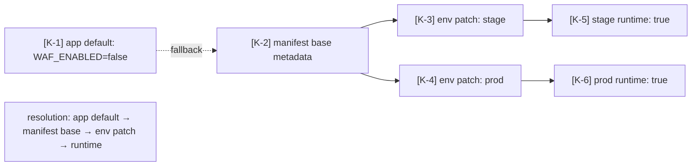

# Mode: Configuration Provenance

## What this mode answers

For each configuration value the system reads at runtime, where does the value come from? Which file, in which override layer, with what default? When two layers disagree, which wins, and why? This is where most "works on my machine" pain originates — and where most release incidents start ("we forgot to set `WAF_ENABLED=true` in stage").

Callout prefix: `K-`. Primary mermaid: layered annotation graph (key → resolution chain → value endpoint). Optional secondary: a tabular markdown matrix (key × environment × value) when cardinality permits.

## Target signals

### Compose-shaped (local)

1. **Compose merge order**: when multiple `compose.*.yml` files are passed (`-f a.yml -f b.yml`), later files override earlier ones at the field level. The merge order is the resolution mechanism. Document it from the actual `up.sh`/`Makefile` invocation, not by guessing.
2. **`.env` resolution**: docker compose reads `.env` from the project directory by default. `--env-file` overrides. `${VAR}` substitutions in compose files use these values.
3. **Service `env_file:` directives**: per-service env files in compose.
4. **`environment:` directives**: inline env vars in a service block, with optional `${VAR}` substitution from `.env`.
5. **Build-time vs. runtime**: `args:` under `build:` are baked into the image; `environment:` is read at container start. The distinction matters — a runtime env override won't change a build-time arg.
6. **Profile-conditional config**: a service may have different `environment:` blocks across profile-specific compose files.
7. **Defaults inside the application**: code-level defaults (e.g., `os.environ.get("WAF_ENABLED", "false")`) are the "lowest layer" in the resolution chain. Read the application code to find them.

### Driver-shaped (orchestrator)

When the target drives releases for other systems, the provenance question is "what config does the *tool* read at runtime to decide what to do":

1. **Tool config files**: `config.json`, `settings.json`, `appsettings.json`, or similar at the repo root or under `config/`. Often the primary input.
2. **Per-namespace data files**: `data/<namespace>/<file>.json` — values that change per-target, layered on top of the global config.
3. **Cron / scheduled run inputs**: `cron-config.json` or `.gitlab-ci.yml` scheduled-pipeline parameters — values injected at trigger time.
4. **Profile / environment overrides**: `.profile`, `~/.config/<tool>/`, env vars the tool reads (`CHANNEL=`, `NAMESPACE=`, `DRY_RUN=`). For PowerShell tooling: `$PROFILE`, module manifests, env-var precedence in `Get-Item Env:`.
5. **CLI argument layering**: when the tool takes args, they typically override config files. Document the override order from the actual entrypoint, not by convention.
6. **Application defaults**: hard-coded fallbacks in the source (`$DefaultChannel = 'int'`, `param([string]$Channel = 'int')`).

The override-order verification rule still applies: cite the actual resolution mechanism (the entrypoint reading config), not the file order on disk.

### Kube-shaped (cloud)

1. **Manifest metadata**: `eve-mcp:GetManifest <name>` reveals the metadata block — env-specific values that flow into the rendered manifest.
2. **Per-environment metadata patches**: `eve-mcp:PatchManifestMetadata`, `eve-mcp:UpdateManifestMetadata` are the levers; `eve-mcp:GetManifest` shows the current state.
3. **Helm values / ConfigMaps / Secrets**: in repo, look in `kube/*-config/` and any helm chart values. The platform (Eve) wires these into the rendered manifest.
4. **Secrets plumbing (not content)**: where secrets *come from* — vault references, secret manager paths, sealed-secret files — not their values. The skill documents the path; never the secret.
5. **Cluster-scoped vs. namespace-scoped resolution**: a value can come from a cluster ConfigMap, a namespace ConfigMap, or a manifest's own metadata. The resolution order is platform-specific; document what you observe.
6. **Defaults in the application**: same as local — code-level fallbacks are part of the chain.

## What to capture as nodes

Per configuration key (or per group of related keys):
- One node per resolution layer where the key appears.
- One terminal node for "value at runtime."
- The application code default is always the last layer.

Group keys by domain when there are too many to enumerate individually:
- Database connection (one cluster of related keys: host, port, user, password)
- Auth (one cluster: client id, secret, audience)
- Feature flags (one cluster, per system: WAF, observability, integrations)

## What to capture as edges

- Each layer-to-layer override edge, with citation to the resolution mechanism (the compose merge invocation in `up.sh`, the manifest metadata structure documented in the platform).
- Defaults edges (application code) cite the line where `getenv` / `os.environ.get` / `process.env.X || "default"` resolves.

## What NOT to capture

- The value itself, when it's a secret. Cite the path; never reproduce the secret content.
- Every config key in the system. Pick keys whose layering is non-trivial or whose drift across environments is high-risk. A flat shared key is uninteresting; a key that resolves differently in stage vs. prod is the whole point.
- Application-internal use of the config. That's `architectural-analysis` data-flow territory. This mode stops at "value reaches process."

## Diagram example (single key, layered)

```mermaid
flowchart LR
    Code["[K-1] os.environ.get('WAF_ENABLED', 'false')"] -.default.-> Runtime
    Env[".env: WAF_ENABLED=true"] --> ComposeBase["compose.yml: ${WAF_ENABLED}"]
    ComposeBase --> ServiceEnv["proxy environment: WAF_ENABLED"]
    EnvLocal[".env.local override"] -.merge.-> Env
    ServiceEnv --> Runtime["[K-2] proxy container env"]

    classDef code fill:#444,stroke:#888
    class Code code
```



## Diagram example (cloud, manifest metadata)



## Tabular alternative (preferred when key count > 5)

| Key | Layer | int | stage | prod | Local |
|---|---|---|---|---|---|
| `WAF_ENABLED` [K-1] | manifest metadata | `false` | `true` | `true` | `false` (.env default) |
| `DB_HOST` [K-2] | manifest metadata | `db-int.svc` | `db-stage.svc` | `db-prod.svc` | `sqlserver` (compose) |
| `LOG_LEVEL` [K-3] | manifest metadata | `debug` | `info` | `warn` | `debug` (.env) |

Each value cell links back to the eve-mcp query or compose file that establishes it.

## Sub-agent prompt seed

```
# Mode
Configuration provenance — for each runtime config value, where does it come from?

# Scope shape
[insert one of: compose-shaped only / kube-shaped only / both]

# What to find — compose-shaped
1. Compose file invocation order in up.sh / Makefile / scripts.
2. .env, .env.local, --env-file usage.
3. env_file: and environment: directives per service.
4. Build args (image-baked) vs runtime env (container-injected) distinction.
5. Profile-conditional env values across compose.*.yml override files.
6. Application code defaults (os.environ.get, getenv with defaults).

# What to find — kube-shaped (prefer eve-mcp when available)
1. Manifest metadata — eve-mcp:GetManifest reveals env-specific overrides.
2. Per-environment metadata patches — note, do not modify.
3. Helm values / ConfigMaps / Secrets in kube/*-config/.
4. Secrets plumbing (paths, vault references) — never the secret content.
5. Cluster-scoped vs namespace-scoped resolution chain.
6. Application code defaults.

# What NOT to find
- The contents of secrets. Cite the path only.
- Every key in the system. Prioritize keys with non-trivial layering or known-to-drift behavior.
- Application-internal use of config (that's data-flow).

# Ingested findings
[Reference any [F-N] failure-mode callouts from prior arch-analysis that name a config-driven failure (e.g., "WAF off when not enabled"). Those callouts pre-identified high-risk keys; this mode resolves their full provenance chain.]

# Output orientation
Prefer flowchart LR for individual high-risk keys. Prefer markdown table for systems with many keys whose layering follows the same pattern. Use both when warranted.

# Citation guidance
- Compose values cite the compose file, env file, or up.sh invocation line.
- Cloud values cite eve-mcp:GetManifest queries when available; manifest YAML otherwise.
- Application defaults cite the source file:line where the default lives.
- Override-order claims must cite the actual mechanism (the up.sh line invoking docker compose with -f flags), not be inferred from filename.
```

## Common pitfalls

- **Inferring override order from filename.** `compose.override.yml` *might* override `compose.yml`, but only if the entrypoint passes both files. Read the actual invocation. If `up.sh` doesn't pass the override, it's not in the chain.
- **Treating `.env.local` as universal.** Some compose setups read it; some don't. Check `--env-file` usage and the project's own conventions.
- **Reproducing secret values.** Never. Cite the path; describe the type (token, key, password); say nothing more.
- **Ignoring build-time args.** A `build.args` value is baked into the image at build. A runtime `environment:` won't override it. If the user's question is about a value they can't change at runtime, this distinction is the answer.
- **Documenting every key.** A flat key with one source and one value across all environments is not interesting. Filter to keys with multi-layer resolution or known divergence.
- **Asserting "this is the order" without proof.** The merge order claim is the highest-risk claim in this mode. Verify by reading the actual compose invocation or platform documentation, not by convention.

## Cross-mode boundary

| Belongs to configuration provenance | Belongs elsewhere |
|---|---|
| "WAF_ENABLED resolves from .env via compose.yml" | "What does the WAF do?" → out of scope (or arch-analysis) |
| "stage manifest sets DB_HOST=stage-db" | "Where does the stage manifest run?" → environment-matrix |
| "App defaults WAF_ENABLED to false" | "What happens when WAF is off?" → recovery-rollback (failure mode) or arch-analysis F- |
| "Secret token comes from vault path X" | "What does the token authenticate to?" → arch-analysis integrations |
| "Profile `monitor` overrides LOG_LEVEL" | "When is profile `monitor` active?" → environment-matrix |
