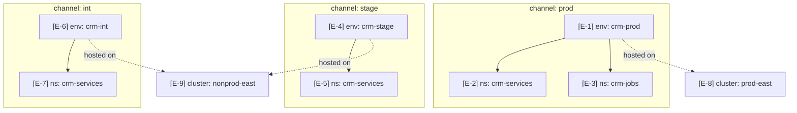
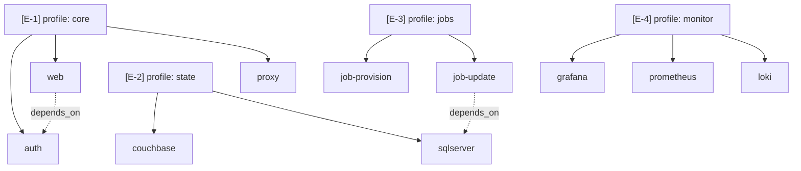

# Mode: Environment Matrix

## What this mode answers

Where does this system run? At what scale, in which physical or logical groupings, and at what version? The matrix names every place a copy of the system exists, the boundary that contains it, and the version pinned to it.

Callout prefix: `E-`. Primary mermaid: `graph TD` for cloud (channel → environment → namespace → cluster); compose-profile × service matrix for local. Optional secondary: a tabular markdown matrix when the cardinality is small enough to read at a glance.

## Target signals

### Compose-shaped (local)

1. **Profiles**: `profiles:` declarations in `compose.*.yml`. Each profile is a logical environment.
2. **Project name**: `name:` at the top of a compose file, or `COMPOSE_PROJECT_NAME` in `.env`. The project is the boundary.
3. **Profile activation flags in entrypoints**: `up.sh --profile X`, `make up-X`, scripted `docker compose --profile X` invocations.
4. **File composition order**: `compose.yml` plus override files (`compose.state.yml`, `compose.jobs.yml`, etc.) — the merge order determines which services are present.
5. **Service-to-profile membership**: which services appear in which profiles. The matrix axis.
6. **Image tags per profile**: usually shared via `${TAG}` from `.env`, but a profile may override.

### Driver-shaped (orchestrator)

When the target drives releases for other systems, the matrix describes what the tool *manages*, not where the tool itself runs:

1. **Per-namespace data files**: `data/<namespace>/` directories often have one entry per managed namespace. Enumerate them as the matrix rows.
2. **Manifest registry**: `data/manifests.json`, `data/namespaces.json` — sources of truth for which manifests exist where, from this tool's perspective.
3. **Cluster mapping** (if the tool tracks it): explicit cluster fields in the data files; otherwise inherited from the channel/environment hierarchy the tool addresses through eve-mcp.
4. **Eve-mcp cross-check**: when available, run `ShowChannels`, `ShowEnvironments`, `ShowNamespaces` and compare the live fleet against what the tool's data files claim. Drift here is a real finding (the tool thinks it manages X, but X doesn't exist).
5. **The tool's own runtime**: typically incidental — single-host CLI, scheduled CI runner. Note in passing; do not make it a matrix axis.

### Kube-shaped (cloud)

1. **Channels**: `eve-mcp:ShowChannels`. Each channel is a promotion lane (typically `int`, `stage`, `prod`).
2. **Environments per channel**: `eve-mcp:ShowEnvironments` — these are the logical homes (e.g., `crm-dev`, `crm-stage`, `crm-prod`).
3. **Clusters**: `eve-mcp:ShowClusters` — physical clusters that host environments. An environment maps to one cluster (usually); the cluster axis matters for blast radius.
4. **Namespaces**: `eve-mcp:ShowNamespaces` per environment. A namespace is the unit of isolation within a cluster.
5. **Manifests per namespace**: `eve-mcp:ShowManifests --namespace <ns>` lists the apps deployed there.
6. **Current deployments**: `eve-mcp:ShowDeployments` per namespace and `eve-mcp:GetDeployment <id>` reveal what's actually running right now (vs. what's configured) — useful when the matrix needs "running here, configured there" distinction.
7. **Pinned versions**: `eve-mcp:GetManifest <name>` reveals current pinned image versions; `eve-mcp:ShowReleaseCandidates` and `eve-mcp:GetReleaseCandidate` show alternate version sources.
8. **Manifest metadata per environment**: `eve-mcp:GetManifest` shows env-specific metadata that differentiates the same manifest across environments. (This is provenance signal — defer detail to configuration-provenance mode; only note that the difference exists.)
9. **Repo-side substrate**: `kube/*-config/`, `aws/*/`, manifest YAML files. When eve-mcp is unavailable, this is the fallback source.

## What to capture as nodes

Cloud:
- Each channel: one node, top of the graph.
- Each environment: one node, child of its channel.
- Each cluster: one node (may be referenced by multiple environments, or vice versa).
- Each namespace: one node, child of its environment.
- A manifest is *not* a node in this mode — it's a label on the namespace edge or an inset list. (Manifests are nodes in promotion-path mode.)

Local:
- Each profile: one node.
- Each service group (commonly modeled as a sub-section): one cluster within the profile.
- Render as a matrix or `graph TD` with profile-as-row and service-group-as-column.

## What to capture as edges

- Channel → environment containment.
- Environment → namespace containment.
- Cluster ←→ environment hosting (often a label on the environment node rather than a separate edge).
- Cross-environment relationships when they exist: e.g., a shared database used by multiple namespaces.

## What NOT to capture

- Application-to-application call graphs. That's `architectural-analysis` integrations territory.
- Per-namespace resource quotas, network policies, RBAC. That's a separate audit; if the user asks, scope it as a follow-up rather than expanding this mode.
- Image versions inline in the matrix unless cardinality is tiny. The matrix is a topology view; version drift is a configuration-provenance concern.

## Diagram example (cloud)



## Diagram example (local)

A compose-profile matrix often reads better as a markdown table than as a graph. Use mermaid only when the relationships are non-obvious.

| Profile | Services | Composed from | Activated by |
|---|---|---|---|
| `core` [E-1] | proxy, web, auth | compose.yml | `up.sh` (default) |
| `state` [E-2] | sqlserver, couchbase | compose.yml + compose.state.yml | `up.sh --state` |
| `jobs` [E-3] | job-update, job-provision | compose.yml + compose.jobs.yml | `up.sh --jobs` |
| `monitor` [E-4] | loki, prometheus, grafana | compose.yml + compose.monitor.yml | `up.sh --monitor` |

Or as mermaid when overlap is the point:



## Sub-agent prompt seed

```
# Mode
Environment matrix — where does this system run, at what scale, in what containers.

# Scope shape
[insert one of: compose-shaped only / kube-shaped only / both]

# What to find — compose-shaped
1. Profiles in compose*.yml.
2. Project name (`name:` or COMPOSE_PROJECT_NAME).
3. Profile activation flags in up.sh / make / scripted invocations.
4. File composition order — which override files merge in for which profiles.
5. Service-to-profile membership.
6. Image tag overrides per profile (rare).

# What to find — kube-shaped (prefer eve-mcp when available)
1. Channels — eve-mcp:ShowChannels.
2. Environments per channel — eve-mcp:ShowEnvironments.
3. Clusters — eve-mcp:ShowClusters.
4. Namespaces per environment — eve-mcp:ShowNamespaces.
5. Manifests per namespace — eve-mcp:ShowManifests.
6. Current deployments — eve-mcp:ShowDeployments, GetDeployment.
7. Pinned versions — eve-mcp:GetManifest (note version, do not deep-dive metadata).

# What NOT to find
- Application-to-application call graphs.
- Resource quotas, network policies, RBAC.
- Detailed env-var differences between envs (that's configuration-provenance mode).

# Ingested findings
[Reference [I-N] (information architecture) and [X-N] (integrations) callouts from prior arch-analysis. The boundary inventory is already done; this mode adds the multiplicity dimension — which boundaries appear how many times across environments.]

# Output orientation
Prefer graph TD with subgraph-per-channel for cloud. Prefer a markdown table for local-only profile matrices when cardinality is small. Use mermaid for local only when overlap or cross-profile dependencies matter.

# Citation guidance
- Cloud topology nodes cite eve-mcp queries (eve-mcp:ShowEnvironments:channel=prod) when available.
- Repo-side fallback nodes cite the markdown or YAML file that names them (kube/crm-dev-config/README.md:1).
- Compose nodes cite the compose file (compose/compose.jobs.yml:1) and profile membership lines individually.
```

## Common pitfalls

- **Channel ≠ environment.** A channel is a promotion lane; an environment is a place. `int` is a channel. `crm-int` is an environment. The diagram should make the distinction visible.
- **Cluster invisibility.** Many cloud matrix diagrams omit clusters entirely. Cluster outages are a real failure mode (recovery-rollback mode references this); show clusters even if it adds a layer.
- **Local matrix as a swarm.** Compose profile matrices easily turn into noisy graphs with every service shown twice. If the matrix is cardinality > 4 profiles × 6 services, prefer the markdown table.
- **Conflating namespace with environment.** Some platforms use one namespace per environment; others use many namespaces per environment. Don't assume — query the actual mapping.
- **Drawing manifests as topology nodes.** Manifests are *what runs in a namespace*, not topology in themselves. They belong on edges or in insets, not as graph nodes.

## Cross-mode boundary

| Belongs to environment matrix | Belongs elsewhere |
|---|---|
| "stage runs in cluster nonprod-east" | "How do we promote to stage?" → promotion-path |
| "namespace crm-services contains 12 manifests" | "What versions are pinned?" → promotion-path (current) or configuration-provenance (which env vars differ) |
| "compose.jobs.yml adds the jobs profile" | "What happens when a job fails?" → recovery-rollback |
| "monitor profile is opt-in via --monitor" | "Why is monitor opt-in?" → out of scope (policy question) |
