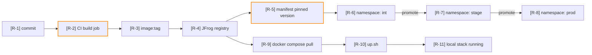
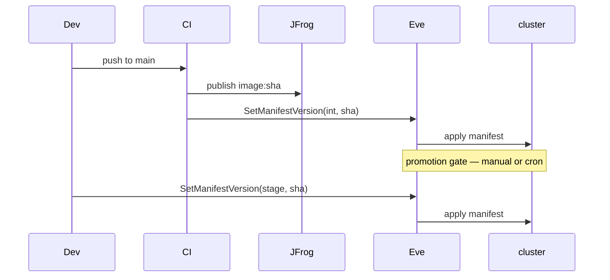

# Mode: Promotion Path

## What this mode answers

How does a version of the system reach a running instance? From the moment a developer commits, through build, image, and registry, through whatever channel-or-tag mechanism the platform uses, into the namespace or compose project where it actually runs.

Callout prefix: `R-`. Primary mermaid: `flowchart LR`. Optional secondary: `sequenceDiagram` for promotion flows that have multiple actors (e.g., dev, CI, registry, Eve, cluster).

## Target signals

Sub-agents look for both shapes. The detected scope from Phase 1 determines which set is in play; both apply when the system is hybrid.

### Compose-shaped (local)

1. **Build inputs**: `Dockerfile`, `docker-compose.build.*`, source mounts vs. baked images.
2. **Image tag resolution**: `image:` directives in `compose.*.yml`, `${TAG}` substitutions, `.env` and `.env.local` values.
3. **Pull triggers**: `docker compose pull` invocations in `up.sh`, `down.sh`, `Makefile`, `justfile`, README walkthroughs.
4. **Bring-up entrypoints**: `up.sh`, `make up`, `just up`, scripted profile activation (`docker compose --profile X up`).
5. **Schema-job ordering**: services that block bring-up via `depends_on` with `condition: service_completed_successfully` — these are local "promotion gates."
6. **Registry sources**: registry hostnames in image references (JFrog, ECR, ghcr.io, Docker Hub) — note which images are local-built vs. pulled.

### Driver-shaped (orchestrator)

When the target *drives* releases for other systems rather than shipping itself:

1. **Pipeline stages**: the named operations the tool encodes — `cut-release`, `forward-merge`, `close-release`, `environment-roll`, etc. Look in CLI entrypoints (`.ps1` files, `scripts/`, `bin/`) and `docs/runbooks/` for the canonical step list.
2. **Targeted fleet**: which repos / manifests / namespaces this tool operates on. Sources: `data/manifests.json`, `data/namespaces.json`, `data/<namespace>/`, `config.json` "targets" or "repos" keys.
3. **Trigger surface**: how operations get invoked — manual CLI, cron config (`cron-config.json`, `.gitlab-ci.yml` scheduled pipelines), webhooks, evebot commands.
4. **Cross-fleet promotion**: when the tool implements multi-stage promotion (e.g., apply to `int` namespace, then `stage`, then `prod` for the same release), the *promotion path* is across that fleet, not within this repo. The diagram's primary axis is fleet stages × release operations.
5. **The tool's own deploy** (if any): a footnote node on the diagram, not the spine. If `.gitlab-ci.yml` has a doc-publish or self-publish job, cite it but don't make it the headline.

### Kube-shaped (cloud)

1. **Channels**: `eve-mcp:ShowChannels` (or `eve-mcp:GetChannel` for a specific one) reveals the promotion ladder (`int → stage → prod`). Repo-side fallback: channel names in markdown.
2. **Environments**: `eve-mcp:ShowEnvironments` per channel, or environment names in `kube/*-config/` directory structure.
3. **Manifests**: `eve-mcp:ShowManifests` (cloud-side authoritative) or manifest YAML in repo (`kube/*/manifests/`).
4. **Applications and image versions**: `eve-mcp:ShowApplications`, `eve-mcp:GetApplication`, `eve-mcp:GetApplicationVersions` — what's promotable, and what versions exist. `eve-mcp:ShowImages` — image inventory in the registry.
5. **Pinned versions and rendered manifests**: `eve-mcp:GetManifest` reveals current pinned versions and metadata; `eve-mcp:GetManifestPlan` previews the rendered Kubernetes resources before any action. `SetManifestVersion` / `UnpinManifestVersion` are the promotion levers (cited as mechanism, never invoked).
6. **CI publish jobs**: `.gitlab-ci.yml` jobs whose stage is `dist` or `publish` (per Unanet four-stage pattern: `vet → build → dist → publish`). These are the "image enters registry" edge.
7. **Release candidates**: `eve-mcp:ShowReleaseCandidates`, `eve-mcp:GetReleaseCandidate` — alternate version sources used in some promotion flows.
8. **Promotion mechanism**: how does a version actually move between channels? Look for `RunManifest`, `Deploy`, audit records via `eve-mcp:GetAuditRecords`, deployment requests via `eve-mcp:ShowDeploymentRequests` / `GetDeploymentRequest`, or scripted `evebot` commands in repo docs.
9. **Crons and scheduled deploys**: `eve-mcp:ShowDeploymentCrons` (cron config), `eve-mcp:GetDeploymentCron` (one cron's detail), `eve-mcp:ShowDeploymentCronJobs` (cron run history). These are automated promotion edges, not manual.

## What to capture as nodes

- Each distinct stage in the promotion ladder: one node.
- Each registry/store crossing: one node (image enters registry, manifest reads from registry).
- Each gate or blocking condition: one node (CI passes, schema migration succeeds, healthcheck green).
- Each environment endpoint where the version comes to rest: one node (compose project running, namespace running).

## What to capture as edges

- Each transition between stages, with citation:
  - "CI publish → registry" cited at the `.gitlab-ci.yml` job
  - "registry → manifest" cited at the manifest's image reference (or `eve-mcp:GetManifest` showing the current pinned image)
  - "manifest → namespace" cited at `eve-mcp:GetManifest` (cloud) or `compose.yml` (local)
- Each gate, with citation to the gating mechanism (`depends_on`, healthcheck, CI job dependency, manual approval step in Eve audit).

## What NOT to capture

- The contents of pulled images. The skill draws boundaries at the registry; what runs *inside* a pulled image is out of scope.
- CI job correctness or pipeline syntax. This mode draws the *edge* CI publishes to a registry; it does not validate the CI itself.
- Application-internal startup logic past the entrypoint. That's `architectural-analysis` control-flow territory — reference an existing `[C-N]` callout if the prior arch-analysis report covered it.
- Promotion *policy* decisions ("we should promote on Tuesdays"). This mode describes the mechanism, not the policy.

## Diagram example (local + cloud hybrid)



For a multi-actor promotion, sequence diagrams work well:



## Sub-agent prompt seed

```
# Mode
Promotion path — how a version reaches a running instance.

# Scope shape
[insert one of: compose-shaped only / kube-shaped only / both]

# What to find — compose-shaped
1. Build inputs: Dockerfile, docker-compose.build.*, source mounts.
2. Image tag resolution: image: directives, ${TAG}, .env values.
3. Pull triggers: docker compose pull invocations.
4. Bring-up entrypoints: up.sh, make up, --profile activation.
5. Schema-job ordering: depends_on with service_completed_successfully.
6. Registry sources: hostname in image references.

# What to find — kube-shaped
1. Channels (eve-mcp:ShowChannels / GetChannel; or markdown declarations).
2. Environments per channel (eve-mcp:ShowEnvironments).
3. Manifests (eve-mcp:ShowManifests; or kube/*/manifests/).
4. Applications and versions (eve-mcp:ShowApplications, GetApplication, GetApplicationVersions, ShowImages).
5. Pinned versions and plans (eve-mcp:GetManifest, GetManifestPlan).
6. CI publish jobs in .gitlab-ci.yml (stage: dist or publish).
7. Release candidates (eve-mcp:ShowReleaseCandidates, GetReleaseCandidate).
8. Promotion mechanism: RunManifest, Deploy, GetAuditRecords, ShowDeploymentRequests, evebot scripts.
9. Scheduled deploys (eve-mcp:ShowDeploymentCrons, GetDeploymentCron, ShowDeploymentCronJobs).

# What NOT to find
- Contents of pulled images.
- CI job correctness — only the publish edge.
- Application-internal startup past the entrypoint.
- Promotion policy ("we should") — only the mechanism.

# Ingested findings
[List of [C-N], [F-N], [I-N] callouts from prior arch-analysis report, with one-line summaries]
Reference these by ID. Do not re-derive their underlying facts. If your finding extends one of them, cite both.

# Output orientation
Prefer flowchart LR for the promotion ladder. Use sequenceDiagram only when multiple actors (dev, CI, registry, platform, cluster) coordinate over time.
```

## Common pitfalls

- **Confusing build with promote.** Building an image is not promotion. Pushing it to a registry is. Promotion is the act of pointing a target environment at a registry artifact.
- **Drawing pipeline-shaped diagrams.** A `.gitlab-ci.yml` reads top-to-bottom; a promotion path reads source-to-destination. They look similar; they answer different questions. If your nodes look like CI stages, you're drawing the wrong diagram.
- **Treating cron as the same as manual.** A cron promotion is automatic and policy-encoded; a manual promotion is gated on judgment. Mark the difference on the edge.
- **Missing the "two paths" pattern.** A registry usually feeds both production (via manifest) and local (via compose pull). Both edges exist; the diagram should show both.
- **Citing the wrong line for an image reference.** The promotion edge is at the line that *points* at the image, not the line that *defines* the image. `image: foo:1.2` in compose is the consume edge; the produce edge is in CI.

## Cross-mode boundary

| Belongs to promotion path | Belongs elsewhere |
|---|---|
| "Image gets built in CI and pushed to JFrog" | "What's in the image?" → out of scope (or arch-analysis IA) |
| "Manifest pins version 2.4.1 in stage" | "What env vars does that manifest set?" → configuration-provenance |
| "Schema migration job blocks bring-up" | "What happens when the migration fails?" → recovery-rollback |
| "Cron promotes int → stage nightly" | "Where does int run, vs. stage?" → environment-matrix |
| "Compose pulls from registry on up.sh" | "Which compose profile is up?" → environment-matrix |
