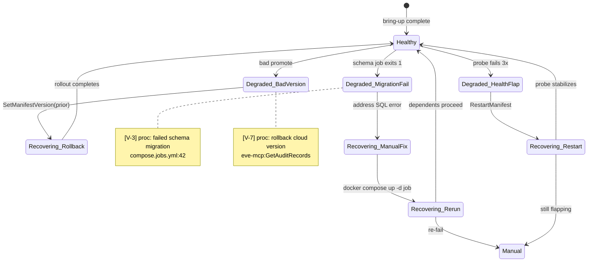

# Mode: Recovery & Rollback

## What this mode answers

When something breaks, how do we get back? What's the documented (or undocumented) procedure for restarting a wedged service, rolling back a bad version, recovering from a failed schema migration, restoring a degraded namespace? This mode names the levers, the order to pull them, and the gaps where no lever exists.

Callout prefix: `V-`. Primary mermaid: `stateDiagram-v2` for the healthy → degraded → recovering lifecycle — **always required**, never substituted by prose. Each degraded state in the diagram corresponds to a numbered procedure list in the report (the diagram is the index; the procedure list is the detail). Procedure lists are supplementary, not a substitute for the diagram.

## Target signals

### Compose-shaped (local)

1. **Restart policies**: `restart:` directives — `no`, `on-failure`, `always`, `unless-stopped`. Each implies a different recovery shape.
2. **Healthchecks**: presence, command, interval, retries. A service with `service_healthy` dependents is gated by its healthcheck; a service without one is opaque.
3. **`depends_on` cascade**: when a healthcheck fails, what blocks? When a `restart: no` schema job fails, what's stuck?
4. **Bring-up scripts**: `up.sh`, `down.sh`, and any `restart-X.sh` or partial-bring-up scripts. These are the documented recovery path.
5. **Image tag rollback**: how does a developer pin the image to a prior version? Is there a `.env` swap or a documented procedure?
6. **Schema migration reversibility**: schema-job containers — are migrations reversible (down scripts present) or one-way?
7. **Volume/state cleanup**: `docker compose down -v` and similar — when is destroying state required, and what does it lose?

### Driver-shaped (orchestrator)

When the target drives releases for other systems, recovery is about *partial-pipeline failure*: an operation started, did some work, then failed mid-flight. Recovery procedures are usually the highest-density content in driver-shaped repos.

1. **Pipeline-specific runbooks**: `docs/runbooks/close-release.md`, `docs/runbooks/forward-merge-gap.md`, `docs/runbooks/environment-roll.md`, etc. These are typically the spine — read them all.
2. **Mid-state recovery**: when an operation has done part of its work (some repos pushed, some not; some namespaces rolled, some not), how does the tool resume? Look for `--resume`, `--retry`, `--continue` flags; idempotency claims in code; checkpoint files.
3. **Dry-run / preview affordances**: `-WhatIf`, `--dry-run`, `--preview` — pre-flight tools that *prevent* the recovery scenario in the first place. Worth diagramming because their absence is itself a finding.
4. **Pipeline gate failures**: when a step fails (CI gate, evebot rejection, target repo conflict), what's the documented response? Often per-step in the runbook, sometimes only in code comments.
5. **Idempotency patterns**: re-running a partially-completed operation should be safe. Cite where the tool achieves this (skip-if-exists checks, version comparison, lock files).
6. **Manual rollback for fleet operations**: if the tool drove a bad version into 12 namespaces, what's the documented un-do? Often an inverse runbook (`environment-roll-back.md`); sometimes a flag on the same operation.

For driver-shaped targets, runbook precedence applies aggressively: the runbook's procedure beats any mechanism citation. The state diagram is required as always; the procedure list is mostly runbook-summary with citation.

### Kube-shaped (cloud)

1. **Restart procedures**: `RestartManifest` is the lever — document what it does and when. Cite as mechanism; never invoke from this skill.
2. **Version unpinning**: `UnpinManifestVersion`, `UnpinNamespaceVersion` — unpinning is often a prerequisite for rollback; without it, a re-promotion may not take effect.
3. **Re-pin to prior version**: `SetManifestVersion <name> <prior-version>`, `SetNamespaceVersion` — the actual rollback action. Cite as mechanism only.
4. **Audit trail**: `eve-mcp:GetAuditRecords` reveals what was the last successful version, who promoted it, when. Recovery often starts here.
5. **Deployment requests and history**: `eve-mcp:ShowDeploymentRequests`, `eve-mcp:GetDeploymentRequest` — failed and successful request history per scope.
6. **Current vs. desired**: `eve-mcp:GetDeployment` shows what's running; `eve-mcp:GetManifest` shows what's configured. Drift between the two is itself a degraded state.
7. **Render preview before action**: `eve-mcp:GetManifestPlan` previews the rendered Kubernetes resources without applying — useful in recovery to see what `SetManifestVersion(prior)` would actually do.
8. **Cron pause/resume**: `eve-mcp:ShowDeploymentCrons`, `eve-mcp:GetDeploymentCron`, `eve-mcp:ShowDeploymentCronJobs` — automated promotions can drive a rollback right back into prod if not paused. The cron-jobs query reveals run history.
9. **Healthchecks at the manifest level**: probes (liveness, readiness) — what triggers a Kube-driven restart vs. a deploy-time failure.
10. **Manifest-level rollout controls**: `RollingUpdate` strategy, `maxSurge`, `maxUnavailable` — these affect how a rollback propagates.

## What to capture as nodes (state diagram — required)

The state diagram is the canonical artifact for this mode. Every recovery scenario surfaces in the diagram as a degraded state with at least one transition out.

- **Healthy** state: nominal operation. One node.
- **Degraded** states: distinct flavors of "not working" — a wedged service, a failed migration, a bad version pinned, a cron-driven re-bad-promote, a healthcheck flap, drift between deployed and configured. One node per distinct flavor.
- **Recovering** states: the in-progress recovery (e.g., re-pinning, re-running a migration job). One node per distinct procedure.
- Transition back to **Healthy** when recovery succeeds.
- Transition to **Manual intervention required** for scenarios with no documented recovery. This is the gap state — its presence in the diagram is itself a finding.

Every state and every transition carries a callout `[V-N]` and a citation. Diagrams without callouts on every state fail verification.

## Procedure list (supplementary)

Each degraded or recovering state in the diagram has a corresponding numbered procedure in the report. The procedure expands the state's recovery sequence in detail — it is not a substitute for the state in the diagram.

Format per scenario:

```markdown
### V-3: Failed schema migration

**Trigger:** `job-update-emarket` exits non-zero, `restart: no` prevents auto-retry [C-28].

**Diagnose:**
1. `docker compose logs job-update-emarket` — read the actual error.
2. Confirm the SQL Server container is healthy: `docker compose ps sqlserver`.

**Recover:**
1. Address root cause (often Redgate license, schema conflict).
2. Remove the failed container: `docker compose rm -f job-update-emarket`.
3. Re-run: `docker compose up -d job-update-emarket`.
4. Watch dependents come up: `docker compose ps`.

**Cite:** compose.jobs.yml:42 (restart: no), up.sh:67 (job invocation).
```

## What NOT to capture

- Recovery *policy* ("we should rollback within 5 minutes"). This mode describes the mechanism.
- Application-internal error handling. That's `architectural-analysis` failure-modes territory — reference an existing `[F-N]` callout if the prior run covered it.
- Hypothetical recovery procedures. If no documented or scripted procedure exists, mark the gap as "no documented recovery" and stop. Inventing a procedure here is fabrication.
- Performance recovery (latency degradation, capacity scaling). Different problem; out of scope.

## Diagram example



## Sub-agent prompt seed

```
# Mode
Recovery & rollback — when things break, what levers exist to get back, and where are the gaps.

# Scope shape
[insert one of: compose-shaped only / kube-shaped only / both]

# What to find — compose-shaped
1. Restart policies on every service.
2. Healthchecks (presence, command, interval, retries).
3. depends_on cascade — what blocks when a service fails.
4. Bring-up scripts: up.sh, down.sh, restart-*.sh, partial-bring-up paths.
5. Image tag rollback procedure (.env swap, documented path).
6. Schema migration reversibility — down scripts present or absent.
7. Volume/state cleanup commands and what they destroy.

# What to find — kube-shaped (prefer eve-mcp when available; cite action tools as mechanism, never invoke)
1. RestartManifest usage and what it actually does.
2. Version unpin levers (UnpinManifestVersion, UnpinNamespaceVersion).
3. Re-pin to prior version (SetManifestVersion, SetNamespaceVersion).
4. Audit trail — eve-mcp:GetAuditRecords (last known good version, who promoted, when).
5. Deployment request history — eve-mcp:ShowDeploymentRequests, GetDeploymentRequest.
6. Drift detection — eve-mcp:GetDeployment (running) vs GetManifest (configured).
7. Render preview before action — eve-mcp:GetManifestPlan.
8. Cron pause/resume — eve-mcp:ShowDeploymentCrons, GetDeploymentCron, ShowDeploymentCronJobs (automated re-promotion risk).
9. Liveness/readiness probes at manifest level.
10. Rollout strategy (RollingUpdate, maxSurge, maxUnavailable).

# What NOT to find
- Recovery policy ("we should") — only mechanism.
- Application-internal error handling (that's arch-analysis F-).
- Hypothetical procedures. Mark gaps as "no documented recovery."
- Performance recovery — out of scope.

# Ingested findings
[Reference [F-N] failure-mode callouts and [C-N] control-flow callouts from prior arch-analysis. The failure surface is already enumerated; this mode adds the recovery dimension. A V- finding may directly continue an F- finding ("F-13: WAF off when not enabled" → "V-1: re-enable WAF and restart proxy").]

# Output orientation
ALWAYS author a stateDiagram-v2 for the lifecycle (healthy → degraded → recovering). The diagram is the canonical artifact and is mandatory. Author a numbered procedure list for each degraded/recovering state to expand the recovery sequence in detail — the list is supplementary to the diagram, not a substitute. Every state in the diagram must carry a [V-N] callout.

# Procedure list format
For each scenario:
- Trigger (what observable signal indicates this state)
- Diagnose (steps to confirm root cause)
- Recover (steps to restore)
- Cite each step

# Gap signals
A gap is as important as a recovery. If a degraded state has no documented recovery, name it explicitly:
"V-N: <state>. No documented recovery. Manual intervention pattern: ___."
```

## Common pitfalls

- **Inventing procedures from intuition.** If `up.sh` doesn't have a partial-bring-up flag, *don't* document one. Document the absence.
- **Ignoring `restart: no` schema jobs.** A schema job with `restart: no` and a failed run is a wedge state. Many compose stacks have one; the recovery is non-obvious.
- **Treating cron-driven promotion as benign.** A bad version + an active deploy cron will re-bad-promote on the next tick. Pause the cron *before* rolling back, not after.
- **Healthcheck-less services.** A service with no healthcheck cannot be detected as degraded by the platform. Diagram it as "opaque" — recovery requires external observation.
- **Rolling forward as rollback.** Sometimes the recovery is "deploy a fix forward," not "go back." Document both shapes; don't assume rollback is always backward.
- **Mixing application errors with platform recovery.** A 5xx from the app is a failure mode (arch-analysis F-). A failed manifest deploy is a release recovery. Don't conflate.

## Cross-mode boundary

| Belongs to recovery & rollback | Belongs elsewhere |
|---|---|
| "Restart procedure for proxy is RestartManifest" | "Why does the proxy fail?" → arch-analysis F- |
| "Schema job is restart: no, requires manual rerun" | "Why is restart: no?" → out of scope (policy); arch-analysis may have rationale |
| "Rollback unpins, then re-pins prior version" | "Where do versions come from?" → promotion-path |
| "Healthcheck flap triggers Kube-level restart" | "What does the healthcheck check?" → arch-analysis or service docs |
| "No documented recovery for monitor stack" | "Why is monitor stack opt-in?" → environment-matrix |
